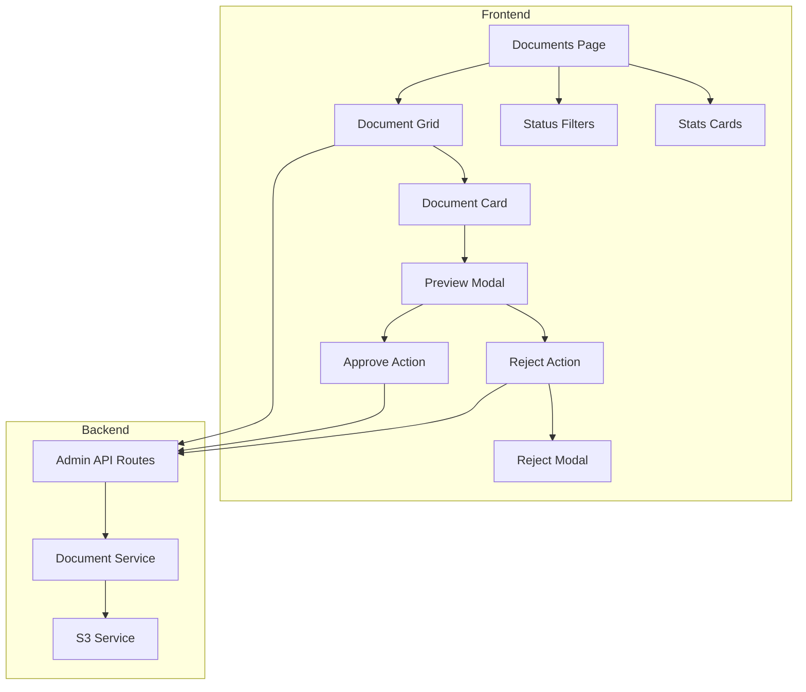

# Design Document: Admin Document Review Enhancement

## Overview

This feature enhances the admin documents page (`/admin/documents`) to provide a comprehensive document review interface. Instead of just showing statistics and redirecting to the operations dashboard, the page will display all uploaded driver documents with photo thumbnails, filtering capabilities, and direct approve/reject actions with comments.

The enhancement leverages the existing `documentService.js` backend and `DocumentVerification.jsx` component patterns while creating a more focused document-centric review experience.

## Architecture



## Components and Interfaces

### Frontend Components

#### 1. Enhanced Documents Page (`/admin/documents/page.js`)
- Main page component that orchestrates the document review interface
- Manages state for documents, filters, selected document, and modals
- Fetches documents from API with filter parameters

#### 2. Document Grid Component
- Renders documents in a responsive grid layout (1-4 columns based on screen size)
- Each card shows: photo thumbnail, driver name, document type, status badge
- Handles image loading errors with placeholder and refresh functionality

#### 3. Document Preview Modal
- Full-size document image view
- Driver information panel
- Document metadata (type, upload date, expiry)
- Action buttons for pending documents
- Display of rejection reason for rejected documents

#### 4. Reject Modal
- Text area for rejection reason (required)
- Validation to prevent empty submissions
- Submit and cancel buttons

### API Endpoints (Existing)

| Endpoint | Method | Description |
|----------|--------|-------------|
| `/api/admin/documents` | GET | Get documents with optional status filter |
| `/api/admin/documents/:id/verify` | POST | Approve or reject a document |
| `/api/admin/documents/:id/url` | GET | Refresh presigned URL for document |
| `/api/admin/stats/operations` | GET | Get document statistics |

## Data Models

### Document Object (from API)
```javascript
{
  _id: string,
  driverId: string,
  driverName: string,
  driverPhone: string,
  driverEmail: string,
  type: 'license' | 'registration' | 'insurance' | 'kyc' | 'selfie_with_car' | 'vehicle_photo',
  url: string,           // Presigned S3 URL
  urlExpiresAt: Date,    // URL expiration time
  status: 'pending' | 'approved' | 'rejected',
  uploadedAt: Date,
  expiryDate: Date | null,
  rejectionReason: string | null,
  reviewedAt: Date | null,
  reviewedBy: { _id: string, name: string } | null,
  originalFilename: string,
  fileSize: number
}
```

### Filter State
```javascript
{
  status: 'pending' | 'approved' | 'rejected' | 'all'
}
```

### Stats Object
```javascript
{
  pendingDocuments: number,
  approvedDocuments: number,
  rejectedDocuments: number,
  totalDrivers: number,
  verifiedDrivers: number
}
```

## Correctness Properties

*A property is a characteristic or behavior that should hold true across all valid executions of a system-essentially, a formal statement about what the system should do. Properties serve as the bridge between human-readable specifications and machine-verifiable correctness guarantees.*

### Property 1: Document card displays required information
*For any* document object, when rendered as a card, the card SHALL contain the document photo (or placeholder), driver name, document type label, and status badge.
**Validates: Requirements 1.2**

### Property 2: Filter returns only matching documents
*For any* set of documents and any selected filter status, all documents displayed SHALL have a status matching the filter (or all documents if filter is 'all').
**Validates: Requirements 2.2**

### Property 3: Pending documents sorted by upload date
*For any* set of pending documents displayed, they SHALL be sorted by uploadedAt in ascending order (oldest first).
**Validates: Requirements 2.3**

### Property 4: Pending documents show action buttons
*For any* document with status 'pending', when displayed in the preview modal, both approve and reject buttons SHALL be visible.
**Validates: Requirements 3.1, 4.1**

### Property 5: Rejection requires non-empty reason
*For any* rejection attempt, if the reason is empty or contains only whitespace, the submission SHALL be prevented.
**Validates: Requirements 4.4**

### Property 6: Rejected documents display rejection reason
*For any* document with status 'rejected' and a non-null rejectionReason, the rejection reason SHALL be displayed in both the card and preview modal.
**Validates: Requirements 5.2**

## Error Handling

| Error Scenario | Handling Strategy |
|----------------|-------------------|
| Document fetch fails | Display error message with retry button |
| Image load fails | Show placeholder with refresh URL button |
| Presigned URL expired | Auto-refresh URL on image error |
| Approve/Reject API fails | Show error toast, keep modal open |
| Empty rejection reason | Prevent submission, show validation error |

## Testing Strategy

### Unit Tests
- Test filter logic correctly filters documents by status
- Test sorting logic for pending documents
- Test validation logic for rejection reason

### Property-Based Tests
Using Jest with fast-check for property-based testing:

1. **Filter Property Test**: Generate random arrays of documents with various statuses, apply filter, verify all results match filter
2. **Sort Property Test**: Generate random arrays of pending documents, verify sorted order
3. **Validation Property Test**: Generate random strings including empty/whitespace, verify validation correctly identifies invalid reasons
4. **Card Rendering Property Test**: Generate random document objects, verify rendered output contains required fields

### Integration Tests
- Test document approval flow end-to-end
- Test document rejection flow with reason
- Test filter tab switching updates displayed documents
- Test stats update after status change
