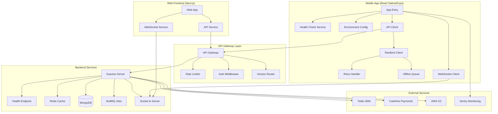

# Design Document: API Connectivity & Deployment

## Overview

This design document outlines the architecture and implementation approach for ensuring robust API connectivity between the HushRyd Mobile App (React Native/Expo), Web Frontend (Next.js), and the Node.js/Express backend. The system provides health checks, environment validation, connection resilience, graceful fallbacks, and comprehensive monitoring to support 50K+ users with real-time features.

## Architecture



## Components and Interfaces

### 1. Health Check Service

**Purpose:** Verify backend availability and service health before critical operations.

**Interface:**
```typescript
interface HealthCheckService {
  checkHealth(): Promise<HealthStatus>;
  checkEndpoint(endpoint: string): Promise<EndpointStatus>;
  getServiceStatus(): ServiceStatus;
}

interface HealthStatus {
  status: 'healthy' | 'degraded' | 'unhealthy';
  timestamp: string;
  services: {
    database: ServiceHealth;
    redis: ServiceHealth;
    external: Record<string, ServiceHealth>;
  };
  version: string;
  uptime: number;
}

interface ServiceHealth {
  status: 'up' | 'down' | 'degraded';
  latency?: number;
  message?: string;
}
```

### 2. Environment Configuration Service

**Purpose:** Validate and manage environment-specific configurations.

**Interface:**
```typescript
interface EnvironmentConfig {
  API_BASE_URL: string;
  WS_URL: string;
  ENVIRONMENT: 'development' | 'staging' | 'production';
  API_VERSION: string;
  TIMEOUT_MS: number;
  RETRY_COUNT: number;
}

interface ConfigValidator {
  validate(): ValidationResult;
  getConfig(): EnvironmentConfig;
  isProduction(): boolean;
}

interface ValidationResult {
  valid: boolean;
  errors: string[];
  warnings: string[];
}
```

### 3. Resilient API Client

**Purpose:** Handle API requests with retry logic, timeout handling, and offline support.

**Interface:**
```typescript
interface ResilientApiClient {
  request<T>(config: RequestConfig): Promise<ApiResponse<T>>;
  get<T>(url: string, options?: RequestOptions): Promise<ApiResponse<T>>;
  post<T>(url: string, data: any, options?: RequestOptions): Promise<ApiResponse<T>>;
  put<T>(url: string, data: any, options?: RequestOptions): Promise<ApiResponse<T>>;
  delete<T>(url: string, options?: RequestOptions): Promise<ApiResponse<T>>;
}

interface RequestConfig {
  url: string;
  method: 'GET' | 'POST' | 'PUT' | 'DELETE';
  data?: any;
  headers?: Record<string, string>;
  timeout?: number;
  retries?: number;
  priority?: 'high' | 'normal' | 'low';
}

interface ApiResponse<T> {
  data: T;
  status: number;
  headers: Record<string, string>;
  cached: boolean;
  retryCount: number;
}

interface RetryStrategy {
  maxRetries: number;
  baseDelay: number;
  maxDelay: number;
  shouldRetry(error: ApiError, attempt: number): boolean;
  getDelay(attempt: number): number;
}
```

### 4. Offline Queue Service

**Purpose:** Queue requests when offline and sync when connection restores.

**Interface:**
```typescript
interface OfflineQueueService {
  enqueue(request: QueuedRequest): Promise<string>;
  dequeue(): Promise<QueuedRequest | null>;
  processQueue(): Promise<ProcessResult>;
  getQueueSize(): number;
  clearQueue(): Promise<void>;
}

interface QueuedRequest {
  id: string;
  request: RequestConfig;
  timestamp: number;
  priority: number;
  retryCount: number;
}

interface ProcessResult {
  processed: number;
  failed: number;
  remaining: number;
}
```

### 5. WebSocket Connection Manager

**Purpose:** Manage real-time connections with auto-reconnect and heartbeat.

**Interface:**
```typescript
interface WebSocketManager {
  connect(): Promise<void>;
  disconnect(): void;
  subscribe(event: string, handler: EventHandler): Unsubscribe;
  emit(event: string, data: any): void;
  getConnectionState(): ConnectionState;
}

interface ConnectionState {
  connected: boolean;
  reconnecting: boolean;
  lastConnected: Date | null;
  reconnectAttempts: number;
}

type EventHandler = (data: any) => void;
type Unsubscribe = () => void;
```

### 6. API Version Manager

**Purpose:** Handle API versioning and compatibility checks.

**Interface:**
```typescript
interface ApiVersionManager {
  getCurrentVersion(): string;
  checkCompatibility(): Promise<CompatibilityResult>;
  handleDeprecation(warning: DeprecationWarning): void;
}

interface CompatibilityResult {
  compatible: boolean;
  serverVersion: string;
  clientVersion: string;
  updateRequired: boolean;
  deprecationWarnings: DeprecationWarning[];
}

interface DeprecationWarning {
  endpoint: string;
  deprecationDate: string;
  replacementEndpoint?: string;
  message: string;
}
```

### 7. Error Reporting Service

**Purpose:** Capture and report errors for diagnostics.

**Interface:**
```typescript
interface ErrorReportingService {
  captureError(error: Error, context?: ErrorContext): void;
  captureApiError(error: ApiError): void;
  setUser(user: UserContext): void;
  addBreadcrumb(breadcrumb: Breadcrumb): void;
}

interface ErrorContext {
  endpoint?: string;
  requestId?: string;
  userId?: string;
  extra?: Record<string, any>;
}

interface ApiError {
  status: number;
  message: string;
  endpoint: string;
  requestId?: string;
  timestamp: string;
  retryAttempts: number;
}
```

## Data Models

### Health Check Response
```typescript
interface HealthCheckResponse {
  status: 'healthy' | 'degraded' | 'unhealthy';
  timestamp: string;
  version: string;
  uptime: number;
  services: {
    database: {
      status: 'up' | 'down';
      latency: number;
    };
    redis: {
      status: 'up' | 'down';
      latency: number;
    };
    twilio: {
      status: 'up' | 'down' | 'unknown';
    };
    cashfree: {
      status: 'up' | 'down' | 'unknown';
    };
    s3: {
      status: 'up' | 'down' | 'unknown';
    };
  };
}
```

### Queued Request Model
```typescript
interface QueuedRequestModel {
  id: string;
  endpoint: string;
  method: string;
  body: string | null;
  headers: Record<string, string>;
  priority: number;
  createdAt: number;
  retryCount: number;
  lastAttempt: number | null;
  error: string | null;
}
```

### API Error Model
```typescript
interface ApiErrorModel {
  code: string;
  message: string;
  status: number;
  details?: Record<string, any>;
  timestamp: string;
  requestId: string;
  path: string;
}
```


## Correctness Properties

*A property is a characteristic or behavior that should hold true across all valid executions of a system-essentially, a formal statement about what the system should do. Properties serve as the bridge between human-readable specifications and machine-verifiable correctness guarantees.*

### Property 1: Health Check Response Completeness
*For any* health check request, the response SHALL contain status for all critical services (database, redis) and return within the specified latency threshold.
**Validates: Requirements 1.1, 1.2**

### Property 2: Health Check Degraded Status Accuracy
*For any* health check when one or more services are unavailable, the response status SHALL be 'degraded' or 'unhealthy' and include specific failure details for each failed service.
**Validates: Requirements 1.3**

### Property 3: Environment URL Validation
*For any* API_BASE_URL configuration, the validator SHALL correctly identify valid HTTPS URLs for production and reject localhost/HTTP URLs in production mode.
**Validates: Requirements 2.1, 2.3, 2.4**

### Property 4: Missing Environment Variable Detection
*For any* set of environment variables with missing required values, the validator SHALL return errors listing all missing variable names.
**Validates: Requirements 2.2**

### Property 5: Exponential Backoff Retry Timing
*For any* failed API request with retry enabled, the retry delays SHALL follow exponential backoff pattern (baseDelay * 2^attempt) up to maxRetries.
**Validates: Requirements 3.1**

### Property 6: HTTP Status Code Classification
*For any* API response status code, the error handler SHALL correctly classify 4xx as client errors and 5xx as server errors with appropriate retry behavior.
**Validates: Requirements 3.3, 3.4**

### Property 7: Offline Queue FIFO Order
*For any* sequence of queued requests, when connection restores the queue SHALL process requests in FIFO order preserving the original request sequence.
**Validates: Requirements 3.5, 3.6**

### Property 8: Graceful 404 Handling
*For any* API endpoint returning 404, the error handler SHALL return a structured error without throwing exceptions that crash the app.
**Validates: Requirements 4.1**

### Property 9: Cache Fallback on Failure
*For any* API request that fails when cached data exists, the response SHALL include the cached data with a stale indicator flag.
**Validates: Requirements 4.2, 4.3**

### Property 10: API Version Header Inclusion
*For any* outgoing API request, the request headers SHALL include X-API-Version with the configured version string.
**Validates: Requirements 5.1**

### Property 11: Version Deprecation Warning Detection
*For any* API response containing deprecation warning headers, the version manager SHALL extract and surface the deprecation information.
**Validates: Requirements 5.3, 5.4**

### Property 12: Error Log Completeness
*For any* API error, the error log entry SHALL contain endpoint, status code, response body (if available), and ISO timestamp.
**Validates: Requirements 7.1, 7.2**

### Property 13: Environment Configuration Loading
*For any* environment name (development, staging, production), the config loader SHALL return the correct API_BASE_URL for that environment.
**Validates: Requirements 8.1, 8.3**

### Property 14: Cache Clear on Environment Switch
*For any* environment switch operation, all cached data SHALL be cleared before connecting to the new environment.
**Validates: Requirements 8.4**

### Property 15: Phone Number Validation (Indian Format)
*For any* phone number input, the validator SHALL accept only 10-digit numbers and correctly format with +91 prefix.
**Validates: Requirements 10.1**

### Property 16: OTP Format and Expiry
*For any* generated OTP, the value SHALL be exactly 6 digits and the expiry timestamp SHALL be set to 60 seconds from generation.
**Validates: Requirements 10.2**

### Property 17: Countdown Timer Accuracy
*For any* countdown timer with initial value N seconds, after T seconds elapsed the remaining time SHALL be max(0, N-T).
**Validates: Requirements 10.4**

### Property 18: Profile Completeness Validation
*For any* user profile, the completeness check SHALL return incomplete if any mandatory field (name, email, gender, emergency contacts) is missing.
**Validates: Requirements 11.2, 11.3**

### Property 19: Booking Role Enforcement
*For any* booking attempt, the system SHALL reject if user is a driver (drivers cannot book) or if passenger tries to post rides.
**Validates: Requirements 13.2**

### Property 20: Wallet State Transitions
*For any* wallet operation, the state transitions SHALL follow: locked → unlocked → withdrawn, and locked amount SHALL never exceed total balance.
**Validates: Requirements 16.1, 16.2, 16.3**

### Property 21: WebSocket Reconnection
*For any* WebSocket disconnection, the client SHALL attempt reconnection within 3 seconds and restore subscriptions on successful reconnect.
**Validates: Requirements 18.3**

### Property 22: SOS Data Capture Completeness
*For any* SOS trigger, the captured data SHALL include GPS coordinates, user details, and timestamp within 2 seconds of trigger.
**Validates: Requirements 19.1**

### Property 23: Cancellation Grace Period
*For any* cancellation request, if timestamp is within 3 minutes of booking confirmation, the cancellation charge SHALL be zero.
**Validates: Requirements 20.1, 20.2, 20.3**

### Property 24: JWT Token Validation
*For any* API request with Authorization header, the backend SHALL validate JWT signature and expiry before processing.
**Validates: Requirements 17.1, 17.2**

### Property 25: Rate Limit Enforcement
*For any* user exceeding 100 requests per minute, subsequent requests SHALL receive 429 status with Retry-After header.
**Validates: Requirements 18.2**

### Property 26: Response Compression
*For any* API response larger than 1KB, the response SHALL be gzip compressed when client accepts gzip encoding.
**Validates: Requirements 19.1**

### Property 27: Pagination Consistency
*For any* paginated list request, the response SHALL include total count and the sum of all pages SHALL equal total count.
**Validates: Requirements 19.3**

### Property 28: Cache TTL Enforcement
*For any* cached item, the cache SHALL return null/miss after TTL expiration and serve fresh data on next request.
**Validates: Requirements 23.1, 23.2, 23.3**

## Error Handling

### API Error Categories

| Category | Status Codes | Retry | User Action |
|----------|-------------|-------|-------------|
| Network Error | N/A | Yes (3x) | Check connection |
| Client Error | 400-499 | No | Fix input |
| Auth Error | 401, 403 | No | Re-login |
| Not Found | 404 | No | Feature unavailable |
| Rate Limited | 429 | Yes (after delay) | Wait |
| Server Error | 500-599 | Yes (3x) | Retry later |
| Timeout | N/A | Yes (1x) | Retry |

### Error Response Format
```json
{
  "error": {
    "code": "VALIDATION_ERROR",
    "message": "Invalid phone number format",
    "details": {
      "field": "phone",
      "expected": "10-digit number"
    },
    "requestId": "req_abc123",
    "timestamp": "2024-01-15T10:30:00Z"
  }
}
```

### Fallback Strategies

1. **Health Check Failure**: Display cached status, retry in background
2. **Auth Failure**: Clear tokens, redirect to login
3. **Search Failure**: Show cached results with stale indicator
4. **Booking Failure**: Queue request, show pending status
5. **SOS Failure**: Direct phone call to emergency contacts
6. **Tracking Failure**: Show last known location, retry connection

## Testing Strategy

### Property-Based Testing Framework
- **Library**: fast-check (JavaScript/TypeScript)
- **Minimum Iterations**: 100 per property test
- **Test Location**: `backend/tests/property/` and `mobile-app/tests/property/`

### Unit Testing Approach
- Test individual service methods in isolation
- Mock external dependencies (Redis, MongoDB, Twilio)
- Focus on edge cases and error conditions

### Integration Testing
- Test API endpoints with real database
- Verify WebSocket connection lifecycle
- Test offline queue synchronization

### Test Categories

1. **Health Check Tests**
   - Verify response format and timing
   - Test degraded status scenarios
   - Test service failure detection

2. **Environment Config Tests**
   - Validate URL format checking
   - Test missing variable detection
   - Verify environment switching

3. **Retry Logic Tests**
   - Verify exponential backoff timing
   - Test max retry limits
   - Test retry condition evaluation

4. **Offline Queue Tests**
   - Verify FIFO ordering
   - Test queue persistence
   - Test sync on reconnection

5. **Error Handling Tests**
   - Test status code classification
   - Verify error log format
   - Test fallback activation

6. **Authentication Tests**
   - Test JWT validation
   - Test token refresh flow
   - Test rate limiting

### Property Test Annotations
Each property-based test MUST include:
- Comment: `**Feature: api-connectivity-deployment, Property {number}: {property_text}**`
- Reference to requirements clause
- Minimum 100 iterations

### Test File Structure
```
backend/tests/property/
  ├── healthCheck.property.test.js
  ├── envConfig.property.test.js
  ├── retryLogic.property.test.js
  ├── offlineQueue.property.test.js
  ├── errorHandling.property.test.js
  └── rateLimit.property.test.js

mobile-app/tests/property/
  ├── apiClient.property.test.js
  ├── offlineQueue.property.test.js
  ├── phoneValidation.property.test.js
  └── countdown.property.test.js
```
