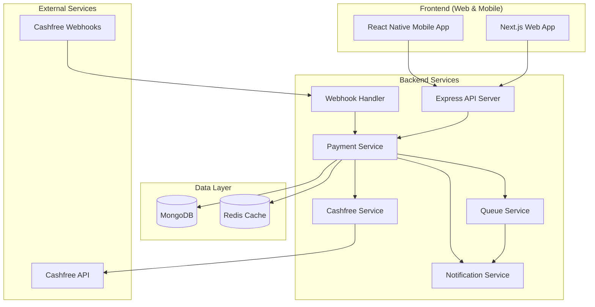
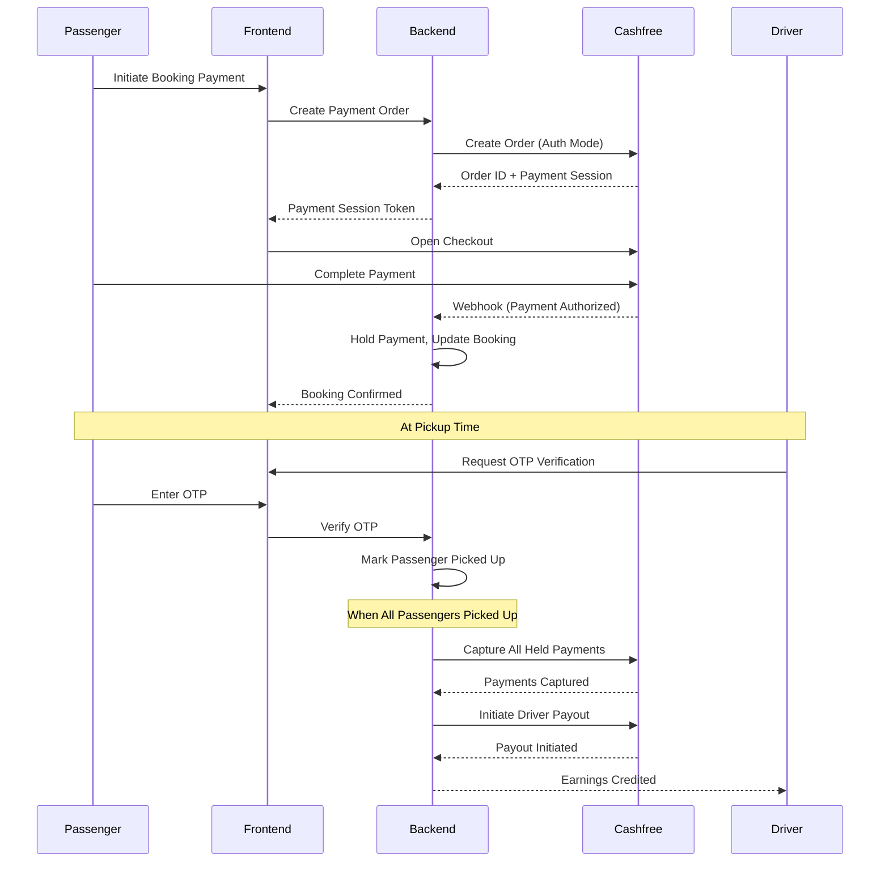
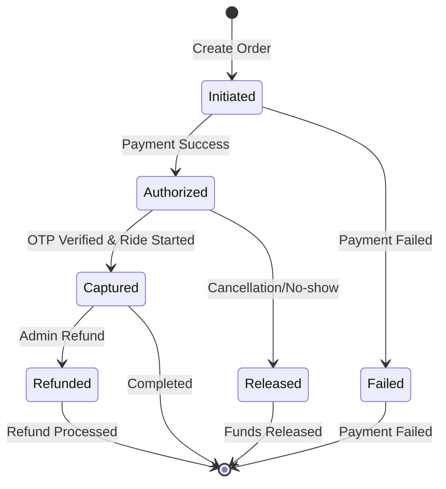

# Design Document: Cashfree Payment Integration

## Overview

This design document outlines the architecture and implementation details for integrating Cashfree Payment Gateway into the HushRyd ride-sharing platform. The integration covers payment collection from passengers with a hold/capture mechanism, automated driver payouts, refund processing, Free Cancellation feature, and comprehensive transaction tracking in the super admin dashboard.

The system implements a payment hold mechanism where passenger payments are authorized but held until OTP verification at pickup. Once all passengers are verified and the ride starts, payments are captured and driver earnings are credited. A fixed ₹10 platform fee is charged on all bookings, and an optional Free Cancellation feature provides full refund protection for an additional fee.

## Architecture



### Payment Flow Architecture



## Components and Interfaces

### 1. Cashfree Service (`backend/src/services/cashfreeService.js`)

Core service for Cashfree API integration.

```javascript
/**
 * CashfreeService Interface
 */
interface CashfreeService {
  // Order Management
  createOrder(orderData: CreateOrderRequest): Promise<OrderResponse>;
  getOrder(orderId: string): Promise<OrderDetails>;
  
  // Payment Operations
  capturePayment(orderId: string, amount: number): Promise<CaptureResponse>;
  getPaymentStatus(orderId: string): Promise<PaymentStatus>;
  
  // Refunds
  createRefund(refundData: RefundRequest): Promise<RefundResponse>;
  getRefundStatus(refundId: string): Promise<RefundStatus>;
  
  // Payouts
  addBeneficiary(beneficiaryData: BeneficiaryRequest): Promise<BeneficiaryResponse>;
  initiatePayout(payoutData: PayoutRequest): Promise<PayoutResponse>;
  getPayoutStatus(payoutId: string): Promise<PayoutStatus>;
  
  // Webhooks
  verifyWebhookSignature(payload: string, signature: string): boolean;
}
```

### 2. Payment Service (`backend/src/services/paymentService.js`)

Business logic for payment operations.

```javascript
/**
 * PaymentService Interface
 */
interface PaymentService {
  // Payment Calculation
  calculatePaymentBreakdown(fare: number, options: PaymentOptions): PaymentBreakdown;
  calculateCancellationCharges(booking: Booking, cancellationTime: Date): CancellationCharges;
  calculateRefundAmount(booking: Booking, cancellationTime: Date): RefundBreakdown;
  
  // Payment Flow
  initiatePayment(bookingId: string, paymentData: PaymentData): Promise<PaymentSession>;
  handlePaymentAuthorized(orderId: string, paymentDetails: PaymentDetails): Promise<void>;
  capturePayments(tripId: string): Promise<CaptureResult[]>;
  
  // Driver Payouts
  creditDriverEarnings(tripId: string, driverId: string): Promise<PayoutResult>;
  
  // Refunds
  processRefund(bookingId: string, amount: number, reason: string): Promise<RefundResult>;
}
```

### 3. Payment Breakdown Types

```typescript
interface PaymentBreakdown {
  baseFare: number;
  platformFee: number;           // Fixed ₹10
  freeCancellationFee?: number;  // Optional, starting at ₹10
  totalAmount: number;
  driverEarnings: number;        // baseFare (driver gets full fare, platform keeps fee)
}

interface CancellationCharges {
  refundableAmount: number;
  platformFee: number;           // Non-refundable
  freeCancellationFee: number;   // Non-refundable
  cancellationCharge: number;    // Based on timing
  discountDeduction: number;     // Any applied discounts
  netRefund: number;
}

interface PaymentOptions {
  hasFreeCancellation: boolean;
  appliedDiscount?: number;
  source: 'web' | 'mobile';
}
```

### 4. Transaction Model (`backend/src/models/Transaction.js`)

```javascript
const TransactionSchema = new mongoose.Schema({
  transactionId: { type: String, required: true, unique: true },
  orderId: { type: String, required: true },
  bookingId: { type: mongoose.Schema.Types.ObjectId, ref: 'Booking' },
  tripId: { type: mongoose.Schema.Types.ObjectId, ref: 'Trip' },
  userId: { type: mongoose.Schema.Types.ObjectId, ref: 'User' },
  driverId: { type: mongoose.Schema.Types.ObjectId, ref: 'Driver' },
  
  type: { 
    type: String, 
    enum: ['collection', 'capture', 'payout', 'refund', 'platform_fee'],
    required: true 
  },
  status: { 
    type: String, 
    enum: ['pending', 'authorized', 'captured', 'completed', 'failed', 'refunded'],
    required: true 
  },
  
  amount: { type: Number, required: true },
  currency: { type: String, default: 'INR' },
  
  breakdown: {
    baseFare: Number,
    platformFee: Number,
    freeCancellationFee: Number,
    discountApplied: Number
  },
  
  paymentMethod: {
    type: { type: String },  // upi, card, netbanking, wallet
    provider: String,
    last4: String
  },
  
  cashfreeData: {
    orderId: String,
    paymentId: String,
    refundId: String,
    payoutId: String,
    referenceId: String
  },
  
  rideDetails: {
    origin: String,
    destination: String,
    departureTime: Date,
    passengerName: String,
    driverName: String
  },
  
  metadata: mongoose.Schema.Types.Mixed,
  
  createdAt: { type: Date, default: Date.now },
  updatedAt: { type: Date, default: Date.now }
});
```

### 5. Webhook Handler (`backend/src/routes/webhooks.js`)

```javascript
/**
 * Webhook Events Handled:
 * - PAYMENT_SUCCESS_WEBHOOK
 * - PAYMENT_FAILED_WEBHOOK
 * - REFUND_STATUS_WEBHOOK
 * - PAYOUT_STATUS_WEBHOOK
 */
interface WebhookHandler {
  handlePaymentWebhook(event: PaymentWebhookEvent): Promise<void>;
  handleRefundWebhook(event: RefundWebhookEvent): Promise<void>;
  handlePayoutWebhook(event: PayoutWebhookEvent): Promise<void>;
}
```

### 6. Frontend Components

#### Web (Next.js)
- `CashfreeCheckout.jsx` - Cashfree JS SDK integration
- `PaymentBreakdown.jsx` - Fare breakdown display
- `FreeCancellationOption.jsx` - Free cancellation toggle
- `CancellationChargesModal.jsx` - Cancellation charges display
- `TransactionDetails.jsx` - Admin transaction view

#### Mobile (React Native)
- `PaymentWebView.jsx` - Web-based checkout for Expo
- `FareBreakdown.jsx` - Fare breakdown component
- `FreeCancellationToggle.jsx` - Free cancellation option
- `ReceiptView.jsx` - Digital receipt display

## Data Models

### Payment Hold State Machine



### Cancellation Policy Tiers

| Time Before Departure | Standard Cancellation | With Free Cancellation |
|-----------------------|----------------------|------------------------|
| > 24 hours | 90% refund | 100% fare refund |
| 12-24 hours | 75% refund | 100% fare refund |
| 2-12 hours | 50% refund | 100% fare refund |
| < 2 hours | 25% refund | Standard policy applies |
| No-show | 0% refund | 0% refund |

*Note: Platform fee (₹10) and Free Cancellation fee are never refunded*

## Correctness Properties

*A property is a characteristic or behavior that should hold true across all valid executions of a system-essentially, a formal statement about what the system should do. Properties serve as the bridge between human-readable specifications and machine-verifiable correctness guarantees.*

### Property 1: Platform Fee Calculation Consistency
*For any* fare amount and booking source (web or mobile), the calculated total amount SHALL equal the base fare plus exactly ₹10 platform fee.
**Validates: Requirements 2.1, 2.4**

### Property 2: Payment Breakdown Completeness
*For any* payment breakdown calculation, the result SHALL contain baseFare, platformFee, and totalAmount fields, and totalAmount SHALL equal the sum of all fee components.
**Validates: Requirements 2.2, 3.3**

### Property 3: Platform Fee Non-Refundability
*For any* refund calculation, the refund amount SHALL NOT include the platform fee, regardless of cancellation timing or Free Cancellation status.
**Validates: Requirements 2.5**

### Property 4: Free Cancellation Total Calculation
*For any* booking with Free Cancellation selected, the total amount SHALL equal base fare plus platform fee plus Free Cancellation fee.
**Validates: Requirements 3.2**

### Property 5: Free Cancellation Window Refund
*For any* booking with Free Cancellation that is cancelled at least 2 hours before departure, the refund amount SHALL equal the full base fare (excluding platform fee and Free Cancellation fee).
**Validates: Requirements 3.4**

### Property 6: Standard Cancellation Outside Window
*For any* booking cancelled less than 2 hours before departure, the standard cancellation policy SHALL apply regardless of Free Cancellation status.
**Validates: Requirements 3.5**

### Property 7: Cancellation Charges Time-Based Calculation
*For any* cancellation request, the cancellation charges SHALL be calculated based on the time difference between cancellation time and departure time according to the defined tiers.
**Validates: Requirements 4.1, 4.3**

### Property 8: Discount Deduction from Refund
*For any* refund where discounts or coupons were applied to the original booking, the refund amount SHALL be reduced by the discount value.
**Validates: Requirements 4.5**

### Property 9: Payment Authorization Hold
*For any* successful payment, the payment status SHALL be 'authorized' (not 'captured') until OTP verification occurs.
**Validates: Requirements 5.1**

### Property 10: OTP Verification State Transition
*For any* valid OTP entry, the passenger pickup status SHALL transition to 'picked_up' and the verification timestamp SHALL be recorded.
**Validates: Requirements 5.2**

### Property 11: All Passengers Verified Triggers Capture
*For any* trip where all booked passengers have been OTP-verified, all held payments SHALL be captured.
**Validates: Requirements 5.3**

### Property 12: Driver Earnings Destination
*For any* driver, earnings SHALL be credited to their wallet if no bank account is registered, or transferred via IMPS if bank account details exist.
**Validates: Requirements 6.2, 6.3**

### Property 13: Failed Payout Queue and Notification
*For any* failed payout attempt, the payout SHALL be added to the retry queue and an admin notification SHALL be generated.
**Validates: Requirements 6.5**

### Property 14: Webhook Signature Verification
*For any* incoming webhook, the signature SHALL be verified against the Cashfree secret before any processing occurs.
**Validates: Requirements 7.2**

### Property 15: Idempotency Key Inclusion
*For any* payment request to Cashfree API, an idempotency key SHALL be included in the request headers.
**Validates: Requirements 7.5**

### Property 16: Refund Amount Validation
*For any* refund request, the refund amount SHALL NOT exceed the original payment amount minus non-refundable fees (platform fee + Free Cancellation fee).
**Validates: Requirements 8.3**

### Property 17: Refund Transaction Record Creation
*For any* completed refund, a transaction record SHALL be created with type 'refund' and the booking payment status SHALL be updated.
**Validates: Requirements 8.4**

### Property 18: Transaction Data Completeness
*For any* transaction record, it SHALL contain type, amount, status, timestamp, and associated ride details (trip ID, driver name, passenger name, route).
**Validates: Requirements 9.1, 9.2, 9.4**

### Property 19: Transaction Filter Accuracy
*For any* transaction filter query, the returned results SHALL only include transactions matching all specified filter criteria.
**Validates: Requirements 9.3**

### Property 20: Circuit Breaker Activation
*For any* sequence of Cashfree API failures exceeding the threshold, the circuit breaker SHALL open and subsequent calls SHALL fail fast without calling the API.
**Validates: Requirements 10.1**

### Property 21: Webhook Idempotency
*For any* webhook event processed multiple times, the system state SHALL be identical to processing it once.
**Validates: Requirements 10.3**

### Property 22: Receipt Data Completeness
*For any* completed payment, the generated receipt SHALL contain base fare, platform fee, Free Cancellation fee (if applicable), and total amount.
**Validates: Requirements 11.1, 11.2**

### Property 23: Receipt Refund Update
*For any* processed refund, the associated receipt SHALL be updated to include refund amount and deduction details.
**Validates: Requirements 11.5**

### Property 24: Payment Data Serialization Round-Trip
*For any* payment data object, serializing to JSON and deserializing back SHALL produce an equivalent object.
**Validates: Requirements 12.5**

## Error Handling

### Payment Errors
| Error Code | Description | User Message | Retry |
|------------|-------------|--------------|-------|
| `PAYMENT_FAILED` | Generic payment failure | Payment failed. Please try again. | Yes |
| `PAYMENT_CANCELLED` | User cancelled payment | Payment was cancelled. | Yes |
| `INSUFFICIENT_FUNDS` | Insufficient balance | Insufficient funds. Try another method. | Yes |
| `CARD_DECLINED` | Card was declined | Card declined. Try another card. | Yes |
| `NETWORK_ERROR` | Network connectivity issue | Network error. Check connection. | Yes |
| `INVALID_BOOKING` | Booking not found/invalid | Invalid booking. Contact support. | No |
| `BOOKING_EXPIRED` | Booking has expired | Booking expired. Create new booking. | No |
| `ALREADY_PAID` | Payment already completed | Already paid for this booking. | No |

### Payout Errors
| Error Code | Description | Action |
|------------|-------------|--------|
| `BENEFICIARY_NOT_FOUND` | Driver not registered | Register driver as beneficiary |
| `INVALID_ACCOUNT` | Invalid bank details | Notify driver to update details |
| `PAYOUT_FAILED` | Transfer failed | Queue for retry, notify admin |
| `INSUFFICIENT_BALANCE` | Platform balance low | Alert admin, pause payouts |

## Testing Strategy

### Unit Testing
- Payment calculation functions (platform fee, cancellation charges, refunds)
- Webhook signature verification
- Transaction state transitions
- Error handling and retry logic

### Property-Based Testing
Using `fast-check` library for JavaScript:

1. **Payment Calculation Properties**
   - Platform fee is always ₹10
   - Total equals sum of components
   - Refund never includes platform fee

2. **Cancellation Charge Properties**
   - Charges increase as departure approaches
   - Free Cancellation provides full refund within window
   - Discounts are deducted from refunds

3. **State Transition Properties**
   - Payment states follow valid transitions
   - All passengers verified triggers capture
   - Failed payouts are queued

4. **Serialization Properties**
   - Round-trip serialization preserves data

### Integration Testing
- End-to-end payment flow with Cashfree sandbox
- Webhook processing with test events
- Payout flow with test beneficiaries

### Test Configuration
```javascript
// jest.config.js additions
module.exports = {
  testMatch: [
    '**/tests/property/**/*.property.test.js',
    '**/tests/unit/**/*.test.js',
    '**/tests/integration/**/*.test.js'
  ],
  setupFilesAfterEnv: ['./tests/setup.js']
};
```

### Property Test Annotations
Each property-based test must include:
```javascript
/**
 * Feature: cashfree-payment-integration, Property 1: Platform Fee Calculation Consistency
 * Validates: Requirements 2.1, 2.4
 */
```

