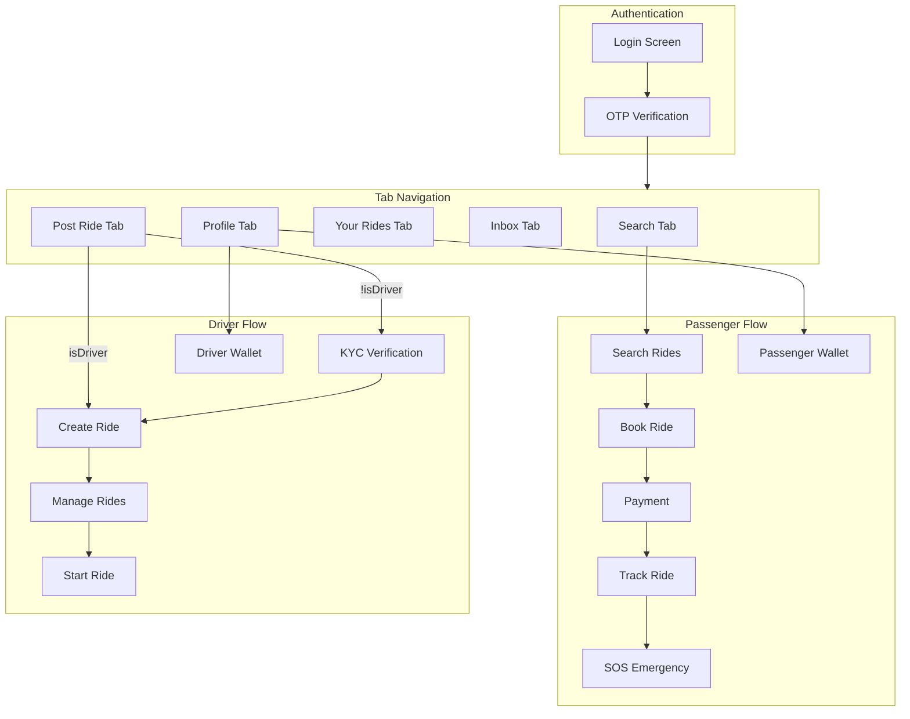

# Design Document: Complete App Flow Review

## Overview

This design document addresses three main issues in the HushRyd mobile application:
1. Post Ride tab not visible after login
2. Upcoming rides page layout instability
3. Comprehensive verification of passenger and driver flows

The solution involves fixing tab navigation configuration, improving layout stability in the bookings screen, and ensuring all critical user flows work correctly end-to-end.

## Architecture

The mobile app follows a file-based routing architecture using Expo Router with the following structure:

```
mobile-app/
├── app/
│   ├── (tabs)/           # Bottom tab navigation screens
│   │   ├── _layout.jsx   # Tab bar configuration
│   │   ├── index.jsx     # Home/Search tab
│   │   ├── publish.jsx   # Post Ride tab
│   │   ├── bookings.jsx  # Your Rides tab
│   │   ├── inbox.jsx     # Inbox tab
│   │   └── profile.jsx   # Profile tab
│   ├── (stack)/          # Stack navigation screens
│   │   ├── track/        # Live tracking
│   │   ├── sos/          # SOS emergency
│   │   ├── driver/       # Driver-specific screens
│   │   ├── wallet/       # Wallet screens
│   │   └── book/         # Booking flow
│   └── (auth)/           # Authentication screens
└── src/
    ├── components/       # Reusable UI components
    ├── services/         # API and business logic
    ├── config/           # Configuration files
    └── utils/            # Utility functions
```

### Component Flow Diagram



## Components and Interfaces

### 1. Tab Navigation Components

#### TabConfig (`src/config/tabConfig.js`)
```javascript
interface TabConfig {
  name: string;      // Route name
  label: string;     // Display label
  icon: string;      // Inactive icon
  activeIcon: string; // Active icon
}

// Tab order: Search, Post Ride, Your Rides, Inbox, Profile
const TAB_CONFIG: TabConfig[];
```

#### TabsLayout (`app/(tabs)/_layout.jsx`)
- Renders bottom tab bar with all 5 tabs
- Uses TAB_CONFIG for dynamic tab generation
- Handles tab visibility and styling

### 2. Bookings Screen Components

#### BookingsScreen (`app/(tabs)/bookings.jsx`)
- Fixed header with "Your Rides" title
- Tab bar for Upcoming/Past filtering
- FlatList with virtualization for performance
- Skeleton loading states
- Empty state handling

### 3. Passenger Flow Components

#### TrackTripScreen (`app/(stack)/track/[bookingId].jsx`)
- TrackingMap: Real-time driver location display
- TripProgress: Pickup/drop progress indicators
- DriverInfoCard: Driver details and contact
- SOSButton: Emergency alert trigger

#### SOSButton (`src/components/sos/SOSButton.jsx`)
- Prominent red emergency button
- Confirmation dialog before trigger
- Pulsing animation for active rides
- Navigation to SOS active screen

### 4. Driver Flow Components

#### PublishScreen (`app/(tabs)/publish.jsx`)
- Conditional rendering based on driver status
- TripCreator for verified drivers
- BecomeDriverPrompt for non-drivers
- RidePostConfirmation after successful post

#### DriverRideExecutionScreen (`app/(stack)/driver/ride/[rideId].jsx`)
- PassengerOTPList for verification
- Start ride button (enabled after all OTPs verified)
- Live location sharing on ride start

### 5. Wallet Components

#### PassengerWalletView (`src/components/wallet/PassengerWalletView.jsx`)
- Balance display
- Add money options
- Transaction history

#### DriverWalletView (`src/components/wallet/DriverWalletView.jsx`)
- Earnings summary
- Pending payouts
- Withdrawal options
- Earnings history

## Data Models

### Tab Configuration
```typescript
interface TabConfig {
  name: string;
  label: string;
  icon: string;
  activeIcon: string;
}
```

### Booking
```typescript
interface Booking {
  id: string;
  tripId: string;
  passengerId: string;
  status: 'pending' | 'confirmed' | 'completed' | 'cancelled';
  seats: number;
  fare: number;
  pickupOTP: string;
  dropOTP: string;
  trip: Trip;
}
```

### Tracking Data
```typescript
interface TrackingData {
  vehicleLocation: { lat: number; lng: number };
  pickupLocation: { lat: number; lng: number };
  dropLocation: { lat: number; lng: number };
  eta: { time: string; minutes: number; distance: string };
  status: 'waiting' | 'active' | 'in_progress' | 'completed';
  driver: DriverInfo;
}
```

### Wallet Data
```typescript
interface PassengerWallet {
  currentBalance: number;
  paymentMethods: PaymentMethod[];
  transactions: Transaction[];
}

interface DriverWallet {
  totalBalance: number;
  lockedAmount: number;
  availableAmount: number;
  thisWeekEarnings: number;
  thisMonthEarnings: number;
  pendingWithdrawals: number;
  transactions: Transaction[];
}
```

## Correctness Properties

*A property is a characteristic or behavior that should hold true across all valid executions of a system-essentially, a formal statement about what the system should do. Properties serve as the bridge between human-readable specifications and machine-verifiable correctness guarantees.*

### Property 1: Tab Configuration Completeness
*For any* valid TAB_CONFIG array, the configuration SHALL contain exactly 5 tabs with names ['index', 'publish', 'bookings', 'inbox', 'profile'] in that order.
**Validates: Requirements 1.1, 1.2**

### Property 2: Tab Rendering Consistency
*For any* tab in TAB_CONFIG, the tab SHALL have non-empty label, icon, and activeIcon properties.
**Validates: Requirements 1.2**

### Property 3: Bookings List Scroll Stability
*For any* list of bookings with length > 0, rendering the BookingsScreen SHALL produce a scrollable FlatList with consistent item heights.
**Validates: Requirements 2.2**

### Property 4: Search Results Relevance
*For any* search query with valid pickup, drop, and date, all returned rides SHALL have matching route and available seats >= requested seats.
**Validates: Requirements 3.1**

### Property 5: Booking Persistence
*For any* confirmed booking, the booking SHALL appear in the user's upcoming bookings list until the ride is completed or cancelled.
**Validates: Requirements 3.4**

### Property 6: Tracking Update Interval
*For any* active ride tracking session, location updates SHALL occur at intervals not exceeding 10 seconds.
**Validates: Requirements 4.2**

### Property 7: SOS Alert Delivery
*For any* triggered SOS alert, the system SHALL send notifications to all registered emergency contacts within 5 seconds.
**Validates: Requirements 5.3**

### Property 8: SOS Location Broadcast
*For any* active SOS session, the passenger's location SHALL be continuously shared with emergency contacts until the SOS is deactivated.
**Validates: Requirements 5.4**

### Property 9: Wallet Balance Consistency
*For any* wallet transaction (add money, payment, refund), the wallet balance SHALL equal previous balance plus/minus the transaction amount.
**Validates: Requirements 6.3, 6.4**

### Property 10: Transaction History Completeness
*For any* wallet, the transaction history SHALL contain all completed transactions in chronological order.
**Validates: Requirements 6.2, 10.2**

### Property 11: Document Validation Rules
*For any* uploaded document, the system SHALL validate file format (jpg, png, pdf) and size (< 5MB) before accepting.
**Validates: Requirements 7.2**

### Property 12: KYC Access Control
*For any* user with KYC status 'approved', the Post Ride tab SHALL display the trip creation form instead of the become driver prompt.
**Validates: Requirements 7.5, 8.1**

### Property 13: Ride Form Validation
*For any* ride creation form submission, all required fields (source, destination, departureTime, seats, pricePerSeat) SHALL be validated as non-empty and valid.
**Validates: Requirements 8.2**

### Property 14: Non-Driver Access Restriction
*For any* user without driver status, the Post Ride tab SHALL display the "Become a Driver" prompt.
**Validates: Requirements 8.5**

### Property 15: OTP Verification Requirement
*For any* ride with passengers, the driver SHALL NOT be able to start the ride until all passenger OTPs are verified.
**Validates: Requirements 9.3**

### Property 16: Ride Earnings Processing
*For any* completed ride, the driver's wallet SHALL be credited with the ride earnings minus platform fee.
**Validates: Requirements 9.5**

### Property 17: Withdrawal Balance Validation
*For any* withdrawal request, the requested amount SHALL NOT exceed the available balance.
**Validates: Requirements 10.4**

### Property 18: Wallet Role Differentiation
*For any* user with both passenger and driver roles, the wallet screen SHALL display role-specific views with clearly separated balances.
**Validates: Requirements 10.5**

### Property 19: UPI ID Format Validation
*For any* UPI ID input, the system SHALL validate that it matches the pattern `username@bankname` where username contains alphanumeric characters and bankname is a valid UPI handle.
**Validates: Requirements 3.1.2**

## Error Handling

### Tab Navigation Errors
- If TAB_CONFIG fails to load, display fallback navigation with essential tabs
- Log navigation errors to crash reporting service
- Show user-friendly error message with retry option

### Booking List Errors
- Display error state with retry button on API failure
- Show skeleton loading during data fetch
- Handle empty state gracefully with call-to-action

### Tracking Errors
- Show last known location if real-time updates fail
- Display "Location unavailable" message with timestamp
- Provide manual refresh option

### SOS Errors
- Show direct emergency call option (112) if SOS API fails
- Retry SOS trigger automatically up to 3 times
- Store SOS request locally for retry when connection restored

### Wallet Errors
- Display cached balance if API unavailable
- Show transaction pending status for failed operations
- Provide manual sync option

## Testing Strategy

### Unit Testing Framework
- Jest for unit tests
- React Native Testing Library for component tests

### Property-Based Testing Framework
- fast-check for property-based tests
- Minimum 100 iterations per property test

### Test Categories

#### 1. Tab Navigation Tests
- Verify TAB_CONFIG contains all required tabs
- Test tab rendering with correct icons and labels
- Test navigation between tabs

#### 2. Bookings Screen Tests
- Test FlatList rendering with various data sizes
- Verify skeleton loading states
- Test empty state rendering
- Verify scroll behavior

#### 3. Passenger Flow Tests
- Test search functionality with various inputs
- Verify booking flow completion
- Test tracking screen rendering
- Verify SOS button functionality

#### 4. Driver Flow Tests
- Test KYC status display
- Verify ride creation form validation
- Test OTP verification flow
- Verify ride start conditions

#### 5. Wallet Tests
- Test balance display accuracy
- Verify transaction history rendering
- Test add money flow
- Verify withdrawal validation

### Property-Based Test Annotations
Each property-based test MUST include:
- Comment with property number and description
- Format: `**Feature: complete-app-flow-review, Property {number}: {property_text}**`
- Reference to requirements being validated

