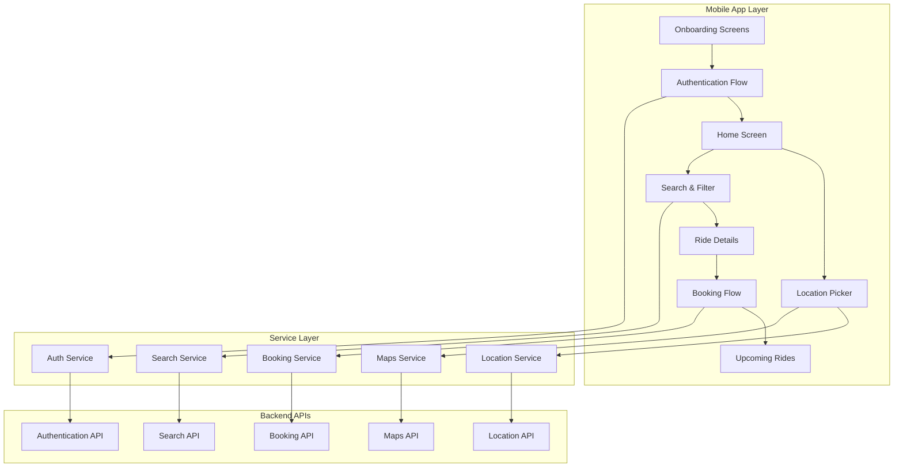

# Design Document

## Overview

The Complete Mobile App Flow design provides a comprehensive user experience for the HushRyd ride-sharing platform. The system integrates onboarding, authentication, location services, search functionality, and booking capabilities into a cohesive mobile application built with React Native and Expo.

The design emphasizes user experience through intuitive navigation, responsive design, and seamless integration with backend services. The architecture supports both online and offline scenarios while maintaining performance and reliability.

## Architecture

### High-Level Architecture



### Component Architecture

The application follows a modular component architecture with clear separation of concerns:

- **Screen Components**: Handle navigation and screen-level state
- **Feature Components**: Implement specific functionality (search, booking, etc.)
- **UI Components**: Reusable interface elements
- **Service Layer**: Business logic and API integration
- **State Management**: Context-based state management for global app state

## Components and Interfaces

### Core Components

#### OnboardingFlow
- **Purpose**: Guide new users through app introduction
- **Props**: `onComplete: () => void`, `onSkip: () => void`
- **State**: Current screen index, completion status
- **Integration**: Connects to onboarding service for content and progress tracking

#### AuthenticationFlow
- **Purpose**: Handle phone number and OTP verification
- **Props**: `onAuthSuccess: (user) => void`
- **State**: Phone number, OTP code, verification status, loading states
- **Integration**: Connects to auth service for OTP generation and verification

#### HomeScreen
- **Purpose**: Main interface for ride booking initiation
- **Props**: `user: User`, `navigation: Navigation`
- **State**: Pickup location, drop location, upcoming rides
- **Integration**: Location service, booking service, referral service

#### LocationPicker
- **Purpose**: Interactive map for location selection
- **Props**: `onLocationSelect: (location) => void`, `initialLocation?: Location`
- **State**: Map region, search query, location suggestions
- **Integration**: Maps service, location autocomplete service

#### SearchResults
- **Purpose**: Display and filter available rides
- **Props**: `searchParams: SearchParams`, `onRideSelect: (ride) => void`
- **State**: Rides list, active filters, loading state
- **Integration**: Search service, filter service

#### RideDetails
- **Purpose**: Show comprehensive ride information
- **Props**: `ride: Ride`, `onBookingInitiate: () => void`
- **State**: Booking status, fare breakdown
- **Integration**: Booking service, fare calculation service

### Service Interfaces

#### AuthService
```typescript
interface AuthService {
  sendOTP(phoneNumber: string): Promise<{success: boolean, message: string}>
  verifyOTP(phon