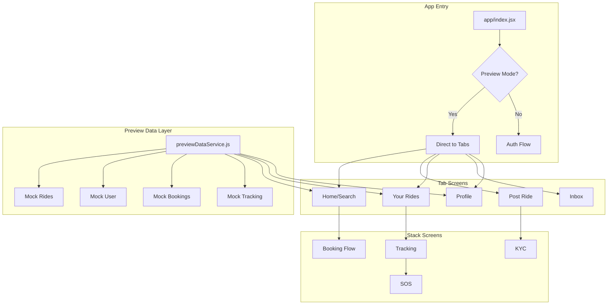

# Design Document: Direct App Preview Mode

## Overview

This feature transforms the mobile app into a direct preview mode that bypasses authentication and onboarding flows, allowing immediate access to the main app interface with pre-populated fake data. The implementation modifies the app entry point to skip auth checks and provides comprehensive mock data for all app features including ride search, booking, tracking, SOS, driver KYC, and ride posting.

## Architecture



## Components and Interfaces

### 1. Preview Data Service (`previewDataService.js`)

Central service providing all mock data for preview mode.

```javascript
// Interface
interface PreviewDataService {
  // User data
  getPreviewUser(): PreviewUser;
  
  // Ride data
  getMockRides(): MockRide[];
  getMockRideById(id: string): MockRide | null;
  
  // Booking data
  getBookings(): Booking[];
  addBooking(booking: Booking): void;
  
  // Tracking data
  getTrackingData(bookingId: string): TrackingData;
  
  // Driver data
  getKYCStatus(): KYCStatus;
  getPostedRides(): PostedRide[];
  addPostedRide(ride: PostedRide): void;
}
```

### 2. Modified App Entry (`app/index.jsx`)

Simplified entry point that directly navigates to tabs.

```javascript
// Simplified flow
export default function Index() {
  // Always redirect to tabs in preview mode
  return <Redirect href="/(tabs)" />;
}
```

### 3. Preview User Provider

Context provider for fake user data across the app.

```javascript
interface PreviewUser {
  _id: string;
  name: string;
  phone: string;
  email: string;
  profilePhoto: string | null;
  gender: string;
  rating: number;
  totalRides: number;
  walletBalance: number;
  isDriver: boolean;
  emergencyContacts: EmergencyContact[];
}
```

## Data Models

### Mock Ride Structure

```javascript
interface MockRide {
  id: string;
  tripId: string;
  driver: {
    _id: string;
    name: string;
    phone: string;
    avatar: string;
    rating: number;
    totalRides: number;
    verified: boolean;
  };
  vehicle: {
    model: string;
    color: string;
    plateNumber: string;
    type: string;
  };
  route: {
    pickup: { address: string; coordinates: [number, number] };
    drop: { address: string; coordinates: [number, number] };
    distance: number;
    duration: number;
  };
  departureTime: string;
  availableSeats: number;
  pricePerSeat: number;
  isWomenOnly: boolean;
  isInstantBooking: boolean;
}
```

### Mock Booking Structure

```javascript
interface MockBooking {
  id: string;
  rideId: string;
  ride: MockRide;
  status: 'confirmed' | 'in_progress' | 'completed' | 'cancelled';
  seats: number;
  totalFare: number;
  bookedAt: string;
  otp: string;
}
```

### Mock Tracking Data

```javascript
interface MockTrackingData {
  bookingId: string;
  driverLocation: { lat: number; lng: number };
  eta: number; // minutes
  progress: number; // 0-100
  status: 'waiting' | 'pickup' | 'in_transit' | 'arriving' | 'completed';
  route: { lat: number; lng: number }[];
}
```

## Correctness Properties

*A property is a characteristic or behavior that should hold true across all valid executions of a system-essentially, a formal statement about what the system should do. Properties serve as the bridge between human-readable specifications and machine-verifiable correctness guarantees.*

### Property 1: Direct Navigation
*For any* app launch in preview mode, the app SHALL navigate directly to the tabs screen without showing onboarding or login screens.
**Validates: Requirements 1.1, 1.3**

### Property 2: Fake User Completeness
*For any* preview mode session, the fake user object SHALL contain all required fields: name, phone, email, and at least one emergency contact.
**Validates: Requirements 1.2**

### Property 3: Mock Ride Data Completeness
*For any* mock ride displayed in the app, the ride SHALL include: driver name, driver rating, vehicle info, route addresses, departure time, available seats, and price per seat.
**Validates: Requirements 3.2**

### Property 4: Booking State Persistence
*For any* completed booking in preview mode, the booking SHALL appear in the Your Rides section with correct ride details and booking status.
**Validates: Requirements 4.3**

### Property 5: Tracking Data Completeness
*For any* active booking being tracked, the tracking data SHALL include: driver location coordinates, ETA in minutes, and progress percentage.
**Validates: Requirements 5.2**

### Property 6: Trip Form Validation
*For any* trip creation form submission, the form SHALL validate that route, departure time, available seats, and price are all provided and valid.
**Validates: Requirements 8.2**

## Error Handling

### Preview Mode Errors

| Error Scenario | Handling Strategy |
|----------------|-------------------|
| Mock data not found | Return default mock data |
| Invalid ride ID | Show "Ride not found" message |
| Booking simulation fails | Show success anyway (preview mode) |
| Tracking data unavailable | Show static mock location |

### Graceful Degradation

- All API calls in preview mode return mock responses
- Network errors are suppressed in preview mode
- All actions simulate success for UI testing

## Testing Strategy

### Property-Based Testing Library
- **Library**: fast-check (JavaScript)
- **Minimum iterations**: 100 per property test

### Unit Tests
- Test preview data service returns valid data
- Test app entry point navigation logic
- Test mock ride data structure validation

### Property-Based Tests

Each correctness property will be implemented as a property-based test:

1. **Direct Navigation Test**: Generate various app states, verify navigation always goes to tabs
2. **Fake User Completeness Test**: Generate user objects, verify all required fields present
3. **Mock Ride Completeness Test**: Generate mock rides, verify all display fields present
4. **Booking Persistence Test**: Generate bookings, verify they appear in bookings list
5. **Tracking Data Test**: Generate tracking states, verify required data present
6. **Form Validation Test**: Generate form inputs, verify validation catches invalid data

### Integration Tests
- Test complete booking flow from search to confirmation
- Test tracking screen with mock data
- Test SOS flow simulation
- Test driver KYC upload simulation
