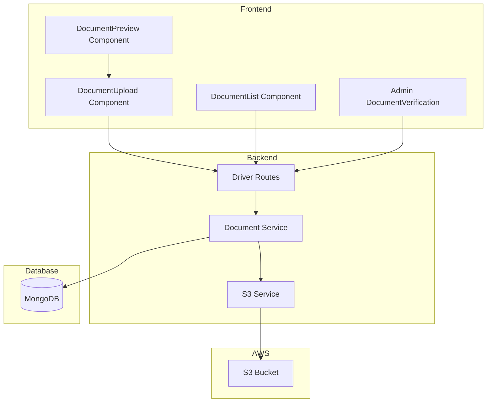

# Design Document: Driver Document Management with AWS S3

## Overview

This design document outlines the implementation of an enhanced driver document management system that integrates AWS S3 for document storage, provides document preview functionality during upload, enables document deletion for drivers, and improves visibility of driver profiles and documents for both drivers and operations teams.

The system will replace the current local file storage with AWS S3, providing scalable, secure, and reliable document storage with presigned URLs for controlled access.

## Architecture



## Components and Interfaces

### 1. S3 Service (New)

A new service to handle all AWS S3 operations.

```javascript
// backend/src/services/s3Service.js

/**
 * S3 Service Interface
 */
interface S3Service {
  /**
   * Upload a file to S3
   * @param file - File buffer or stream
   * @param key - S3 object key
   * @param contentType - MIME type
   * @returns S3 upload result with URL
   */
  uploadFile(file: Buffer, key: string, contentType: string): Promise<{
    key: string;
    bucket: string;
    location: string;
  }>;

  /**
   * Generate a presigned URL for viewing
   * @param key - S3 object key
   * @param expiresIn - URL validity in seconds (default: 3600)
   * @returns Presigned URL
   */
  getPresignedUrl(key: string, expiresIn?: number): Promise<string>;

  /**
   * Delete a file from S3
   * @param key - S3 object key
   * @returns Deletion result
   */
  deleteFile(key: string): Promise<{ deleted: boolean }>;

  /**
   * Generate S3 key for driver documents
   * @param driverId - Driver ID
   * @param documentType - Document type
   * @param filename - Original filename
   * @returns S3 key
   */
  generateDocumentKey(driverId: string, documentType: string, filename: string): string;
}
```

### 2. Document Service (Enhanced)

Updates to existing document service to integrate S3.

```javascript
// Enhanced methods in documentService.js

/**
 * Submit document with S3 upload
 */
submitDocument({ driverId, type, file, expiryDate }): Promise<Document>;

/**
 * Delete a document (pending only)
 */
deleteDocument(documentId: string, driverId: string): Promise<{ deleted: boolean }>;

/**
 * Get document with fresh presigned URL
 */
getDocumentWithUrl(documentId: string): Promise<Document>;

/**
 * Get all driver documents with presigned URLs
 */
getDriverDocumentsWithUrls(driverId: string): Promise<Document[]>;
```

### 3. Driver Routes (Enhanced)

New and updated API endpoints.

```
DELETE /api/driver/documents/:documentId
  - Delete a pending document
  - Returns: { success: boolean, message: string }

GET /api/driver/documents/:documentId/url
  - Get fresh presigned URL for a document
  - Returns: { url: string, expiresAt: Date }

GET /api/driver/profile/complete
  - Get complete driver profile with documents and presigned URLs
  - Returns: { profile: DriverProfile, documents: Document[] }
```

### 4. Frontend Components

#### DocumentUpload Component (Enhanced)

```jsx
// Enhanced features:
// - File preview before upload
// - Preview modal for images/PDFs
// - Delete button for pending documents
// - Status indicators with document thumbnails
```

#### DocumentPreview Component (New)

```jsx
// frontend/src/components/driver/DocumentPreview.jsx
interface DocumentPreviewProps {
  file: File | null;
  url: string | null;
  type: 'image' | 'pdf';
  onConfirm: () => void;
  onCancel: () => void;
}
```

## Data Models

### Document Schema (Updated)

```javascript
const DriverDocumentSchema = {
  type: String,           // Document type
  s3Key: String,          // S3 object key (new)
  s3Bucket: String,       // S3 bucket name (new)
  url: String,            // Deprecated - kept for migration
  uploadedAt: Date,
  status: String,         // pending, approved, rejected
  reviewedBy: ObjectId,
  reviewedAt: Date,
  rejectionReason: String,
  expiryDate: Date,
  originalFilename: String,  // Original filename (new)
  contentType: String,       // MIME type (new)
  fileSize: Number           // File size in bytes (new)
};
```

### S3 Key Structure

```
driver-documents/
  └── {driverId}/
      └── {documentType}/
          └── {timestamp}-{uuid}.{extension}

Example: driver-documents/507f1f77bcf86cd799439011/license/1701432000000-abc123.jpg
```


## Correctness Properties

*A property is a characteristic or behavior that should hold true across all valid executions of a system-essentially, a formal statement about what the system should do. Properties serve as the bridge between human-readable specifications and machine-verifiable correctness guarantees.*

Based on the prework analysis, the following properties have been identified. After reflection, redundant properties have been consolidated.

### Property 1: Document Retrieval Completeness

*For any* driver with uploaded documents, retrieving their documents SHALL return all documents with type, uploadedAt, status fields present, and rejected documents SHALL include rejectionReason.

**Validates: Requirements 1.1, 1.2, 1.4**

### Property 2: S3 Key Uniqueness and Structure

*For any* document upload, the generated S3 key SHALL be unique and SHALL follow the pattern `driver-documents/{driverId}/{documentType}/{timestamp}-{uuid}.{extension}`.

**Validates: Requirements 4.1, 4.2**

### Property 3: Presigned URL Generation

*For any* stored document, requesting a presigned URL SHALL return a valid URL that differs from previously generated URLs (due to signature) and includes expiry information.

**Validates: Requirements 1.3, 4.3, 5.2, 5.3**

### Property 4: Pending Document Deletion

*For any* pending document, deletion SHALL remove the document from both the database and S3, and subsequent retrieval SHALL not include the deleted document.

**Validates: Requirements 3.1, 4.4**

### Property 5: Approved Document Protection

*For any* approved document, deletion attempts SHALL be rejected with an appropriate error, and the document SHALL remain unchanged in both database and S3.

**Validates: Requirements 3.2**

### Property 6: Complete Profile Retrieval

*For any* driver, the complete profile endpoint SHALL return both driver profile information and all associated documents with presigned URLs.

**Validates: Requirements 5.1**

## Error Handling

### S3 Service Errors

| Error Code | Description | HTTP Status | User Message |
|------------|-------------|-------------|--------------|
| S3_UPLOAD_FAILED | Failed to upload file to S3 | 500 | Upload failed. Please try again. |
| S3_DELETE_FAILED | Failed to delete file from S3 | 500 | Delete failed. Please try again. |
| S3_URL_GENERATION_FAILED | Failed to generate presigned URL | 500 | Unable to load document. Please refresh. |
| S3_CONFIG_ERROR | S3 configuration missing | 500 | Service temporarily unavailable. |

### Document Service Errors

| Error Code | Description | HTTP Status | User Message |
|------------|-------------|-------------|--------------|
| DOCUMENT_NOT_FOUND | Document does not exist | 404 | Document not found. |
| CANNOT_DELETE_APPROVED | Attempting to delete approved document | 403 | Approved documents cannot be deleted. |
| CANNOT_DELETE_REJECTED | Attempting to delete rejected document | 403 | Please upload a new document instead. |
| UNAUTHORIZED_DELETE | Driver doesn't own the document | 403 | You can only delete your own documents. |
| INVALID_FILE_TYPE | Unsupported file type | 400 | Only JPEG, PNG, and PDF files are allowed. |
| FILE_TOO_LARGE | File exceeds size limit | 400 | File size must be less than 5MB. |

## Testing Strategy

### Property-Based Testing

The system will use **fast-check** as the property-based testing library for JavaScript/Node.js.

Each property-based test MUST:
- Run a minimum of 100 iterations
- Be tagged with a comment referencing the correctness property: `**Feature: driver-document-management, Property {number}: {property_text}**`
- Use smart generators that constrain inputs to valid document types, driver IDs, and file metadata

### Unit Tests

Unit tests will cover:
- S3 service methods (with mocked AWS SDK)
- Document service business logic
- API route handlers
- Frontend component rendering and interactions

### Test File Structure

```
backend/tests/
  ├── property/
  │   └── document.property.test.js    # Property-based tests
  └── unit/
      ├── s3Service.test.js            # S3 service unit tests
      └── documentService.test.js      # Document service unit tests
```

### Generators for Property Tests

```javascript
// Document type generator
const documentTypeArb = fc.constantFrom('license', 'registration', 'insurance', 'kyc');

// Driver ID generator (valid MongoDB ObjectId format)
const driverIdArb = fc.hexaString({ minLength: 24, maxLength: 24 });

// Document status generator
const documentStatusArb = fc.constantFrom('pending', 'approved', 'rejected');

// File metadata generator
const fileMetadataArb = fc.record({
  originalFilename: fc.string({ minLength: 1, maxLength: 100 }),
  contentType: fc.constantFrom('image/jpeg', 'image/png', 'application/pdf'),
  fileSize: fc.integer({ min: 1, max: 5 * 1024 * 1024 })
});
```
