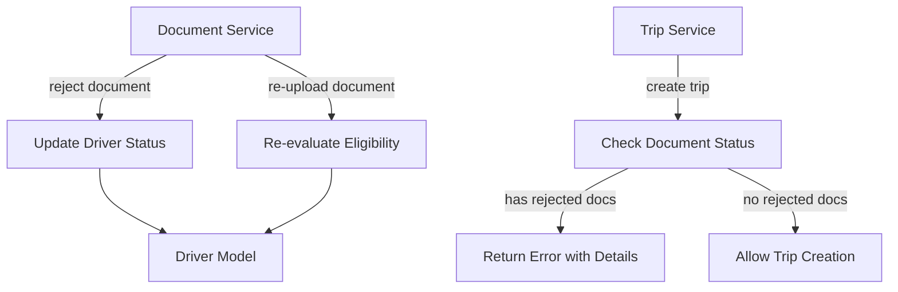

# Design Document

## Overview

This feature fixes the issue where drivers cannot post rides after re-uploading previously rejected documents. The solution involves:

1. Updating driver verification status when documents are rejected
2. Re-evaluating verification eligibility when documents are re-uploaded
3. Modifying ride posting validation to check document status rather than just overall verification status
4. Providing clear error messages when ride posting is blocked due to document issues

## Architecture

The solution modifies existing services without introducing new components:



## Components and Interfaces

### Modified Components

#### 1. documentService.js

**Modified Functions:**

- `rejectDocument(documentId, reviewerId, reason)` - Add logic to update driver verification status to 'pending' when a required document is rejected

- `submitDocument({ driverId, type, file, expiryDate })` - Already handles re-upload correctly, but add verification status re-evaluation after successful re-upload

**New Function:**

- `evaluateDriverVerificationStatus(driverId)` - Evaluates and updates driver verification status based on current document states

```javascript
/**
 * Evaluate and update driver verification status based on document states
 * @param {string} driverId - Driver ID
 * @returns {Promise<{status: string, rejectedDocuments: Array}>}
 */
const evaluateDriverVerificationStatus = async (driverId) => {
  // Returns new status and list of any rejected documents
};
```

#### 2. tripService.js

**Modified Functions:**

- `createTrip(driverId, tripData)` - Modify validation to check for rejected documents instead of just verification status

**New Function:**

- `checkDriverDocumentEligibility(driverId)` - Check if driver has any rejected documents that block ride posting

```javascript
/**
 * Check if driver is eligible to post rides based on document status
 * @param {string} driverId - Driver ID
 * @returns {Promise<{eligible: boolean, rejectedDocuments: Array}>}
 */
const checkDriverDocumentEligibility = async (driverId) => {
  // Returns eligibility and list of rejected documents with reasons
};
```

### Interface Changes

#### Trip Creation Error Response

When ride posting is blocked due to document issues:

```javascript
{
  success: false,
  error: {
    code: 'DOCUMENTS_NEED_ATTENTION',
    message: 'Cannot create trip: Some documents need attention',
    rejectedDocuments: [
      {
        type: 'kyc',
        status: 'rejected',
        rejectionReason: 'Document has expired'
      }
    ]
  }
}
```

## Data Models

No schema changes required. The existing Driver model already has:
- `verificationStatus`: 'pending' | 'verified' | 'suspended'
- `documents[].status`: 'pending' | 'approved' | 'rejected'
- `documents[].rejectionReason`: string

## Correctness Properties

*A property is a characteristic or behavior that should hold true across all valid executions of a system-essentially, a formal statement about what the system should do. Properties serve as the bridge between human-readable specifications and machine-verifiable correctness guarantees.*

### Property 1: Document rejection updates driver status
*For any* verified driver with all required documents approved, when any required document is rejected, the driver's verification status SHALL change to 'pending'.
**Validates: Requirements 1.1, 1.3**

### Property 2: Ride posting eligibility based on document status
*For any* driver, the driver SHALL be allowed to create trips if and only if they have no required documents with 'rejected' status (all required documents are either 'approved' or 'pending').
**Validates: Requirements 2.2, 2.4, 3.3, 4.2**

### Property 3: Rejected document error response completeness
*For any* driver with rejected documents attempting to create a trip, the error response SHALL contain all rejected documents with their types and rejection reasons.
**Validates: Requirements 2.3, 3.1, 3.2**

### Property 4: Document approval restores verified status
*For any* driver with verification status 'pending', when the last required document is approved (all required documents now approved), the driver's verification status SHALL change to 'verified'.
**Validates: Requirements 4.1**

### Property 5: Re-upload triggers eligibility re-evaluation
*For any* driver with a rejected document, when that document is re-uploaded, the driver's ride posting eligibility SHALL be re-evaluated based on current document states.
**Validates: Requirements 2.1**

### Property 6: Latest document version consideration
*For any* driver with multiple uploads of the same document type, the verification system SHALL consider only the most recent upload when evaluating status.
**Validates: Requirements 4.3**

## Error Handling

| Scenario | Error Code | Message | HTTP Status |
|----------|------------|---------|-------------|
| Driver has rejected documents | DOCUMENTS_NEED_ATTENTION | Cannot create trip: Some documents need attention | 403 |
| Driver not found | DRIVER_NOT_FOUND | Driver not found | 404 |
| Invalid trip data | INVALID_TRIP_DATA | Validation errors | 400 |

## Testing Strategy

### Property-Based Testing

The project uses **fast-check** for property-based testing (already configured in the codebase).

Each property test should run a minimum of 100 iterations to ensure coverage of edge cases.

**Test File:** `backend/tests/property/documentValidation.property.test.js`

Property tests will:
1. Generate random driver states with various document combinations
2. Apply operations (reject, approve, re-upload)
3. Verify the resulting state matches the property invariants

### Unit Tests

Unit tests will cover:
- `evaluateDriverVerificationStatus` function with specific document state combinations
- `checkDriverDocumentEligibility` function edge cases
- Error response format validation

**Test File:** `backend/tests/unit/documentValidation.test.js`

### Test Annotations

Each property-based test must be annotated with:
```javascript
// **Feature: driver-document-ride-validation, Property {number}: {property_text}**
```

