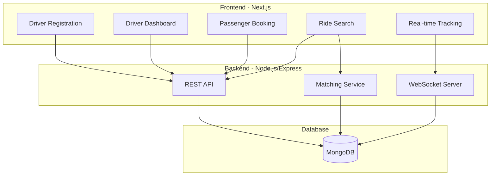

# Driver & Passenger Rides - Design Document

## Overview

This design covers the core ride-sharing functionality including driver registration/onboarding, driver dashboard, passenger ride booking, ride search/matching, and real-time tracking. The system builds on the existing HushRyd platform infrastructure.

## Architecture



## Components and Interfaces

### Frontend Components

#### Driver Components
```javascript
// components/driver/RegistrationForm.jsx
// Multi-step form for driver onboarding

// components/driver/Dashboard.jsx
// Driver main dashboard with trips and earnings

// components/driver/TripCreator.jsx
// Form to create new trips

// components/driver/TripManager.jsx
// Manage active and upcoming trips

// components/driver/EarningsView.jsx
// View earnings and transaction history
```

#### Passenger Components
```javascript
// components/passenger/RideSearch.jsx
// Search form with source, destination, date, seats

// components/passenger/SearchResults.jsx
// Display matching trips with filters

// components/passenger/TripDetails.jsx
// Complete trip information before booking

// components/passenger/BookingConfirmation.jsx
// Booking summary and payment

// components/passenger/MyBookings.jsx
// List of passenger bookings

// components/passenger/LiveTracking.jsx
// Real-time map tracking
```

### Backend API Interfaces

#### Driver Registration API
```javascript
// POST /api/driver/register
const RegisterDriverRequest = {
  personalDetails: {
    name: String,
    phone: String,
    email: String,
    address: String
  },
  vehicleDetails: {
    registrationNumber: String,
    make: String,
    model: String,
    year: Number,
    color: String,
    type: String,  // 'sedan' | 'suv' | 'hatchback'
    seats: Number
  }
}

// POST /api/driver/documents
// Multipart form for document uploads

// GET /api/driver/status
// Returns driver verification status
```

#### Trip Management API
```javascript
// POST /api/trips
const CreateTripRequest = {
  source: { address: String, coordinates: { lat: Number, lng: Number } },
  destination: { address: String, coordinates: { lat: Number, lng: Number } },
  scheduledAt: Date,
  availableSeats: Number,
  farePerSeat: Number,
  vehicleId: String
}

// GET /api/trips/:id
// PUT /api/trips/:id/start
// PUT /api/trips/:id/complete
// DELETE /api/trips/:id (cancel)
```

#### Booking API
```javascript
// POST /api/bookings
const CreateBookingRequest = {
  tripId: String,
  seats: Number,
  pickupPoint: { address: String, coordinates: Object },
  dropPoint: { address: String, coordinates: Object }
}

// GET /api/bookings
// GET /api/bookings/:id
// DELETE /api/bookings/:id (cancel)
```

#### Search API
```javascript
// GET /api/search/rides
const SearchQuery = {
  sourceCoords: { lat: Number, lng: Number },
  destCoords: { lat: Number, lng: Number },
  date: String,
  seats: Number,
  vehicleType: String,  // optional
  maxFare: Number,      // optional
  minRating: Number     // optional
}
```

## Data Models

### Driver Model Extension
```javascript
// Already exists in backend/src/models/Driver.js
// Add methods for onboarding workflow
```

### Booking Model
```javascript
const BookingSchema = {
  _id: ObjectId,
  bookingId: String,        // Human-readable ID
  tripId: ObjectId,
  passengerId: ObjectId,
  seats: Number,
  pickupPoint: LocationSchema,
  dropPoint: LocationSchema,
  fare: Number,
  status: String,           // 'pending' | 'confirmed' | 'cancelled' | 'completed'
  paymentStatus: String,    // 'pending' | 'paid' | 'refunded'
  paymentId: String,
  bookedAt: Date,
  cancelledAt: Date,
  cancelReason: String,
  rating: Number,
  feedback: String,
  createdAt: Date,
  updatedAt: Date
}
```

## Correctness Properties

*A property is a characteristic or behavior that should hold true across all valid executions of a system-essentially, a formal statement about what the system should do. Properties serve as the bridge between human-readable specifications and machine-verifiable correctness guarantees.*

### Property 1: Driver Onboarding Status Transition
*For any* completed driver onboarding (all required fields and documents submitted), the driver status SHALL be set to 'pending_verification'.
**Validates: Requirements 1.5**

### Property 2: Driver Verification Enables Rides
*For any* driver with status 'verified', the system SHALL allow trip creation; for any driver with status other than 'verified', trip creation SHALL be rejected.
**Validates: Requirements 1.6**

### Property 3: Trip Creation Data Integrity
*For any* valid trip creation request, all fields (source, destination, date, time, seats, fare) SHALL be stored and retrievable.
**Validates: Requirements 2.2**

### Property 4: Trip Start Status Transition
*For any* trip with valid passenger OTP verification, the trip status SHALL transition from 'scheduled' to 'in_progress'.
**Validates: Requirements 2.4**

### Property 5: Trip Completion Triggers Payment
*For any* trip marked as completed, the payment processing SHALL be triggered and trip status SHALL be 'completed'.
**Validates: Requirements 2.5**

### Property 6: Earnings Consistency
*For any* driver, the total earnings SHALL equal the sum of all completed trip payouts minus platform commission.
**Validates: Requirements 2.6**

### Property 7: Search Results Completeness
*For any* search result, each trip SHALL contain driver info, vehicle details, departure time, and fare.
**Validates: Requirements 3.2**

### Property 8: Booking Seat Reservation
*For any* confirmed booking, the trip's available seats SHALL be decremented by the booked seat count.
**Validates: Requirements 3.4**

### Property 9: Booking Confirmation on Payment
*For any* successful payment, the booking status SHALL be 'confirmed' and a booking reference SHALL be generated.
**Validates: Requirements 3.5**

### Property 10: Geo-Search Radius Matching
*For any* search query, all returned trips SHALL have source within 5km of search source AND destination within 5km of search destination.
**Validates: Requirements 4.1**

### Property 11: Search Result Sorting
*For any* search results sorted by departure time, the results SHALL be in ascending chronological order.
**Validates: Requirements 4.2**

### Property 12: Overbooking Prevention
*For any* booking attempt where requested seats exceed available seats, the booking SHALL be rejected.
**Validates: Requirements 4.5**

### Property 13: Passenger Cancellation Refund
*For any* passenger cancellation before trip start, a refund SHALL be processed according to the cancellation policy.
**Validates: Requirements 6.1**

### Property 14: Driver Cancellation Full Refund
*For any* driver-initiated trip cancellation, all booked passengers SHALL receive full refunds.
**Validates: Requirements 6.2**

### Property 15: Rating Storage
*For any* rating submission (1-5 stars), the rating SHALL be stored and associated with the correct trip and user.
**Validates: Requirements 6.4**

## Error Handling

| Error Code | Condition | Response |
|------------|-----------|----------|
| DRIVER_001 | Driver not verified | 403 Forbidden |
| DRIVER_002 | Invalid vehicle data | 400 Bad Request |
| TRIP_001 | Trip not found | 404 Not Found |
| TRIP_002 | Trip already started | 400 Bad Request |
| TRIP_003 | Invalid OTP | 401 Unauthorized |
| BOOKING_001 | Insufficient seats | 400 Bad Request |
| BOOKING_002 | Trip not available | 400 Bad Request |
| BOOKING_003 | Payment failed | 402 Payment Required |
| SEARCH_001 | Invalid coordinates | 400 Bad Request |

## Testing Strategy

### Property-Based Testing Framework
- **Library**: fast-check (JavaScript)
- **Test Runner**: Jest
- **Minimum iterations**: 100 per property test

### Unit Testing
- Driver registration validation
- Trip CRUD operations
- Booking workflow
- Search algorithm
- Refund calculations

### Property-Based Tests
Each correctness property will have a corresponding property-based test tagged with:
`**Feature: driver-passenger-rides, Property {number}: {property_text}**`
