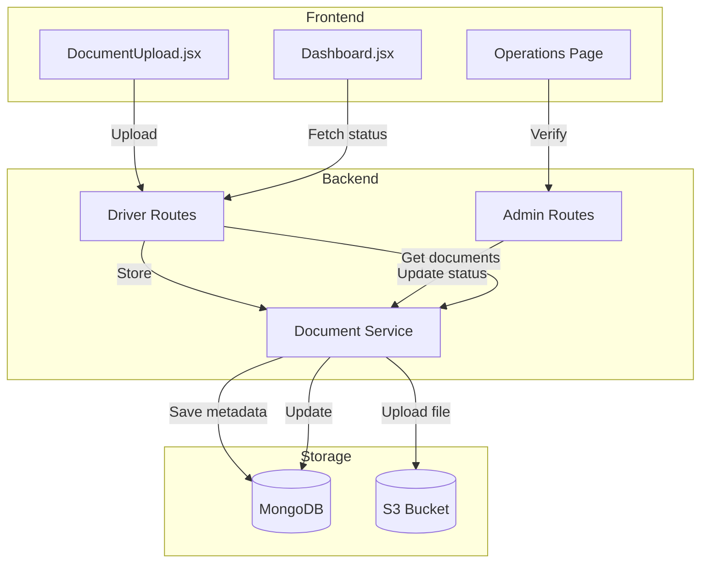

# Design Document: Driver Photo & Document Fixes

## Overview

This design addresses three interconnected issues in the HushRyd driver document management system:

1. **Missing optional document uploads**: The driver frontend currently only shows 4 required document types but doesn't allow uploading selfie_with_car and vehicle_photo
2. **Invalid document ID format error**: The admin operations panel is sending incorrect document IDs when approving/rejecting documents
3. **Rejection comment synchronization**: Ensuring rejection reasons are properly stored and displayed to drivers

## Architecture

The existing architecture supports these fixes with minimal changes:



## Components and Interfaces

### 1. Frontend: DocumentUpload.jsx

**Current Issue**: The `REQUIRED_DOCUMENTS` array only contains 4 document types. Optional documents (selfie_with_car, vehicle_photo) are not included.

**Fix**: Add a separate `OPTIONAL_DOCUMENTS` array and render both sections.

```javascript
const REQUIRED_DOCUMENTS = [
  { type: 'license', label: 'Driving License', ... },
  { type: 'registration', label: 'Vehicle Registration', ... },
  { type: 'insurance', label: 'Insurance', ... },
  { type: 'kyc', label: 'KYC Document', ... }
];

const OPTIONAL_DOCUMENTS = [
  { type: 'selfie_with_car', label: 'Selfie with Car', description: 'Photo of you with your vehicle', accept: '.jpg,.jpeg,.png' },
  { type: 'vehicle_photo', label: 'Vehicle Photo', description: 'Clear photo of your vehicle', accept: '.jpg,.jpeg,.png' }
];
```

### 2. Frontend: Operations Page (Admin)

**Current Issue**: The document ID being passed to `handleApproveDocument` and `handleRejectDocument` may not be a valid MongoDB ObjectId string.

**Root Cause Analysis**: Looking at the code, when documents are fetched via `fetchDriverDocuments`, the response structure may have nested `_id` fields or the ID might be an object instead of a string.

**Fix**: Ensure document IDs are properly extracted as strings before API calls.

```javascript
const handleApproveDocument = async (docId) => {
  // Ensure docId is a string
  const documentId = typeof docId === 'object' ? docId._id?.toString() || docId.toString() : docId;
  
  // Validate format before sending
  if (!documentId || !/^[0-9a-fA-F]{24}$/.test(documentId)) {
    alert('Invalid document ID format');
    return;
  }
  // ... rest of function
};
```

### 3. Backend: Document Service

**Current Implementation**: The `verifyDocument`, `approveDocument`, and `rejectDocument` functions already validate ObjectId format. The issue is likely in how the frontend extracts the ID.

**Enhancement**: Add more detailed error messages for debugging.

### 4. Document Re-upload Flow

**Current Issue**: When a driver re-uploads a rejected document, the `submitDocument` function adds a NEW document to the array instead of replacing the rejected one. This causes:
- Multiple documents of the same type in the database
- Operations may see the old rejected document instead of the new one
- Confusion about which document to review

**Fix**: Modify `submitDocument` to detect if a rejected document of the same type exists and replace it instead of creating a new one.

```javascript
// In documentService.submitDocument
const submitDocument = async ({ driverId, type, file, expiryDate = null }) => {
  // ... validation code ...
  
  // Check if there's an existing rejected document of this type
  const existingRejectedDoc = driver.documents.find(
    doc => doc.type === type && doc.status === 'rejected'
  );
  
  if (existingRejectedDoc) {
    // Delete old file from S3
    if (existingRejectedDoc.s3Key) {
      await s3Service.deleteFile(existingRejectedDoc.s3Key);
    }
    
    // Update existing document with new file
    existingRejectedDoc.s3Key = uploadResult.key;
    existingRejectedDoc.s3Bucket = uploadResult.bucket;
    existingRejectedDoc.originalFilename = file.originalname;
    existingRejectedDoc.contentType = file.mimetype;
    existingRejectedDoc.fileSize = file.size;
    existingRejectedDoc.uploadedAt = new Date();
    existingRejectedDoc.status = 'pending';
    existingRejectedDoc.rejectionReason = undefined;
    existingRejectedDoc.reviewedBy = undefined;
    existingRejectedDoc.reviewedAt = undefined;
    
    await driver.save();
    return { /* document details */ };
  }
  
  // No rejected document exists, create new one
  // ... existing code ...
};
```

## Data Models

### Driver Document Schema (Existing - No Changes)

```javascript
const DriverDocumentSchema = {
  type: { type: String, enum: ['license', 'registration', 'insurance', 'kyc', 'selfie_with_car', 'vehicle_photo'] },
  s3Key: String,
  status: { type: String, enum: ['pending', 'approved', 'rejected'] },
  rejectionReason: String,
  reviewedBy: ObjectId,
  reviewedAt: Date,
  // ... other fields
};
```

The schema already supports all 6 document types and rejection reasons.

## Correctness Properties

*A property is a characteristic or behavior that should hold true across all valid executions of a system-essentially, a formal statement about what the system should do. Properties serve as the bridge between human-readable specifications and machine-verifiable correctness guarantees.*

### Property 1: File validation rejects invalid inputs
*For any* file with a MIME type not in ['image/jpeg', 'image/png', 'application/pdf'] or size greater than 5MB, the upload validation SHALL reject the file and return an appropriate error message.
**Validates: Requirements 1.2**

### Property 2: Document ID validation
*For any* string input to the document verification endpoint, the system SHALL accept only valid 24-character hexadecimal MongoDB ObjectId strings and reject all others with an INVALID_DOCUMENT_ID error.
**Validates: Requirements 2.3**

### Property 3: Rejection reason round-trip
*For any* document rejection with a non-empty reason string, querying that document SHALL return the exact same rejection reason that was provided during rejection.
**Validates: Requirements 3.1, 3.4**

### Property 4: Re-upload replaces rejected document
*For any* driver with a rejected document of type T, when uploading a new document of type T, the system SHALL have exactly one document of type T with status 'pending' and no documents of type T with status 'rejected'.
**Validates: Requirements 4.1, 4.2, 4.3**

### Property 5: Re-upload clears rejection metadata
*For any* re-uploaded document that was previously rejected, the document SHALL have no rejectionReason, no reviewedBy, and no reviewedAt fields set.
**Validates: Requirements 4.2, 4.3**

## Error Handling

| Error Code | Condition | User Message |
|------------|-----------|--------------|
| INVALID_DOCUMENT_ID | Document ID is not a valid ObjectId | "Invalid document ID format" |
| INVALID_FILE_TYPE | File MIME type not allowed | "Only JPEG, PNG, and PDF files are allowed" |
| FILE_TOO_LARGE | File exceeds 5MB | "File size must be less than 5MB" |
| DOCUMENT_NOT_FOUND | Document doesn't exist | "Document not found" |
| DOCUMENT_ALREADY_PROCESSED | Document already approved/rejected | "Document already {status}" |

## Testing Strategy

### Unit Tests
- Test file validation logic with various file types and sizes
- Test ObjectId validation with valid and invalid strings
- Test rejection reason storage and retrieval

### Property-Based Tests
Using fast-check for JavaScript property-based testing:

1. **File Validation Property**: Generate random file objects with various MIME types and sizes, verify validation correctly accepts/rejects
2. **ObjectId Validation Property**: Generate random strings (valid ObjectIds, invalid strings, edge cases), verify validation behavior
3. **Rejection Reason Round-Trip Property**: Generate random rejection reasons, verify they are stored and retrieved correctly

### Integration Tests
- Test full upload flow for optional documents
- Test approve/reject flow from admin panel
- Test driver dashboard displays rejection reasons correctly
