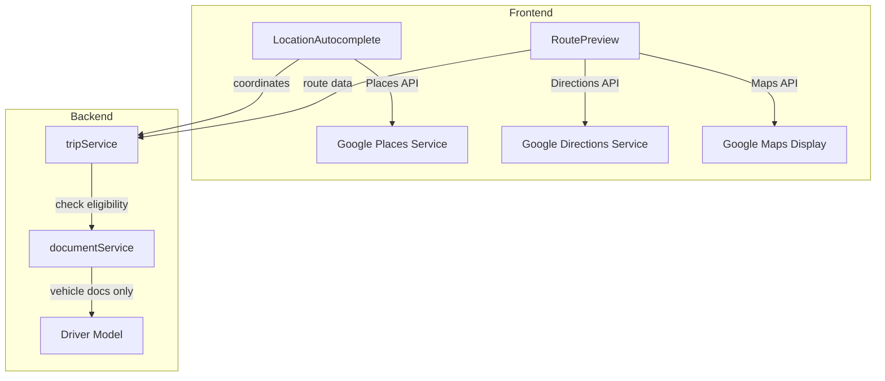

# Design Document: Google Maps Integration

## Overview

This feature integrates Google Maps APIs for enhanced location selection and route visualization, and updates the document verification requirements to exclude government ID from ride posting eligibility. The implementation includes:

1. Google Places Autocomplete for pickup/drop-off location selection
2. Google Maps route preview showing journey path, distance, and duration
3. Updated document eligibility logic - only vehicle documents (license, registration, insurance) required for ride posting

## Architecture



## Components and Interfaces

### 1. Frontend Components

#### LocationAutocomplete (Enhanced)
Already exists at `frontend/src/components/search/LocationAutocomplete.jsx`. No changes needed - already integrates Google Places API.

#### RoutePreviewMap (New Component)
```javascript
// frontend/src/components/maps/RoutePreviewMap.jsx
/**
 * Displays route between two locations using Google Maps
 * @param {Object} source - Source location with coordinates
 * @param {Object} destination - Destination location with coordinates
 * @param {Function} onRouteCalculated - Callback with distance/duration
 */
```

### 2. Backend Services

#### tripService.js (Modified)
Update `REQUIRED_DOCUMENT_TYPES` to exclude 'kyc':
```javascript
// Before: ['license', 'registration', 'insurance', 'kyc']
// After:
const REQUIRED_DOCUMENT_TYPES = ['license', 'registration', 'insurance'];
```

#### documentService.js (Modified)
Update eligibility check to exclude KYC from required documents.

### 3. API Endpoints

| Endpoint | Method | Description |
|----------|--------|-------------|
| `/api/trips` | POST | Create trip with Google Places coordinates |
| `/api/search` | GET | Search rides with geo-coordinates |

## Data Models

### Location Schema (Existing)
```javascript
{
  address: String,      // Formatted address from Google Places
  name: String,         // Place name
  coordinates: {
    lat: Number,
    lng: Number
  },
  placeId: String       // Google Place ID for reference
}
```

### Route Schema (Existing in Trip)
```javascript
{
  distance: Number,     // Distance in meters
  duration: Number,     // Duration in seconds
  polyline: String      // Encoded polyline for map display
}
```

### Required Documents (Updated)
```javascript
// Only vehicle-related documents required for ride posting
const REQUIRED_DOCUMENT_TYPES = ['license', 'registration', 'insurance'];
// KYC is optional - not required for ride posting eligibility
```

## Correctness Properties

*A property is a characteristic or behavior that should hold true across all valid executions of a system-essentially, a formal statement about what the system should do. Properties serve as the bridge between human-readable specifications and machine-verifiable correctness guarantees.*

### Property 1: Location Selection Data Persistence
*For any* location selected from Google Places autocomplete, the stored data SHALL contain the place name, formatted address, and valid coordinates (lat/lng within valid ranges).
**Validates: Requirements 5.2, 5.4**

### Property 2: Route Preview Data Completeness
*For any* route preview request with valid source and destination coordinates, the response SHALL contain distance (in meters) and duration (in seconds).
**Validates: Requirements 6.3**

### Property 3: Vehicle Documents Only for Ride Posting Eligibility
*For any* driver with license, registration, and insurance documents approved, the driver SHALL be eligible to post rides regardless of KYC document status (pending, approved, rejected, or missing).
**Validates: Requirements 9.1, 9.2, 9.4**

## Error Handling

| Scenario | Error Code | Message | HTTP Status |
|----------|------------|---------|-------------|
| Google Places API unavailable | PLACES_API_ERROR | Location service unavailable | 503 |
| Route calculation failed | ROUTE_CALCULATION_FAILED | Unable to calculate route | 400 |
| Invalid coordinates | INVALID_COORDINATES | Coordinates outside serviceable area | 400 |
| Vehicle documents not approved | DOCUMENTS_NEED_ATTENTION | Vehicle documents need attention | 403 |

## Testing Strategy

### Property-Based Testing Library
- **Library**: fast-check (JavaScript)
- **Minimum iterations**: 100 per property test

### Unit Tests
- Location data validation
- Route data validation
- Document eligibility logic with KYC excluded

### Property-Based Tests

1. **Property 1 Test**: Generate random location selections, verify stored data contains name, address, and valid coordinates
2. **Property 2 Test**: Generate random coordinate pairs, request route, verify distance and duration present
3. **Property 3 Test**: Generate drivers with various document combinations (KYC approved/pending/rejected/missing), verify eligibility based only on vehicle docs

### Test Annotations
Each property-based test MUST be tagged with:
```javascript
// **Feature: google-maps-integration, Property {number}: {property_text}**
// **Validates: Requirements X.Y**
```

## Environment Configuration

### Required Environment Variables
```
NEXT_PUBLIC_GOOGLE_MAPS_API_KEY=your_google_maps_api_key
```

### Google Cloud Console Setup
1. Enable Places API
2. Enable Maps JavaScript API
3. Enable Directions API
4. Restrict API key to your domains

