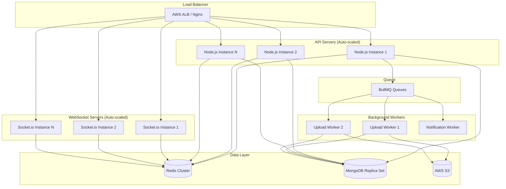

# High-Load Scalability - Design Document

## Overview

This design addresses the critical challenge of handling 10,000+ concurrent users on HushRyd platform without crashes or service degradation. The architecture implements horizontal scaling, message queues for document uploads, Redis for real-time tracking, connection pooling, and graceful degradation patterns.

### Technology Stack Additions

- **Redis**: Session storage, caching, real-time pub/sub for tracking
- **BullMQ**: Background job queue for document processing
- **Socket.io with Redis Adapter**: Horizontally scalable WebSocket connections
- **PM2 Cluster Mode**: Multi-process Node.js for CPU utilization
- **AWS S3 Presigned URLs**: Direct upload bypassing backend
- **MongoDB Connection Pooling**: Efficient database connection reuse
- **Rate Limiting (express-rate-limit + Redis)**: Distributed rate limiting

## Architecture



## Components and Interfaces

### 1. Document Upload System (Handles 7K concurrent uploads)

```javascript
// services/uploadService.js
/**
 * Design Decision: S3 Presigned URLs for direct upload
 * Rationale: Bypasses backend servers completely, S3 handles unlimited concurrent uploads
 * 
 * Flow:
 * 1. Client requests presigned URL from backend (lightweight)
 * 2. Client uploads directly to S3 (no backend load)
 * 3. S3 triggers Lambda or client notifies backend
 * 4. Backend queues document for processing
 */

const generatePresignedUrl = async (userId, documentType, fileType) => {
  const key = `documents/${userId}/${documentType}/${Date.now()}.${fileType}`;
  
  const command = new PutObjectCommand({
    Bucket: process.env.S3_BUCKET,
    Key: key,
    ContentType: `image/${fileType}`,
    Metadata: {
      userId,
      documentType,
      uploadedAt: new Date().toISOString()
    }
  });
  
  const presignedUrl = await getSignedUrl(s3Client, command, { 
    expiresIn: 3600 // 1 hour validity
  });
  
  return { presignedUrl, key };
};

/**
 * Queue document for processing after upload
 * Design Decision: BullMQ with Redis for guaranteed delivery
 * Rationale: Handles 7K+ concurrent uploads without blocking API
 */
const queueDocumentProcessing = async (documentData) => {
  const job = await documentQueue.add('process-document', documentData, {
    attempts: 3,
    backoff: {
      type: 'exponential',
      delay: 2000
    },
    removeOnComplete: 100,
    removeOnFail: 50
  });
  
  // Return queue position for user feedback
  const waiting = await documentQueue.getWaitingCount();
  return {
    jobId: job.id,
    queuePosition: waiting,
    estimatedWait: Math.ceil(waiting / 100) // 100 docs/min processing rate
  };
};
```

### 2. Real-Time Tracking System (Handles 3K concurrent sessions)

```javascript
// services/trackingService.js
/**
 * Design Decision: Redis Pub/Sub for location broadcasting
 * Rationale: Decouples location updates from WebSocket servers,
 * allows horizontal scaling of Socket.io instances
 */

const redis = require('ioredis');
const pub = new redis(process.env.REDIS_URL);
const sub = new redis(process.env.REDIS_URL);

// Driver sends location update
const updateDriverLocation = async (driverId, tripId, location) => {
  const locationData = {
    driverId,
    tripId,
    lat: location.lat,
    lng: location.lng,
    speed: location.speed,
    heading: location.heading,
    timestamp: Date.now()
  };
  
  // Store in Redis (not MongoDB) for real-time access
  // TTL of 5 minutes - old locations auto-expire
  await redis.setex(
    `location:driver:${driverId}`,
    300,
    JSON.stringify(locationData)
  );
  
  // Publish to trip channel for all subscribers
  await pub.publish(`trip:${tripId}:location`, JSON.stringify(locationData));
  
  // Batch write to MongoDB every 30 seconds for history
  await locationBuffer.add(locationData);
};

// Socket.io with Redis Adapter for horizontal scaling
const { createAdapter } = require('@socket.io/redis-adapter');

const setupSocketServer = (httpServer) => {
  const io = new Server(httpServer, {
    cors: { origin: '*' },
    pingTimeout: 60000,
    pingInterval: 25000,
    transports: ['websocket', 'polling']
  });
  
  // Redis adapter allows multiple Socket.io instances
  const pubClient = new redis(process.env.REDIS_URL);
  const subClient = pubClient.duplicate();
  io.adapter(createAdapter(pubClient, subClient));
  
  io.on('connection', (socket) => {
    // Subscribe to trip tracking
    socket.on('track:subscribe', async (tripId) => {
      socket.join(`trip:${tripId}`);
      
      // Send last known location immediately
      const lastLocation = await redis.get(`location:trip:${tripId}`);
      if (lastLocation) {
        socket.emit('location:update', JSON.parse(lastLocation));
      }
    });
  });
  
  // Listen to Redis pub/sub and broadcast to rooms
  sub.subscribe('trip:*:location');
  sub.on('message', (channel, message) => {
    const tripId = channel.split(':')[1];
    io.to(`trip:${tripId}`).emit('location:update', JSON.parse(message));
  });
  
  return io;
};
```

### 3. Database Connection Pooling

```javascript
// config/database.js
/**
 * Design Decision: Connection pooling with queue on exhaustion
 * Rationale: 100 connections can serve 10K users with proper pooling
 */

const mongoose = require('mongoose');

const connectDB = async () => {
  const options = {
    // Connection pool settings
    maxPoolSize: 100,           // Max connections per server
    minPoolSize: 10,            // Keep minimum connections ready
    maxIdleTimeMS: 30000,       // Close idle connections after 30s
    waitQueueTimeoutMS: 10000,  // Wait 10s for connection before error
    
    // Read preference for load distribution
    readPreference: 'secondaryPreferred', // Use replicas for reads
    
    // Retry settings
    retryWrites: true,
    retryReads: true,
    
    // Timeouts
    serverSelectionTimeoutMS: 5000,
    socketTimeoutMS: 45000,
    connectTimeoutMS: 10000
  };
  
  mongoose.connection.on('error', (err) => {
    logger.error('MongoDB connection error:', err);
    // Don't crash - attempt reconnection
  });
  
  mongoose.connection.on('disconnected', () => {
    logger.warn('MongoDB disconnected, attempting reconnection...');
  });
  
  await mongoose.connect(process.env.MONGODB_URI, options);
  logger.info('MongoDB connected with connection pooling');
};

// Query timeout wrapper
const withTimeout = async (query, timeoutMs = 5000) => {
  const timeoutPromise = new Promise((_, reject) => {
    setTimeout(() => reject(new Error('Query timeout')), timeoutMs);
  });
  
  try {
    return await Promise.race([query, timeoutPromise]);
  } catch (error) {
    if (error.message === 'Query timeout') {
      // Try to serve from cache
      return null; // Caller handles cache fallback
    }
    throw error;
  }
};
```

### 4. Rate Limiting with Redis

```javascript
// middleware/rateLimiter.js
/**
 * Design Decision: Distributed rate limiting with Redis
 * Rationale: Works across multiple API instances
 */

const rateLimit = require('express-rate-limit');
const RedisStore = require('rate-limit-redis');

// Standard rate limit for most endpoints
const standardLimiter = rateLimit({
  store: new RedisStore({
    client: redisClient,
    prefix: 'rl:standard:'
  }),
  windowMs: 60 * 1000, // 1 minute
  max: 100,            // 100 requests per minute
  message: {
    error: 'Too many requests',
    retryAfter: 60
  },
  standardHeaders: true,
  legacyHeaders: false
});

// Higher limit for critical endpoints (SOS, tracking)
const criticalLimiter = rateLimit({
  store: new RedisStore({
    client: redisClient,
    prefix: 'rl:critical:'
  }),
  windowMs: 60 * 1000,
  max: 300,            // 300 requests per minute for critical
  message: {
    error: 'Rate limit exceeded for critical endpoint',
    retryAfter: 30
  }
});

// Upload-specific limiter (generous for document uploads)
const uploadLimiter = rateLimit({
  store: new RedisStore({
    client: redisClient,
    prefix: 'rl:upload:'
  }),
  windowMs: 60 * 1000,
  max: 20,             // 20 upload requests per minute per user
  keyGenerator: (req) => req.user?.id || req.ip
});

// Circuit breaker for system protection
const circuitBreaker = {
  state: 'CLOSED',
  failures: 0,
  threshold: 50,
  resetTimeout: 30000,
  
  async execute(fn) {
    if (this.state === 'OPEN') {
      throw new Error('Circuit breaker is OPEN');
    }
    
    try {
      const result = await fn();
      this.failures = 0;
      return result;
    } catch (error) {
      this.failures++;
      if (this.failures >= this.threshold) {
        this.state = 'OPEN';
        setTimeout(() => {
          this.state = 'HALF-OPEN';
        }, this.resetTimeout);
      }
      throw error;
    }
  }
};
```

### 5. Caching Layer

```javascript
// services/cacheService.js
/**
 * Design Decision: Multi-tier caching with Redis
 * Rationale: Reduces database load by 80%+ for read operations
 */

const cacheService = {
  // User profile cache (5 min TTL)
  async getUserProfile(userId) {
    const cacheKey = `user:profile:${userId}`;
    
    // Try cache first
    const cached = await redis.get(cacheKey);
    if (cached) {
      return JSON.parse(cached);
    }
    
    // Cache miss - fetch from DB
    const user = await User.findById(userId).lean();
    if (user) {
      await redis.setex(cacheKey, 300, JSON.stringify(user));
    }
    return user;
  },
  
  // Trip search cache (30 sec TTL - data changes frequently)
  async searchTrips(searchParams) {
    const cacheKey = `search:${JSON.stringify(searchParams)}`;
    
    const cached = await redis.get(cacheKey);
    if (cached) {
      return JSON.parse(cached);
    }
    
    const results = await Trip.find(searchParams).lean();
    await redis.setex(cacheKey, 30, JSON.stringify(results));
    return results;
  },
  
  // Driver location (real-time, no DB write)
  async getDriverLocation(driverId) {
    return redis.get(`location:driver:${driverId}`);
  },
  
  // Invalidate cache on update
  async invalidateUser(userId) {
    await redis.del(`user:profile:${userId}`);
  }
};
```

### 6. BullMQ Queue Configuration

```javascript
// queues/documentQueue.js
/**
 * Design Decision: Separate queues for different job types
 * Rationale: Allows independent scaling and prioritization
 */

const { Queue, Worker } = require('bullmq');

const connection = {
  host: process.env.REDIS_HOST,
  port: process.env.REDIS_PORT
};

// Document processing queue
const documentQueue = new Queue('document-processing', {
  connection,
  defaultJobOptions: {
    attempts: 3,
    backoff: { type: 'exponential', delay: 2000 },
    removeOnComplete: { count: 1000 },
    removeOnFail: { count: 500 }
  }
});

// Worker with concurrency control
const documentWorker = new Worker('document-processing', async (job) => {
  const { userId, documentType, s3Key } = job.data;
  
  // Process document (validate, compress, extract metadata)
  const result = await processDocument(s3Key);
  
  // Update database
  await Driver.updateOne(
    { userId },
    { $push: { documents: result } }
  );
  
  // Notify user
  await notificationQueue.add('document-processed', {
    userId,
    documentType,
    status: 'processed'
  });
  
  return result;
}, {
  connection,
  concurrency: 10,  // Process 10 documents simultaneously
  limiter: {
    max: 100,       // Max 100 jobs per minute
    duration: 60000
  }
});

// Auto-scale workers based on queue depth
const autoScaleWorkers = async () => {
  const waiting = await documentQueue.getWaitingCount();
  
  if (waiting > 5000) {
    // Spawn additional workers (in production, trigger auto-scaling)
    logger.warn(`Queue depth high: ${waiting}. Consider scaling workers.`);
  }
};

setInterval(autoScaleWorkers, 30000);
```

### 7. Mobile App Crash Prevention

```javascript
// mobile-app/src/services/api/resilientClient.js
/**
 * Design Decision: Resilient API client with retry and offline support
 * Rationale: Prevents app crashes from network issues
 */

const createResilientClient = () => {
  const client = axios.create({
    baseURL: API_URL,
    timeout: 10000
  });
  
  // Retry interceptor
  client.interceptors.response.use(
    response => response,
    async error => {
      const config = error.config;
      
      // Don't retry if already retried 3 times
      if (config._retryCount >= 3) {
        return Promise.reject(error);
      }
      
      config._retryCount = (config._retryCount || 0) + 1;
      
      // Exponential backoff
      const delay = Math.pow(2, config._retryCount) * 1000;
      await new Promise(resolve => setTimeout(resolve, delay));
      
      return client(config);
    }
  );
  
  return client;
};

// Offline queue for critical actions
const offlineQueue = {
  queue: [],
  
  add(action) {
    this.queue.push({
      ...action,
      timestamp: Date.now()
    });
    AsyncStorage.setItem('offlineQueue', JSON.stringify(this.queue));
  },
  
  async sync() {
    const stored = await AsyncStorage.getItem('offlineQueue');
    if (!stored) return;
    
    const queue = JSON.parse(stored);
    for (const action of queue) {
      try {
        await this.execute(action);
        this.queue = this.queue.filter(a => a.timestamp !== action.timestamp);
      } catch (error) {
        // Keep in queue for next sync
      }
    }
    
    await AsyncStorage.setItem('offlineQueue', JSON.stringify(this.queue));
  }
};

// Network status listener
NetInfo.addEventListener(state => {
  if (state.isConnected) {
    offlineQueue.sync();
  }
});
```

## Data Models

### Queue Job Schema
```javascript
const QueueJobSchema = {
  id: String,
  type: String,           // 'document-processing' | 'notification' | 'payment'
  data: Object,
  status: String,         // 'waiting' | 'active' | 'completed' | 'failed'
  attempts: Number,
  maxAttempts: Number,
  createdAt: Date,
  processedAt: Date,
  failedReason: String
};
```

### Location Cache Schema (Redis)
```javascript
// Stored in Redis, not MongoDB
const LocationCacheSchema = {
  driverId: String,
  tripId: String,
  lat: Number,
  lng: Number,
  speed: Number,
  heading: Number,
  timestamp: Number,
  ttl: 300  // 5 minutes
};
```

## Correctness Properties

*A property is a characteristic or behavior that should hold true across all valid executions of a system-essentially, a formal statement about what the system should do. Properties serve as the bridge between human-readable specifications and machine-verifiable correctness guarantees.*

### Property 1: Upload Queue Guaranteed Delivery
*For any* document upload request, if the presigned URL is generated successfully, the document SHALL eventually be processed (within retry limits) regardless of server restarts or failures.
**Validates: Requirements 1.3, 1.5**

### Property 2: Location Update Latency
*For any* driver location update, all subscribed passengers SHALL receive the update within 500ms under normal load conditions.
**Validates: Requirements 2.1, 2.2**

### Property 3: Connection Pool Efficiency
*For any* set of concurrent database requests, the system SHALL serve all requests using at most maxPoolSize connections without connection leaks.
**Validates: Requirements 3.1, 3.2**

### Property 4: Rate Limit Fairness
*For any* user, rate limiting SHALL be applied consistently across all API instances using distributed state.
**Validates: Requirements 4.1, 4.2**

### Property 5: Cache Consistency
*For any* cached data, after invalidation, subsequent reads SHALL return fresh data from the database.
**Validates: Requirements 6.4**

### Property 6: Graceful Degradation Priority
*For any* system overload scenario, SOS alerts and live tracking SHALL continue functioning while non-critical features are shed.
**Validates: Requirements 8.1, 8.2**

### Property 7: Offline Queue Persistence
*For any* critical action queued while offline, the action SHALL be persisted and executed when connectivity is restored.
**Validates: Requirements 7.6**

### Property 8: Auto-Scale Response Time
*For any* scaling trigger condition, new instances SHALL be launched and receiving traffic within 5 minutes.
**Validates: Requirements 5.1, 5.3**

## Error Handling

| Error Code | Condition | Response | System Action |
|------------|-----------|----------|---------------|
| SCALE_001 | Queue depth exceeded | 202 Accepted | Auto-scale workers |
| SCALE_002 | Connection pool exhausted | 503 Retry | Queue request, alert ops |
| SCALE_003 | Rate limit exceeded | 429 Too Many | Return Retry-After header |
| SCALE_004 | Circuit breaker open | 503 Unavailable | Shed non-critical requests |
| SCALE_005 | Cache unavailable | 200 (degraded) | Fall back to database |
| SCALE_006 | WebSocket capacity reached | Reconnect | Spawn new instance |

## Testing Strategy

### Load Testing
- Use k6 or Artillery for load testing
- Simulate 10,000 concurrent users
- Test document upload with 7,000 concurrent uploads
- Test tracking with 3,000 concurrent WebSocket connections

### Property-Based Tests
- Test queue delivery guarantees
- Test rate limiter distribution
- Test cache invalidation consistency

### Chaos Engineering
- Kill random instances during load test
- Simulate Redis failure
- Simulate MongoDB replica failover
- Test circuit breaker activation

