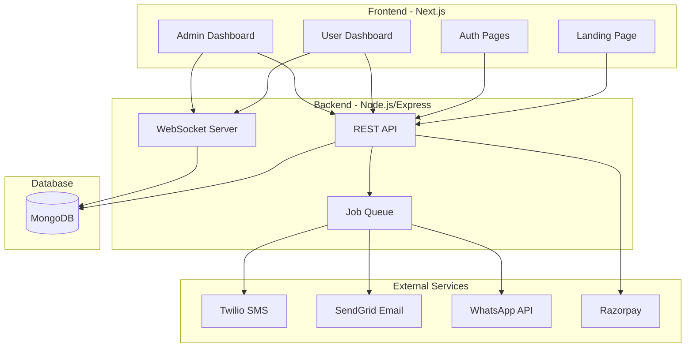
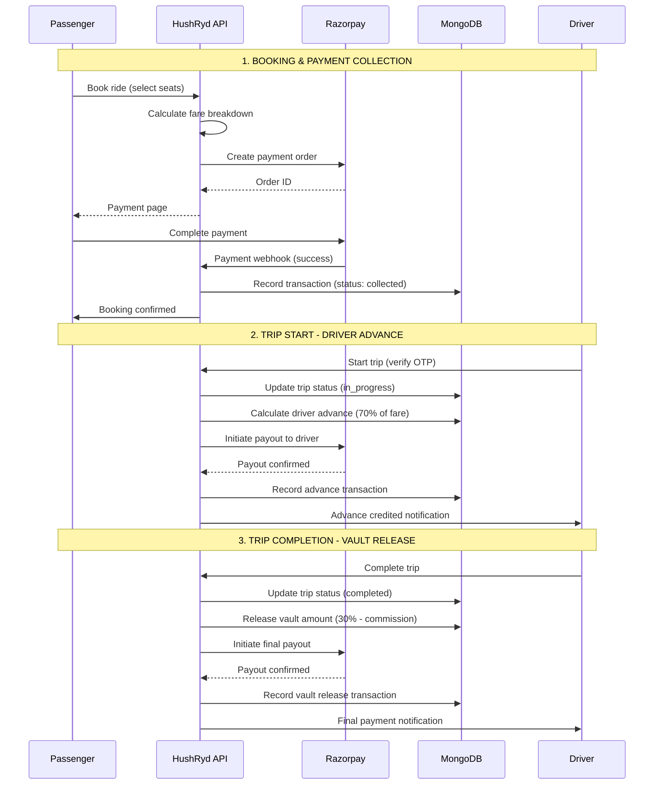

# HushRyd Platform - Design Document

## Overview

HushRyd is a full-stack ride-sharing web application built with Next.js (frontend), Node.js/Express (backend API), and MongoDB (database). The platform provides a responsive landing page, OTP-based authentication, multi-channel notifications, and a comprehensive admin dashboard for managing rides, payments, document verification, and emergency support.

### Technology Stack

- **Frontend**: Next.js 14 (App Router), JavaScript (ES6+), Tailwind CSS, React Query
- **Backend**: Node.js, Express.js, JavaScript (ES6+)
- **Database**: MongoDB with Mongoose ODM
- **Authentication**: JWT tokens with OTP verification
- **External Services**: Twilio (SMS), SendGrid (Email), WhatsApp Business API, Razorpay (Payments)
- **Real-time**: Socket.io for live tracking and SOS alerts
- **Validation**: Joi for request validation, JSDoc for type documentation

## Architecture



## Components and Interfaces

### Frontend Components

#### 1. Landing Page Components
```javascript
// components/landing/Hero.jsx
/**
 * @typedef {Object} HeroProps
 * @property {string} title
 * @property {string} subtitle
 * @property {string} ctaText
 * @property {Function} onCtaClick
 */

// components/landing/Features.jsx
/**
 * @typedef {Object} Feature
 * @property {string} icon
 * @property {string} title
 * @property {string} description
 */

// components/landing/HowItWorks.jsx
/**
 * @typedef {Object} Step
 * @property {number} number
 * @property {string} title
 * @property {string} description
 * @property {string} image
 */

// components/landing/SafetySection.jsx
/**
 * @typedef {Object} SafetyFeature
 * @property {string} icon
 * @property {string} title
 * @property {string} description
 */

// components/landing/Testimonials.jsx
/**
 * @typedef {Object} Testimonial
 * @property {string} id
 * @property {string} name
 * @property {string} role
 * @property {string} content
 * @property {number} rating
 * @property {string} avatar
 */

// components/landing/Pricing.jsx
/**
 * @typedef {Object} PricingTier
 * @property {string} name
 * @property {string} price
 * @property {string[]} features
 * @property {boolean} highlighted
 */

// components/landing/Footer.jsx
/**
 * @typedef {Object} FooterLink
 * @property {string} label
 * @property {string} href
 */

// components/landing/Header.jsx
// Design Decision: Sticky header with smooth scroll navigation
// Rationale: Improves UX by keeping navigation accessible and providing visual feedback during scroll
/**
 * @typedef {Object} HeaderProps
 * @property {string} logo
 * @property {NavItem[]} navItems
 * @property {boolean} isSticky
 * @property {Function} onNavClick
 */

/**
 * @typedef {Object} NavItem
 * @property {string} label
 * @property {string} sectionId
 * @property {string} href
 */
```

#### 2. Authentication Components
```javascript
// components/auth/OTPInput.jsx
/**
 * @typedef {Object} OTPInputProps
 * @property {number} length - Number of OTP digits (default: 6)
 * @property {string} value
 * @property {Function} onChange
 * @property {Function} onComplete - Called when all digits entered
 * @property {boolean} disabled
 * @property {string} [error]
 */

// components/auth/PhoneInput.jsx
/**
 * @typedef {Object} PhoneInputProps
 * @property {string} value
 * @property {Function} onChange
 * @property {string} countryCode - e.g., '+91'
 * @property {Function} onCountryChange
 * @property {string} [error]
 */

// components/auth/AuthForm.jsx
/**
 * @typedef {Object} AuthFormProps
 * @property {'phone'|'email'} mode
 * @property {Function} onSubmit
 * @property {boolean} loading
 */
```

#### 3. Admin Dashboard Components
```javascript
// components/admin/RidesList.jsx
/**
 * @typedef {Object} RidesListProps
 * @property {Object[]} rides
 * @property {Function} onViewRide
 * @property {Function} onFilterChange
 * @property {Object} pagination
 */

/**
 * @typedef {Object} RideFilters
 * @property {string[]} status
 * @property {{start: Date, end: Date}} dateRange
 * @property {string} searchQuery
 */

// components/admin/PaymentsDashboard.jsx
/**
 * @typedef {Object} PaymentsDashboardProps
 * @property {number} totalRevenue
 * @property {number} pendingPayouts
 * @property {Object[]} transactions
 * @property {Function} onExport - Called with 'csv' or 'pdf'
 */

// components/admin/DocumentVerification.jsx
/**
 * @typedef {Object} DocumentVerificationProps
 * @property {Object[]} documents
 * @property {Function} onApprove
 * @property {Function} onReject - Called with (docId, reason)
 */

// components/admin/SOSAlerts.jsx
/**
 * @typedef {Object} SOSAlertsProps
 * @property {Object[]} alerts
 * @property {Function} onResolve - Called with (alertId, resolution)
 * @property {Function} onContactUser
 */
```

### Backend API Interfaces

#### 1. Authentication API
```javascript
// POST /api/auth/request-otp
const RequestOTPRequest = {
  identifier: String,         // phone or email
  type: String                // 'phone' | 'email'
}

const RequestOTPResponse = {
  success: Boolean,
  message: String,
  expiresAt: String           // ISO timestamp
}

// POST /api/auth/verify-otp
const VerifyOTPRequest = {
  identifier: String,
  otp: String,
  type: String                // 'phone' | 'email'
}

const VerifyOTPResponse = {
  success: Boolean,
  token: String,              // JWT token
  user: Object,               // User object
  isNewUser: Boolean          // True if first-time user
}
```

#### 2. Notification API
```javascript
// POST /api/notifications/send
const SendNotificationRequest = {
  userId: String,
  channels: [String],         // ['sms', 'email', 'whatsapp']
  template: String,
  data: Object,               // Template variables
  attachments: [Attachment]
}

const Attachment = {
  type: String,               // 'pdf' | 'image'
  name: String,
  content: String             // Base64 encoded or URL
}
```

#### 3. User Profile API
```javascript
// GET /api/profile
const GetProfileResponse = {
  user: Object,
  editableFields: [String]    // ['name', 'gender', 'healthInfo', 'preferences']
}

// PUT /api/profile
const UpdateProfileRequest = {
  name: String,
  gender: String,             // 'male' | 'female' | 'other'
  healthInfo: String,
  preferences: Object
}

const UpdateProfileResponse = {
  success: Boolean,
  user: Object,
  updatedFields: [String]
}

// POST /api/profile/emergency-contacts
const AddEmergencyContactRequest = {
  name: String,
  phone: String,
  relationship: String
}

// POST /api/profile/kyc
// Design Decision: Multipart form upload with immediate queue processing
// Rationale: Ensures documents are validated and queued atomically
const UploadKYCRequest = {
  documentType: String,       // 'id_proof' | 'selfie'
  file: File                  // Multipart file upload
}

const UploadKYCResponse = {
  success: Boolean,
  documentId: String,
  status: String,             // 'pending'
  queuePosition: Number
}
```

#### 4. Admin API
```javascript
// GET /api/admin/rides
const GetRidesQuery = {
  page: Number,
  limit: Number,
  status: String,             // Optional filter
  startDate: String,          // ISO date
  endDate: String,            // ISO date
  search: String              // Search by tripId, passenger, driver
}

// GET /api/admin/payments
const GetPaymentsQuery = {
  page: Number,
  limit: Number,
  startDate: String,
  endDate: String
}

// POST /api/admin/documents/:id/verify
const VerifyDocumentRequest = {
  status: String,             // 'approved' | 'rejected'
  reason: String              // Required if rejected
}

// POST /api/admin/sos/:id/resolve
const ResolveSOSRequest = {
  resolution: String,
  actionsTaken: [String]
}

// POST /api/admin/trips/:id/cancel
// Design Decision: Separate endpoint for trip cancellation with refund option
// Rationale: Allows atomic operation with optional refund processing in single request
const CancelTripRequest = {
  reason: String,
  initiateRefund: Boolean,
  refundAmount: Number        // Optional, defaults to full fare
}

const CancelTripResponse = {
  success: Boolean,
  tripId: String,
  newStatus: String,
  refundId: String            // If refund was initiated
}

// POST /api/admin/trips/:id/contact
const ContactPartiesRequest = {
  targetUsers: [String],      // ['driver', 'passenger', 'all']
  message: String,
  channels: [String]          // ['sms', 'email', 'whatsapp']
}

// GET /api/admin/reports/export
// Design Decision: Support both CSV and PDF formats with date range filtering
// Rationale: CSV for data analysis, PDF for formal reporting and audits
const ExportReportQuery = {
  format: String,             // 'csv' | 'pdf'
  reportType: String,         // 'transactions' | 'revenue' | 'payouts'
  startDate: String,
  endDate: String
}

const ExportReportResponse = {
  success: Boolean,
  downloadUrl: String,
  expiresAt: String,
  recordCount: Number
}
```

## Data Models

### User Model
```javascript
/**
 * User Schema
 * Design Decision: Single user collection with role-based access
 * Rationale: A user can be both passenger and driver, phone/email must be unique across all users
 */
const UserSchema = {
  _id: ObjectId,
  phone: String,        // Unique index - prevents same phone for driver/passenger
  email: String,        // Unique index - prevents same email for driver/passenger
  name: String,
  gender: String,       // 'male' | 'female' | 'other'
  healthInfo: String,
  preferences: UserPreferences,
  emergencyContacts: [EmergencyContact],
  kycStatus: String,    // 'pending' | 'verified' | 'rejected'
  kycDocuments: [KYCDocument],
  role: String,         // 'passenger' | 'driver' | 'admin' | 'operations'
  isActive: Boolean,
  createdAt: Date,
  updatedAt: Date
}

// Unique indexes to prevent duplicate phone/email
// db.users.createIndex({ phone: 1 }, { unique: true, sparse: true })
// db.users.createIndex({ email: 1 }, { unique: true, sparse: true })

const EmergencyContact = {
  name: String,
  phone: String,
  relationship: String
}

const UserPreferences = {
  rideType: [String],           // ['regular', 'female-only', 'accessible', 'premium']
  notificationChannels: [String] // ['sms', 'email', 'whatsapp']
}

const KYCDocument = {
  type: String,         // 'id_proof' | 'selfie'
  url: String,
  uploadedAt: Date,
  verifiedAt: Date,
  verifiedBy: ObjectId
}
```

### Phone Number Uniqueness Validation
```javascript
/**
 * Design Decision: Enforce unique phone/email at database and application level
 * Rationale: Prevents fraud where same person creates driver and passenger accounts
 * to manipulate ratings or payments
 */

// Validation service
const validateUniqueIdentifier = async (phone, email, excludeUserId = null) => {
  const query = {
    $or: []
  };
  
  if (phone) query.$or.push({ phone });
  if (email) query.$or.push({ email });
  if (excludeUserId) query._id = { $ne: excludeUserId };
  
  const existingUser = await User.findOne(query);
  
  if (existingUser) {
    if (existingUser.phone === phone) {
      throw new Error('PHONE_ALREADY_REGISTERED');
    }
    if (existingUser.email === email) {
      throw new Error('EMAIL_ALREADY_REGISTERED');
    }
  }
  
  return true;
}
```

## Payment Flow Architecture

### Payment Lifecycle


### Payment Breakdown Logic
```javascript
/**
 * Design Decision: 70-30 split with platform commission
 * Rationale: Driver gets 70% advance at trip start for fuel/expenses,
 * remaining 30% minus platform fee released after completion
 */
const calculatePaymentBreakdown = (totalFare, platformCommissionRate = 0.12) => {
  const platformCommission = Math.round(totalFare * platformCommissionRate);
  const driverTotal = totalFare - platformCommission;
  const driverAdvance = Math.round(driverTotal * 0.70);  // 70% at trip start
  const vaultAmount = driverTotal - driverAdvance;        // 30% held until completion
  
  return {
    totalCollected: totalFare,
    platformCommission,
    driverAdvance,
    vaultAmount,
    vaultStatus: 'locked'
  };
}

// Example: ₹1000 fare with 12% commission
// platformCommission: ₹120
// driverTotal: ₹880
// driverAdvance: ₹616 (paid at trip start)
// vaultAmount: ₹264 (released after completion)
```

### Payment Status Updates
```javascript
/**
 * Payment state machine
 * Design Decision: Atomic updates with transaction logging
 * Rationale: Every payment state change creates an audit trail
 */
const PaymentStateMachine = {
  // When passenger pays
  onPaymentCollected: async (tripId, razorpayPaymentId) => {
    await Trip.findByIdAndUpdate(tripId, {
      'payment.transactions': {
        $push: {
          type: 'collection',
          amount: totalFare,
          status: 'completed',
          gateway: 'razorpay',
          gatewayTransactionId: razorpayPaymentId,
          createdAt: new Date()
        }
      }
    });
  },
  
  // When trip starts - pay driver advance
  onTripStart: async (tripId) => {
    const trip = await Trip.findById(tripId);
    const { driverAdvance } = trip.payment;
    
    // Initiate Razorpay payout
    const payout = await razorpay.payouts.create({
      account_number: driver.bankDetails.accountNumber,
      amount: driverAdvance * 100, // paise
      currency: 'INR'
    });
    
    await Trip.findByIdAndUpdate(tripId, {
      $push: {
        'payment.transactions': {
          type: 'advance',
          amount: driverAdvance,
          status: 'completed',
          gatewayTransactionId: payout.id
        }
      }
    });
  },
  
  // When trip completes - release vault
  onTripComplete: async (tripId) => {
    const trip = await Trip.findById(tripId);
    const { vaultAmount } = trip.payment;
    
    // Initiate final payout
    const payout = await razorpay.payouts.create({...});
    
    await Trip.findByIdAndUpdate(tripId, {
      'payment.vaultStatus': 'released',
      $push: {
        'payment.transactions': {
          type: 'payout',
          amount: vaultAmount,
          status: 'completed',
          gatewayTransactionId: payout.id
        }
      }
    });
  },
  
  // When refund is initiated
  onRefund: async (tripId, refundAmount, reason) => {
    const refund = await razorpay.payments.refund(paymentId, {
      amount: refundAmount * 100
    });
    
    await Trip.findByIdAndUpdate(tripId, {
      $push: {
        'payment.transactions': {
          type: 'refund',
          amount: refundAmount,
          status: 'completed',
          gatewayTransactionId: refund.id
        }
      }
    });
    
    // Update passenger payment status
    await Trip.updateOne(
      { _id: tripId, 'passengers.userId': passengerId },
      { $set: { 'passengers.$.paymentStatus': 'refunded' } }
    );
  }
};
```

### Driver Model
```javascript
/**
 * Driver Schema - extends User with driver-specific data
 * Design Decision: Separate collection linked to User via userId
 * Rationale: Keeps user data normalized, driver can be deactivated without affecting user account
 */
const DriverSchema = {
  _id: ObjectId,
  userId: ObjectId,           // Reference to User collection
  licenseNumber: String,
  licenseExpiry: Date,
  vehicles: [VehicleSchema],
  documents: [DriverDocumentSchema],
  verificationStatus: String, // 'pending' | 'verified' | 'suspended'
  rating: Number,
  totalTrips: Number,
  earnings: {
    total: Number,            // Lifetime earnings
    pending: Number,          // Awaiting payout
    vault: Number             // Currently held in vault
  },
  bankDetails: BankDetailsSchema,
  createdAt: Date,
  updatedAt: Date
}

const VehicleSchema = {
  _id: ObjectId,
  registrationNumber: String,
  make: String,
  model: String,
  year: Number,
  color: String,
  type: String,               // 'sedan' | 'suv' | 'hatchback' | 'premium'
  seats: Number,
  insuranceExpiry: Date,
  photos: [String],
  isActive: Boolean
}

const DriverDocumentSchema = {
  _id: ObjectId,
  type: String,               // 'license' | 'registration' | 'insurance' | 'kyc' | 'selfie_with_car' | 'vehicle_photo'
  url: String,
  uploadedAt: Date,
  status: String,             // 'pending' | 'approved' | 'rejected'
  reviewedBy: ObjectId,
  reviewedAt: Date,
  rejectionReason: String,
  expiryDate: Date
}

const BankDetailsSchema = {
  accountNumber: String,      // Encrypted at rest
  ifscCode: String,
  accountHolderName: String,
  bankName: String
}
```

### Trip Model
```javascript
const TripSchema = {
  _id: ObjectId,
  tripId: String,             // Human-readable unique ID (e.g., "HR-2024-001234")
  driver: ObjectId,           // Reference to Driver
  vehicle: ObjectId,          // Reference to Vehicle
  passengers: [TripPassengerSchema],
  source: LocationSchema,
  destination: LocationSchema,
  route: RouteInfoSchema,
  scheduledAt: Date,
  startedAt: Date,
  completedAt: Date,
  status: String,             // 'scheduled' | 'driver_assigned' | 'in_progress' | 'completed' | 'cancelled'
  fare: FareBreakdownSchema,
  payment: PaymentInfoSchema,
  otp: String,                // Ride start validation OTP (hashed)
  tracking: [TrackingInfoSchema],
  createdAt: Date,
  updatedAt: Date
}

const TripPassengerSchema = {
  userId: ObjectId,
  seats: Number,
  pickupPoint: LocationSchema,
  dropPoint: LocationSchema,
  fare: Number,
  paymentStatus: String,      // 'pending' | 'paid' | 'refunded'
  boardedAt: Date,
  droppedAt: Date
}

const LocationSchema = {
  address: String,
  coordinates: {
    lat: Number,
    lng: Number
  },
  landmark: String
}

const FareBreakdownSchema = {
  baseFare: Number,
  distanceCharge: Number,
  tollCharges: Number,
  platformFee: Number,
  taxes: Number,
  total: Number
}

const PaymentInfoSchema = {
  totalCollected: Number,
  platformCommission: Number,
  driverAdvance: Number,
  vaultAmount: Number,
  vaultStatus: String,        // 'locked' | 'released'
  transactions: [PaymentTransactionSchema]
}

const PaymentTransactionSchema = {
  _id: ObjectId,
  type: String,               // 'collection' | 'advance' | 'payout' | 'refund'
  amount: Number,
  status: String,             // 'pending' | 'completed' | 'failed'
  gateway: String,
  gatewayTransactionId: String,
  createdAt: Date
}

const TrackingInfoSchema = {
  coordinates: { lat: Number, lng: Number },
  timestamp: Date,
  speed: Number
}
```

### OTP Model
```javascript
const OTPSchema = {
  _id: ObjectId,
  identifier: String,         // phone or email
  type: String,               // 'phone' | 'email'
  code: String,               // 6-digit OTP (hashed with bcrypt)
  attempts: Number,           // Max 3 attempts
  expiresAt: Date,            // 5 minutes from creation
  verified: Boolean,
  createdAt: Date
}

// TTL index to auto-delete expired OTPs
// db.otps.createIndex({ expiresAt: 1 }, { expireAfterSeconds: 0 })
```

### SOS Alert Model
```javascript
const SOSAlertSchema = {
  _id: ObjectId,
  tripId: ObjectId,
  triggeredBy: ObjectId,
  userType: String,           // 'passenger' | 'driver'
  location: {
    coordinates: { lat: Number, lng: Number },
    address: String
  },
  status: String,             // 'active' | 'acknowledged' | 'resolved'
  acknowledgedBy: ObjectId,
  acknowledgedAt: Date,
  resolvedBy: ObjectId,
  resolvedAt: Date,
  resolution: String,
  actionsTaken: [String],
  notificationsSent: {
    adminNotified: Boolean,
    emergencyContactsNotified: Boolean,
    notifiedAt: Date
  },
  createdAt: Date,
  updatedAt: Date
}
```

### Notification Log Model
```javascript
const NotificationLogSchema = {
  _id: ObjectId,
  userId: ObjectId,
  channel: String,            // 'sms' | 'email' | 'whatsapp'
  template: String,
  recipient: String,
  content: String,
  status: String,             // 'pending' | 'sent' | 'delivered' | 'failed'
  attempts: Number,
  lastAttemptAt: Date,
  deliveredAt: Date,
  errorMessage: String,
  metadata: Object,           // Flexible key-value store
  createdAt: Date
}
```

## Correctness Properties

*A property is a characteristic or behavior that should hold true across all valid executions of a system-essentially, a formal statement about what the system should do. Properties serve as the bridge between human-readable specifications and machine-verifiable correctness guarantees.*

### Property 1: OTP Generation Validity
*For any* valid phone number or email address, when OTP is requested, the system SHALL generate exactly a 6-digit numeric code and store it with a 5-minute expiration timestamp.
**Validates: Requirements 2.1, 2.2**

### Property 2: OTP Verification Correctness
*For any* OTP submission, if the OTP matches the stored code and is within the expiration window, authentication SHALL succeed; otherwise, it SHALL fail and increment the attempt counter.
**Validates: Requirements 2.3, 2.4**

### Property 3: OTP Lockout Enforcement
*For any* OTP record, if attempts exceed 3 or the expiration time has passed, all subsequent verification attempts SHALL be rejected until a new OTP is requested.
**Validates: Requirements 2.5**

### Property 4: Post-Authentication Routing
*For any* successfully authenticated user, the system SHALL route to profile setup if `isNewUser` is true, otherwise to the dashboard.
**Validates: Requirements 2.6, 2.7**

### Property 5: Booking Notification Completeness
*For any* confirmed booking, the notification service SHALL queue exactly three notifications (email with invoice, SMS with trip details, WhatsApp with PDF) for the user.
**Validates: Requirements 3.1, 3.2, 3.3**

### Property 6: Trip Status Notification Dispatch
*For any* trip status change, the system SHALL send notifications to all affected parties via their configured preferred channels.
**Validates: Requirements 3.4**

### Property 7: Notification Retry Behavior
*For any* failed notification, the system SHALL retry up to 3 times with exponential backoff intervals and log each attempt with failure reason.
**Validates: Requirements 3.5**

### Property 8: Rides List Pagination Consistency
*For any* admin rides query with pagination parameters, the returned results SHALL contain at most `limit` items and correctly reflect the applied filters.
**Validates: Requirements 4.1**

### Property 9: Trip Detail Completeness
*For any* trip ID, the trip detail response SHALL include all required fields: passenger info, driver info, vehicle info, route, fare breakdown, and status history.
**Validates: Requirements 4.2**

### Property 10: Trip Search Accuracy
*For any* search query, all returned trips SHALL match the query against trip ID, passenger name, or driver name fields.
**Validates: Requirements 4.3**

### Property 11: Payment Recording Integrity
*For any* processed payment, the system SHALL record platform commission, driver payout amount, and escrow status such that: `totalCollected = platformCommission + driverAdvance + vaultAmount`.
**Validates: Requirements 5.2**

### Property 12: Transaction Detail Completeness
*For any* transaction record, the detail view SHALL include fare, commission percentage, advance paid, and vault balance fields.
**Validates: Requirements 5.3**

### Property 13: Refund Processing Consistency
*For any* refund operation, the system SHALL update the payment status to 'refunded', create a refund transaction record, and adjust the related trip's payment totals accordingly.
**Validates: Requirements 5.4**

### Property 14: Document Verification Workflow
*For any* document verification action (approve/reject), the system SHALL update the document status, record the reviewer and timestamp, and trigger a notification to the driver with the outcome.
**Validates: Requirements 6.3, 6.4**

### Property 15: Document Expiry Alert Timing
*For any* driver document with an expiry date, the system SHALL generate an alert notification exactly 30 days before expiration.
**Validates: Requirements 6.5**

### Property 16: SOS Trigger Response
*For any* SOS trigger event, the system SHALL immediately capture GPS coordinates and timestamp, notify the admin dashboard within 5 seconds, and send emergency notifications to all registered emergency contacts.
**Validates: Requirements 7.1, 7.2, 7.3**

### Property 17: SOS Alert Data Completeness
*For any* SOS alert displayed to admin, the alert SHALL include trip details, user info, exact location coordinates, and available contact options.
**Validates: Requirements 7.4**

### Property 18: SOS Resolution Logging
*For any* resolved SOS alert, the system SHALL log the resolution details, actions taken, resolver identity, and complete timeline from trigger to resolution.
**Validates: Requirements 7.5**

### Property 19: Profile Update Persistence
*For any* valid profile update request, the changes SHALL be persisted to the database and the response SHALL confirm the update.
**Validates: Requirements 8.2**

### Property 20: Emergency Contact Storage
*For any* emergency contact addition, the contact details SHALL be stored in the user's profile and be retrievable for SOS notifications.
**Validates: Requirements 8.3**

### Property 21: API Key Security
*For any* API request to external services, the API keys SHALL be retrieved from server-side environment variables and SHALL NOT appear in client-side code or responses.
**Validates: Requirements 9.2**

### Property 22: Secure Error Logging
*For any* API authentication failure, the error log SHALL contain the error type and timestamp but SHALL NOT contain the actual API key value.
**Validates: Requirements 9.4**

### Property 23: Data Persistence Consistency
*For any* user data create or update operation, the data SHALL be persisted to MongoDB and a subsequent read SHALL return the updated values.
**Validates: Requirements 10.1**

### Property 24: Sensitive Data Encryption
*For any* stored sensitive data (personal information, payment details), the data SHALL be encrypted at rest and decrypted only when accessed by authorized operations.
**Validates: Requirements 10.3**

### Property 25: Database Retry Resilience
*For any* transient database operation failure, the system SHALL retry the operation and maintain data consistency (no partial writes).
**Validates: Requirements 10.4**

### Property 26: Admin Trip Intervention Completeness
*For any* admin trip cancellation request, the system SHALL update the trip status to 'cancelled', optionally process a refund if requested, and notify all affected parties.
**Validates: Requirements 4.5**

### Property 27: Financial Report Export Integrity
*For any* financial report export request, the generated file SHALL contain all transactions within the specified date range with complete field data (fare, commission, advance, vault balance).
**Validates: Requirements 5.5**

### Property 28: Document Submission Queue Processing
*For any* driver document submission, the system SHALL add the document to the verification queue with 'pending' status and send a notification to the operations team.
**Validates: Requirements 6.1**

### Property 29: Document Review Display Completeness
*For any* driver document review request, the system SHALL display all uploaded documents including license, vehicle registration, insurance, KYC documents, and vehicle photos.
**Validates: Requirements 6.2**cuments including license, vehicle registration, insurance, KYC documents, and vehicle photos.
**Validates: Requirements 6.2**

### Property 30: KYC Document Upload Security
*For any* user KYC document upload, the system SHALL securely store the document with encryption and add it to the verification queue with 'pending' status.
**Validates: Requirements 8.4**

### Property 31: Phone/Email Uniqueness Enforcement
*For any* user registration or profile update with phone or email, the system SHALL reject the operation if the phone or email already exists for another user account.
**Validates: Requirements 2.1, 2.2 (implicit - prevents duplicate accounts)**

## Configuration Management

### Environment Variables
Design Decision: All API keys and sensitive configuration loaded from environment variables at startup.
Rationale: Follows 12-factor app principles, enables secure key management and rotation without code changes.

```javascript
// config/environment.js
const requiredEnvVars = [
  // SMS Provider (Twilio)
  'TWILIO_ACCOUNT_SID',
  'TWILIO_AUTH_TOKEN',
  'TWILIO_PHONE_NUMBER',
  
  // Email Provider (SendGrid)
  'SENDGRID_API_KEY',
  'SENDGRID_FROM_EMAIL',
  
  // WhatsApp Business API
  'WHATSAPP_API_KEY',
  'WHATSAPP_PHONE_NUMBER_ID',
  
  // Payment Gateway (Razorpay)
  'RAZORPAY_KEY_ID',
  'RAZORPAY_KEY_SECRET',
  
  // Database
  'MONGODB_URI',
  
  // JWT
  'JWT_SECRET',
  'JWT_EXPIRY'
];

/**
 * Design Decision: Config validation at startup with graceful failure
 * Rationale: Fail fast if required configuration is missing
 */
const validateEnvironment = () => {
  const missing = requiredEnvVars.filter(key => !process.env[key]);
  
  if (missing.length > 0) {
    throw new Error(`Missing required environment variables: ${missing.join(', ')}`);
  }
  
  return {
    twilio: {
      accountSid: process.env.TWILIO_ACCOUNT_SID,
      authToken: process.env.TWILIO_AUTH_TOKEN,
      phoneNumber: process.env.TWILIO_PHONE_NUMBER
    },
    sendgrid: {
      apiKey: process.env.SENDGRID_API_KEY,
      fromEmail: process.env.SENDGRID_FROM_EMAIL
    },
    whatsapp: {
      apiKey: process.env.WHATSAPP_API_KEY,
      phoneNumberId: process.env.WHATSAPP_PHONE_NUMBER_ID
    },
    razorpay: {
      keyId: process.env.RAZORPAY_KEY_ID,
      keySecret: process.env.RAZORPAY_KEY_SECRET
    },
    mongodb: {
      uri: process.env.MONGODB_URI
    },
    jwt: {
      secret: process.env.JWT_SECRET,
      expiry: process.env.JWT_EXPIRY || '7d'
    }
  };
};

module.exports = { validateEnvironment };
```

### Hot Reload Support
Design Decision: Configuration service with file watcher for non-secret config updates.
Rationale: Allows operational parameters (rate limits, feature flags) to be updated without restart while keeping secrets in environment variables.

## Error Handling

### Authentication Errors
| Error Code | Condition | Response | User Action |
|------------|-----------|----------|-------------|
| AUTH_001 | Invalid phone/email format | 400 Bad Request | Correct input format |
| AUTH_002 | OTP expired | 401 Unauthorized | Request new OTP |
| AUTH_003 | Invalid OTP | 401 Unauthorized | Retry (max 3 attempts) |
| AUTH_004 | Max attempts exceeded | 429 Too Many Requests | Wait and request new OTP |
| AUTH_005 | Session expired | 401 Unauthorized | Re-authenticate |

### Notification Errors
| Error Code | Condition | Response | System Action |
|------------|-----------|----------|---------------|
| NOTIF_001 | SMS delivery failed | Logged | Retry with backoff |
| NOTIF_002 | Email delivery failed | Logged | Retry with backoff |
| NOTIF_003 | WhatsApp delivery failed | Logged | Retry with backoff |
| NOTIF_004 | All retries exhausted | Logged | Alert operations team |
| NOTIF_005 | Invalid recipient | 400 Bad Request | Log and skip |

### Payment Errors
| Error Code | Condition | Response | System Action |
|------------|-----------|----------|---------------|
| PAY_001 | Payment gateway timeout | 504 Gateway Timeout | Retry once, then queue |
| PAY_002 | Insufficient funds | 402 Payment Required | Notify user |
| PAY_003 | Refund failed | 500 Internal Error | Queue for manual review |
| PAY_004 | Invalid transaction | 400 Bad Request | Log and reject |

### Database Errors
| Error Code | Condition | Response | System Action |
|------------|-----------|----------|---------------|
| DB_001 | Connection failed | 503 Service Unavailable | Retry with backoff |
| DB_002 | Write conflict | 409 Conflict | Retry with fresh data |
| DB_003 | Validation failed | 400 Bad Request | Return validation errors |
| DB_004 | Document not found | 404 Not Found | Return appropriate message |

### SOS Errors
| Error Code | Condition | Response | System Action |
|------------|-----------|----------|---------------|
| SOS_001 | Location unavailable | Accept with flag | Use last known location |
| SOS_002 | Admin notification failed | Logged | Retry immediately, escalate |
| SOS_003 | Emergency contact unreachable | Logged | Try alternate channels |

## Testing Strategy

### Property-Based Testing Framework
- **Library**: fast-check (JavaScript)
- **Test Runner**: Jest
- **Minimum iterations**: 100 per property test
- **Configuration**: Seed-based reproducibility for debugging failures

### Unit Testing
Unit tests will cover:
- Individual component rendering and behavior
- API endpoint request/response validation
- Data model validation functions
- Utility function correctness
- Error handling paths

### Property-Based Tests
Each correctness property will have a corresponding property-based test:

```javascript
// Example: Property 2 - OTP Verification Correctness
// **Feature: hushryd-platform, Property 2: OTP Verification Correctness**
const fc = require('fast-check');
const { verifyOtp } = require('../services/auth');

describe('OTP Verification', () => {
  it('should correctly verify OTP based on match and expiry', () => {
    fc.assert(
      fc.property(
        fc.record({
          identifier: fc.emailAddress(),
          storedOtp: fc.stringOf(fc.constantFrom('0','1','2','3','4','5','6','7','8','9'), { minLength: 6, maxLength: 6 }),
          submittedOtp: fc.stringOf(fc.constantFrom('0','1','2','3','4','5','6','7','8','9'), { minLength: 6, maxLength: 6 }),
          isExpired: fc.boolean()
        }),
        ({ identifier, storedOtp, submittedOtp, isExpired }) => {
          const result = verifyOtp(identifier, submittedOtp, storedOtp, isExpired);
          if (storedOtp === submittedOtp && !isExpired) {
            expect(result.success).toBe(true);
          } else {
            expect(result.success).toBe(false);
          }
        }
      ),
      { numRuns: 100 }
    );
  });
});
```

### Integration Testing
- API endpoint integration with database
- Notification service integration with external providers (mocked)
- WebSocket connection and real-time updates
- Authentication flow end-to-end

### Test Organization
```
tests/
├── unit/
│   ├── components/
│   ├── services/
│   ├── models/
│   └── utils/
├── property/
│   ├── auth.property.test.js
│   ├── notifications.property.test.js
│   ├── payments.property.test.js
│   ├── documents.property.test.js
│   ├── sos.property.test.js
│   ├── database.property.test.js
│   ├── admin.property.test.js
│   └── profile.property.test.js
└── integration/
    ├── api/
    └── websocket/
```

### Test Annotations
All property-based tests MUST include the annotation format:
```javascript
// **Feature: hushryd-platform, Property {number}: {property_text}**
```

### Coverage Goals
- Unit test coverage: 80% line coverage
- Property tests: All 31 correctness properties covered
- Integration tests: All critical user flows covered
