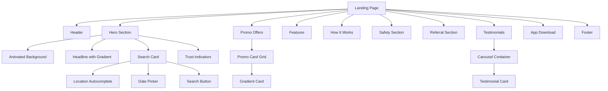

# Design Document: Landing Page Redesign

## Overview

This design document outlines the architecture and implementation approach for redesigning the HushRyd landing page to create an extraordinary, visually stunning user experience. The redesign focuses on modern UI patterns including glassmorphism, vibrant gradients, micro-animations, and responsive layouts that work seamlessly across all devices.

The landing page will serve as the primary conversion funnel, showcasing HushRyd's value proposition for carpooling in India while building trust through safety features, social proof, and promotional offers.

## Architecture

### Component Architecture



### Design System

```
Colors:
├── Primary Gradients
│   ├── Purple-Pink: from-purple-500 to-pink-500
│   ├── Blue-Cyan: from-blue-500 to-cyan-500
│   ├── Green-Emerald: from-green-500 to-emerald-500
│   └── Orange-Red: from-orange-500 to-red-500
├── Background Gradients
│   ├── Hero: from-blue-50 via-white to-orange-50
│   └── Sections: Alternating white/gray-50
├── Text Colors
│   ├── Primary: gray-900
│   ├── Secondary: gray-600
│   └── Gradient Text: from-blue-600 to-orange-600
└── Accent Colors
    ├── Trust: blue-500, green-500
    ├── Women-only: pink-500, purple-500
    └── CTA: orange-500, blue-600
```

## Components and Interfaces

### 1. Hero Section Component

```typescript
interface HeroProps {
  headline: string;
  subheadline: string;
  trustIndicators: TrustIndicator[];
}

interface TrustIndicator {
  icon: string;
  value: string;
  label: string;
}

interface SearchFormData {
  from: string;
  to: string;
  date: string;
  passengers: number;
}
```

### 2. Promo Card Component

```typescript
interface PromoOffer {
  id: string;
  icon: string;
  title: string;
  subtitle: string;
  code: string;
  gradient: 'purple-pink' | 'blue-cyan' | 'green-emerald' | 'orange-red';
  validUntil?: Date;
}

interface PromoCardProps {
  offer: PromoOffer;
  onCopyCode: (code: string) => void;
}
```

### 3. Testimonial Component

```typescript
interface Testimonial {
  id: string;
  name: string;
  photo: string;
  rating: number; // 1-5
  review: string;
  date: Date;
  tripRoute?: string;
}

interface TestimonialCarouselProps {
  testimonials: Testimonial[];
  autoScrollInterval: number; // milliseconds
}
```

### 4. Safety Feature Component

```typescript
interface SafetyFeature {
  id: string;
  icon: string;
  title: string;
  description: string;
  expandedDescription?: string;
  accentColor: 'blue' | 'green' | 'pink' | 'purple';
}
```

### 5. How It Works Step Component

```typescript
interface Step {
  number: number;
  icon: string;
  title: string;
  description: string;
}

interface HowItWorksProps {
  steps: Step[];
  showConnectors: boolean;
}
```

## Data Models

### Promo Offer Model

```javascript
const promoOffers = [
  {
    id: 'promo-1',
    icon: '🏷️',
    title: 'Get 50% OFF',
    subtitle: 'on First Ride',
    code: 'HUSHRYD50',
    gradient: 'purple-pink'
  },
  {
    id: 'promo-2',
    icon: '🎁',
    title: 'Win iPhone 15 Pro',
    subtitle: 'Book & Win Amazing Prizes',
    code: 'GRANDWIN',
    gradient: 'blue-cyan'
  },
  {
    id: 'promo-3',
    icon: '💰',
    title: '₹200 Cashback',
    subtitle: 'Instant Cashback',
    code: 'CASHBACK',
    gradient: 'green-emerald'
  },
  {
    id: 'promo-4',
    icon: '⭐',
    title: 'Get Free Membership',
    subtitle: 'Premium Benefits',
    code: 'PREMIUM',
    gradient: 'orange-red'
  }
];
```

### Trust Indicators Model

```javascript
const trustIndicators = [
  { icon: '😊', value: '50,000+', label: 'Happy Riders' },
  { icon: '✓', value: '5,000+', label: 'Verified Drivers' },
  { icon: '🛡️', value: '4.8', label: 'Safety Rating' },
  { icon: '🚗', value: '100,000+', label: 'Rides Completed' }
];
```

### Safety Features Model

```javascript
const safetyFeatures = [
  {
    id: 'verified-drivers',
    icon: '✓',
    title: 'Verified Drivers',
    description: 'All drivers undergo background verification',
    accentColor: 'green'
  },
  {
    id: 'women-only',
    icon: '👩',
    title: 'Women-Only Rides',
    description: 'Safe rides with female drivers for women passengers',
    accentColor: 'pink'
  },
  {
    id: 'sos-button',
    icon: '🆘',
    title: 'SOS Button',
    description: 'One-tap emergency assistance',
    accentColor: 'red'
  },
  {
    id: 'live-tracking',
    icon: '📍',
    title: 'Live Tracking',
    description: 'Share your ride location with loved ones',
    accentColor: 'blue'
  }
];
```

## Correctness Properties

*A property is a characteristic or behavior that should hold true across all valid executions of a system-essentially, a formal statement about what the system should do. Properties serve as the bridge between human-readable specifications and machine-verifiable correctness guarantees.*

Based on the prework analysis, the following correctness properties have been identified:

### Property 1: Promo Card Content Completeness
*For any* promo offer data, the rendered Promo_Card SHALL contain the icon, title, subtitle, and promo code fields.
**Validates: Requirements 2.2**

### Property 2: Promo Card Gradient Assignment
*For any* promo offer with a gradient type, the rendered card SHALL have the corresponding CSS gradient class applied.
**Validates: Requirements 2.1**

### Property 3: Search Form Validation
*For any* search form submission, IF either the departure or destination field is empty, THEN the form SHALL prevent submission and display a validation error.
**Validates: Requirements 3.3**

### Property 4: Search URL Parameter Generation
*For any* valid search submission with from, to, date, and passengers values, the generated URL SHALL contain all four parameters with correct values.
**Validates: Requirements 3.5**

### Property 5: Testimonial Card Content Completeness
*For any* testimonial data, the rendered testimonial card SHALL contain the user's photo, name, rating, and review text.
**Validates: Requirements 7.1, 7.3**

### Property 6: Star Rating Rendering
*For any* rating value between 1 and 5, the rendered star display SHALL show exactly that many filled stars.
**Validates: Requirements 7.4**

### Property 7: Safety Feature Content Completeness
*For any* safety feature data, the rendered Trust_Badge SHALL contain an icon, title, and description.
**Validates: Requirements 6.1, 6.2**

### Property 8: How It Works Step Rendering
*For any* step data array, each rendered step SHALL display its number, icon, and description.
**Validates: Requirements 5.1**

### Property 9: Responsive Grid Layout
*For any* viewport width, the promo card grid SHALL display 4 columns for desktop (>1024px), 2 columns for tablet (768-1024px), and 1 column for mobile (<768px).
**Validates: Requirements 2.4, 10.1, 10.2, 10.3**

### Property 10: CTA Button Touch Target Size
*For any* CTA button on mobile viewport, the rendered button SHALL have minimum dimensions of 44x44 pixels.
**Validates: Requirements 10.4**

### Property 11: Hover Animation Timing
*For any* interactive element with hover effects, the CSS transition duration SHALL be between 150ms and 200ms.
**Validates: Requirements 1.5, 9.3**

### Property 12: Referral Code Display for Authenticated Users
*For any* authenticated user with a referral code, the referral section SHALL display their unique code with a copy button.
**Validates: Requirements 4.4**

### Property 13: Platform Detection for App Download
*For any* mobile device, the app download section SHALL detect the platform (iOS/Android) and apply highlight styling to the relevant store button.
**Validates: Requirements 8.5**

## Error Handling

### Search Form Errors
- Empty location fields: Display inline validation message "Please select a departure city" or "Please select a destination city"
- Invalid date (past date): Display "Please select a future date"
- Google Places API failure: Fall back to manual text input with popular city suggestions

### Clipboard Operations
- Copy failure: Display toast "Unable to copy. Please copy manually: [CODE]"
- Copy success: Display toast "Code copied to clipboard!"

### Image Loading
- Testimonial photo load failure: Display placeholder avatar with user initials
- App mockup load failure: Hide mockup section gracefully

### Carousel Errors
- Empty testimonials array: Hide testimonials section entirely
- Single testimonial: Display static card without carousel controls

## Testing Strategy

### Unit Testing
Unit tests will verify individual component rendering and logic:
- Promo card renders all required fields
- Search form validation logic
- Star rating calculation
- Responsive breakpoint detection
- Clipboard copy functionality

### Property-Based Testing
Property-based tests will use **fast-check** library to verify correctness properties across many random inputs:

**Test Configuration:**
- Minimum 100 iterations per property test
- Custom generators for domain-specific data (promo offers, testimonials, etc.)

**Property Tests to Implement:**
1. Promo card content completeness (Property 1)
2. Search form validation (Property 3)
3. URL parameter generation (Property 4)
4. Testimonial card content (Property 5)
5. Star rating rendering (Property 6)
6. Safety feature content (Property 7)
7. Responsive grid layout (Property 9)
8. CTA button sizing (Property 10)
9. Hover animation timing (Property 11)

Each property-based test MUST be tagged with a comment referencing the correctness property:
```javascript
// **Feature: landing-page-redesign, Property 1: Promo Card Content Completeness**
```

### Integration Testing
- Search form submission and navigation
- Promo code copy to clipboard
- Testimonial carousel auto-scroll behavior
- Responsive layout transitions

### Visual Regression Testing
- Screenshot comparisons for key breakpoints (mobile, tablet, desktop)
- Animation timing verification
- Gradient rendering consistency
