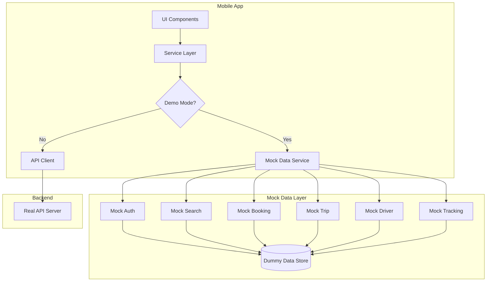

# Design Document: Mobile App Demo Mode

## Overview

This design implements a demo/dummy data mode for the HushRyd mobile app that enables complete testing of passenger and driver flows without backend connectivity. The solution uses a mock data service layer that intercepts API calls when demo mode is enabled, returning realistic pre-configured data that simulates the full user experience.

The architecture follows a service interception pattern where the existing API client is wrapped with a demo-aware layer that can route requests to either the real backend or the mock data service based on configuration.

## Architecture



## Components and Interfaces

### 1. Demo Configuration Service

```javascript
// src/services/demo/demoConfig.js

/**
 * @typedef {Object} DemoConfig
 * @property {boolean} enabled - Whether demo mode is active
 * @property {string} userRole - Current demo user role ('passenger' | 'driver')
 * @property {string} userId - Demo user ID
 * @property {boolean} showIndicator - Show demo mode indicator in UI
 */

interface DemoConfigService {
  // Check if demo mode is enabled
  isDemoMode(): Promise<boolean>;
  
  // Enable/disable demo mode
  setDemoMode(enabled: boolean): Promise<void>;
  
  // Get current demo user role
  getDemoRole(): Promise<'passenger' | 'driver'>;
  
  // Set demo user role
  setDemoRole(role: 'passenger' | 'driver'): Promise<void>;
  
  // Get full demo configuration
  getConfig(): Promise<DemoConfig>;
}
```

### 2. Mock API Interceptor

```javascript
// src/services/demo/mockApiInterceptor.js

/**
 * Wraps the API client to intercept calls in demo mode
 */
interface MockApiInterceptor {
  // Intercept GET requests
  get(url: string, params?: object): Promise<ApiResponse>;
  
  // Intercept POST requests
  post(url: string, data?: object): Promise<ApiResponse>;
  
  // Intercept PUT requests
  put(url: string, data?: object): Promise<ApiResponse>;
  
  // Intercept DELETE requests
  delete(url: string): Promise<ApiResponse>;
}
```

### 3. Mock Data Generators

```javascript
// src/services/demo/mockData/

interface MockDataGenerators {
  // Generate mock trips for search results
  generateTrips(count: number, filters?: SearchFilters): Trip[];
  
  // Generate a single trip with full details
  generateTripDetails(tripId: string): TripDetails;
  
  // Generate mock driver profile
  generateDriver(): Driver;
  
  // Generate mock booking
  generateBooking(tripId: string, seats: number): Booking;
  
  // Generate mock user profile
  generateUser(role: 'passenger' | 'driver'): User;
  
  // Generate mock location update
  generateLocationUpdate(tripId: string): LocationUpdate;
}
```

### 4. Demo State Manager

```javascript
// src/services/demo/demoStateManager.js

/**
 * Manages in-memory state for demo mode
 */
interface DemoStateManager {
  // Store created bookings
  bookings: Map<string, Booking>;
  
  // Store created trips
  trips: Map<string, Trip>;
  
  // Current demo user
  currentUser: User | null;
  
  // Reset all demo state
  reset(): void;
  
  // Add a booking
  addBooking(booking: Booking): void;
  
  // Update booking status
  updateBookingStatus(bookingId: string, status: string): void;
  
  // Add a trip
  addTrip(trip: Trip): void;
  
  // Update trip status
  updateTripStatus(tripId: string, status: string): void;
}
```

## Data Models

### Demo User

```javascript
const DemoUser = {
  passenger: {
    _id: 'demo-passenger-001',
    name: 'Rahul Sharma',
    phone: '+919876543210',
    email: 'rahul.demo@hushryd.com',
    role: 'passenger',
    profilePhoto: null,
    emergencyContacts: [
      { name: 'Priya Sharma', phone: '+919876543211', relation: 'Spouse' }
    ],
    verified: true,
  },
  driver: {
    _id: 'demo-driver-001',
    name: 'Amit Kumar',
    phone: '+919876543220',
    email: 'amit.driver@hushryd.com',
    role: 'driver',
    profilePhoto: null,
    rating: 4.8,
    totalTrips: 156,
    verified: true,
    documents: {
      license: { status: 'verified' },
      registration: { status: 'verified' },
      insurance: { status: 'verified' },
      permit: { status: 'verified' },
    },
    vehicle: {
      type: 'sedan',
      make: 'Maruti Suzuki',
      model: 'Dzire',
      year: 2022,
      color: 'White',
      plateNumber: 'MH12AB1234',
      seats: 4,
    },
  },
};
```

### Mock Trip Data

```javascript
const MockTrips = [
  {
    tripId: 'HR-2025-000001',
    source: {
      address: 'Mumbai, Maharashtra',
      coordinates: { lat: 19.0760, lng: 72.8777 },
    },
    destination: {
      address: 'Pune, Maharashtra',
      coordinates: { lat: 18.5204, lng: 73.8567 },
    },
    scheduledAt: '2025-12-10T08:00:00Z',
    availableSeats: 3,
    farePerSeat: 450,
    driver: {
      name: 'Rajesh Patil',
      rating: 4.7,
      totalTrips: 89,
      verified: true,
    },
    vehicle: {
      type: 'sedan',
      make: 'Honda',
      model: 'City',
      color: 'Silver',
    },
    instantBooking: true,
    ladiesOnly: false,
  },
  // Additional mock trips...
];
```

### Mock Booking Data

```javascript
const MockBooking = {
  _id: 'demo-booking-001',
  bookingId: 'BK-2025-000001',
  tripId: 'HR-2025-000001',
  passengerId: 'demo-passenger-001',
  seats: 2,
  status: 'confirmed',
  pin: '1234',
  totalFare: 900,
  platformFee: 45,
  pickupPoint: {
    address: 'Dadar Station, Mumbai',
    coordinates: { lat: 19.0178, lng: 72.8478 },
  },
  dropPoint: {
    address: 'Shivajinagar, Pune',
    coordinates: { lat: 18.5308, lng: 73.8475 },
  },
  paymentStatus: 'completed',
  createdAt: '2025-12-08T10:00:00Z',
};
```

### Indian Cities Data

```javascript
const IndianCities = [
  { name: 'Mumbai', state: 'Maharashtra', lat: 19.0760, lng: 72.8777 },
  { name: 'Pune', state: 'Maharashtra', lat: 18.5204, lng: 73.8567 },
  { name: 'Delhi', state: 'Delhi', lat: 28.6139, lng: 77.2090 },
  { name: 'Bangalore', state: 'Karnataka', lat: 12.9716, lng: 77.5946 },
  { name: 'Chennai', state: 'Tamil Nadu', lat: 13.0827, lng: 80.2707 },
  { name: 'Hyderabad', state: 'Telangana', lat: 17.3850, lng: 78.4867 },
  { name: 'Ahmedabad', state: 'Gujarat', lat: 23.0225, lng: 72.5714 },
  { name: 'Jaipur', state: 'Rajasthan', lat: 26.9124, lng: 75.7873 },
  { name: 'Lucknow', state: 'Uttar Pradesh', lat: 26.8467, lng: 80.9462 },
  { name: 'Kolkata', state: 'West Bengal', lat: 22.5726, lng: 88.3639 },
];

const IndianVehicles = [
  { make: 'Maruti Suzuki', models: ['Swift', 'Dzire', 'Ertiga', 'Baleno'] },
  { make: 'Hyundai', models: ['i20', 'Creta', 'Verna', 'Venue'] },
  { make: 'Honda', models: ['City', 'Amaze', 'WR-V'] },
  { make: 'Tata', models: ['Nexon', 'Harrier', 'Safari', 'Altroz'] },
  { make: 'Mahindra', models: ['XUV700', 'Scorpio', 'Thar', 'XUV300'] },
  { make: 'Toyota', models: ['Innova', 'Fortuner', 'Glanza'] },
];

const IndianNames = {
  firstNames: ['Rahul', 'Amit', 'Priya', 'Sneha', 'Vikram', 'Anjali', 'Rajesh', 'Pooja', 'Suresh', 'Kavita'],
  lastNames: ['Sharma', 'Patel', 'Kumar', 'Singh', 'Gupta', 'Verma', 'Reddy', 'Nair', 'Joshi', 'Mehta'],
};
```

## Error Handling

### Demo Error Scenarios

```javascript
const DemoErrorScenarios = {
  // Phone number triggers for specific errors
  NETWORK_ERROR: '+919999999991',
  TRIP_FULL: '+919999999992',
  INVALID_OTP: '+919999999993',
  PAYMENT_FAILED: '+919999999994',
  
  // Error responses
  errors: {
    NETWORK_ERROR: {
      success: false,
      error: 'Network connection failed',
      code: 'NETWORK_ERROR',
    },
    TRIP_FULL: {
      success: false,
      error: 'No seats available on this trip',
      code: 'SEATS_UNAVAILABLE',
    },
    INVALID_OTP: {
      success: false,
      error: 'Invalid OTP. Please try again.',
      code: 'INVALID_OTP',
    },
    PAYMENT_FAILED: {
      success: false,
      error: 'Payment processing failed',
      code: 'PAYMENT_FAILED',
    },
  },
};
```

## Testing Strategy

### Unit Testing

Unit tests will verify:
- Demo configuration persistence
- Mock data generation produces valid data structures
- API interceptor correctly routes requests based on demo mode
- State manager maintains consistency

### Property-Based Testing

Property-based tests will use fast-check to verify:
- Generated trips always have valid required fields
- Fare calculations match production logic
- PIN generation produces valid 4-digit codes
- Location coordinates are within valid ranges

Testing framework: Jest with fast-check for property-based testing.


## Correctness Properties

*A property is a characteristic or behavior that should hold true across all valid executions of a system-essentially, a formal statement about what the system should do. Properties serve as the bridge between human-readable specifications and machine-verifiable correctness guarantees.*

### Property 1: Demo mode routing intercepts API calls
*For any* API request made when demo mode is enabled, the request SHALL be routed to the mock data service and return a mock response instead of calling the real backend.
**Validates: Requirements 1.1**

### Property 2: Demo mode disabled passes through to real API
*For any* API request made when demo mode is disabled, the request SHALL be passed through to the real API client without interception.
**Validates: Requirements 1.3**

### Property 3: Demo mode persistence round-trip
*For any* demo mode state (enabled/disabled), storing the state and then reading it back SHALL return the same value.
**Validates: Requirements 1.4**

### Property 4: Generated trips have valid required fields
*For any* search request in demo mode, all returned trips SHALL have valid required fields including tripId, source, destination, scheduledAt, availableSeats, farePerSeat, and driver information with name and rating.
**Validates: Requirements 2.1, 2.2**

### Property 5: Generated bookings have valid PIN and fare
*For any* booking created in demo mode, the booking SHALL have a unique 4-digit numeric PIN and a fare breakdown with totalFare equal to (farePerSeat × seats) plus platformFee.
**Validates: Requirements 2.3**

### Property 6: Booking confirmation updates status
*For any* booking that is confirmed with payment, the booking status SHALL change from 'pending' to 'confirmed' and paymentStatus SHALL change to 'completed'.
**Validates: Requirements 2.4**

### Property 7: Trip creation generates unique IDs
*For any* two trips created in demo mode, their tripIds SHALL be different.
**Validates: Requirements 3.2**

### Property 8: PIN validation correctness
*For any* booking with a PIN, verifying with the correct PIN SHALL succeed, and verifying with any incorrect PIN SHALL fail with a validation error.
**Validates: Requirements 3.5**

### Property 9: Trip completion updates status and earnings
*For any* trip that is completed, the trip status SHALL change to 'completed' and an earnings summary SHALL be generated with amount equal to the sum of confirmed booking fares minus platform fees.
**Validates: Requirements 3.6**

### Property 10: Generated names are from Indian name pool
*For any* driver or passenger name generated by the mock service, the name SHALL be composed of a first name and last name from the predefined Indian names list.
**Validates: Requirements 4.1**

### Property 11: Generated coordinates are within India bounds
*For any* trip source or destination generated by the mock service, the coordinates SHALL be within India's geographic bounds (lat: 6.5-35.5, lng: 68-97).
**Validates: Requirements 4.2**

### Property 12: Mock fare calculation matches production
*For any* trip with given distance and seat count, the mock fare calculation SHALL produce the same result as the production fareCalculation service.
**Validates: Requirements 4.3**

### Property 13: Data referential integrity
*For any* booking in the demo state, the referenced tripId SHALL exist in the trips collection, and for any trip, the referenced driver SHALL have valid driver data.
**Validates: Requirements 4.4**

### Property 14: Generated vehicles are from Indian market
*For any* vehicle generated by the mock service, the make and model SHALL be from the predefined Indian vehicles list.
**Validates: Requirements 4.5**

### Property 15: Role-specific login returns appropriate data
*For any* login in demo mode, logging in as 'passenger' SHALL return a user with role='passenger', and logging in as 'driver' SHALL return a user with role='driver' and verified=true.
**Validates: Requirements 5.1, 5.2**

### Property 16: Role switching maintains state isolation
*For any* sequence of role switches, the passenger's bookings SHALL remain unchanged when switching to driver and back, and the driver's trips SHALL remain unchanged when switching to passenger and back.
**Validates: Requirements 5.3**

### Property 17: OTP request returns valid OTP
*For any* OTP request in demo mode, the response SHALL include a devOtp field containing a valid 6-digit numeric string.
**Validates: Requirements 6.1**

### Property 18: OTP verification creates session
*For any* OTP verification where the entered OTP matches the returned devOtp, the response SHALL include a valid token and user object.
**Validates: Requirements 6.2**

### Property 19: Logout clears session
*For any* logout action in demo mode, the authentication state SHALL be cleared such that isAuthenticated() returns false.
**Validates: Requirements 6.3**

### Property 20: Phone number format acceptance
*For any* phone number string with 10+ digits (with or without country code, spaces, or dashes), the demo auth service SHALL accept it for OTP request.
**Validates: Requirements 6.4**

### Property 21: Error phone numbers trigger errors
*For any* phone number in the error trigger list (e.g., +919999999991), the corresponding API call SHALL return the predefined error response.
**Validates: Requirements 8.1**

### Property 22: Full trip booking returns error
*For any* booking attempt on a trip with availableSeats=0, the response SHALL be unsuccessful with error code 'SEATS_UNAVAILABLE'.
**Validates: Requirements 8.2**

### Property 23: Invalid PIN returns error
*For any* PIN verification with a PIN that doesn't match the booking's PIN, the response SHALL be unsuccessful with error code 'INVALID_PIN'.
**Validates: Requirements 8.3**
