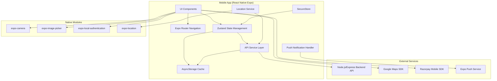

# Design Document: HushRyd Mobile App (React Native Expo)

## Overview

The HushRyd Mobile App is a cross-platform mobile application built with React Native Expo, targeting both Android and iOS devices. The app provides the same core functionality as the existing web platform, enabling passengers to search and book rides, and drivers to create and manage trips. The mobile app shares the existing Node.js/Express backend API, ensuring data consistency across platforms.

Key design principles:
- **Shared Backend**: Reuse existing REST API endpoints without modification
- **Offline-First**: Cache critical data locally for offline access
- **Native Experience**: Leverage native device capabilities (camera, location, biometrics)
- **JavaScript**: Plain JavaScript for simplicity and faster development
- **Accessibility**: WCAG 2.1 AA compliance for inclusive design

## Architecture



### Technology Stack

| Layer | Technology | Purpose |
|-------|------------|---------|
| Framework | React Native + Expo SDK 50+ | Cross-platform mobile development |
| Language | JavaScript | Simple, fast development |
| Navigation | Expo Router | File-based routing with deep linking |
| State Management | Zustand | Lightweight, performant state management |
| API Client | Axios + React Query | HTTP requests with caching and retry |
| Local Storage | AsyncStorage | Persistent key-value storage |
| Secure Storage | expo-secure-store | Encrypted storage for tokens |
| Maps | react-native-maps | Google Maps integration |
| Payments | Razorpay React Native SDK | Payment processing |
| Push Notifications | expo-notifications | Push notification handling |
| Testing | Jest + React Native Testing Library | Unit and integration testing |
| Property Testing | fast-check | Property-based testing |

## Components and Interfaces

### 1. API Service Layer

```javascript
// src/services/api/client.js
/**
 * @typedef {Object} ApiResponse
 * @property {boolean} success
 * @property {*} [data]
 * @property {string} [error]
 * @property {string} [code]
 */

/**
 * @typedef {Object} RequestConfig
 * @property {Object.<string, string>} [headers]
 * @property {number} [timeout]
 * @property {boolean} [retry]
 */

// API Client methods: get, post, put, delete
// All return Promise<ApiResponse>
```

### 2. Authentication Service

```javascript
// src/services/auth/authService.js
/**
 * @typedef {Object} OTPResponse
 * @property {boolean} success
 * @property {string} message
 * @property {string} expiresAt
 */

/**
 * @typedef {Object} AuthResponse
 * @property {boolean} success
 * @property {string} [token]
 * @property {number} [expiresIn]
 * @property {User} [user]
 * @property {boolean} [isNewUser]
 * @property {string} [redirectTo]
 * @property {string} [error]
 * @property {string} [errorCode]
 */

/**
 * @typedef {Object} User
 * @property {string} id
 * @property {string} [phone]
 * @property {string} [email]
 * @property {string} [name]
 * @property {'passenger'|'driver'|'admin'} role
 */

// AuthService methods:
// - requestOTP(identifier, type) -> Promise<OTPResponse>
// - verifyOTP(identifier, type, otp, mode) -> Promise<AuthResponse>
// - logout() -> Promise<void>
// - getStoredToken() -> Promise<string|null>
// - isAuthenticated() -> Promise<boolean>
// - enableBiometrics() -> Promise<boolean>
// - authenticateWithBiometrics() -> Promise<AuthResponse>
```

### 3. Search Service

```javascript
// src/services/search/searchService.js
/**
 * @typedef {Object} SearchParams
 * @property {string} [from]
 * @property {string} [to]
 * @property {Coordinates} [sourceCoords]
 * @property {Coordinates} [destCoords]
 * @property {string} [date]
 * @property {number} [seats]
 * @property {'sedan'|'suv'|'hatchback'|'premium'} [vehicleType]
 * @property {number} [maxFare]
 * @property {number} [minRating]
 * @property {'departure'|'fare'|'rating'} [sortBy]
 * @property {'asc'|'desc'} [sortOrder]
 * @property {number} [page]
 * @property {number} [limit]
 */

/**
 * @typedef {Object} Ride
 * @property {string} id
 * @property {DriverInfo} driver
 * @property {VehicleInfo} vehicle
 * @property {RouteInfo} route
 * @property {string} departureTime
 * @property {number} availableSeats
 * @property {number} farePerSeat
 * @property {string[]} amenities
 */

// SearchService methods:
// - searchRides(params) -> Promise<{success, rides, pagination}>
// - getTripDetails(tripId) -> Promise<TripDetailsResponse>
```

### 4. Booking Service

```javascript
// src/services/booking/bookingService.js
/**
 * @typedef {Object} BookingData
 * @property {number} seats
 * @property {Location} pickupPoint
 * @property {Location} dropPoint
 */

/**
 * @typedef {Object} Booking
 * @property {string} id
 * @property {string} tripId
 * @property {string} passengerId
 * @property {number} seats
 * @property {'pending'|'confirmed'|'cancelled'|'completed'} status
 * @property {string} pin
 * @property {number} totalFare
 * @property {Location} pickupPoint
 * @property {Location} dropPoint
 * @property {string} createdAt
 */

// BookingService methods:
// - createBooking(tripId, data) -> Promise<BookingResponse>
// - confirmBooking(bookingId, paymentId) -> Promise<BookingResponse>
// - cancelBooking(bookingId, reason) -> Promise<CancelResponse>
// - getBookings(params) -> Promise<BookingListResponse>
// - getBookingById(bookingId) -> Promise<BookingResponse>
// - getUpcomingBookings() -> Promise<UpcomingBookingsResponse>
```

### 5. Location Service

```javascript
// src/services/location/locationService.js
/**
 * @typedef {Object} Coordinates
 * @property {number} lat
 * @property {number} lng
 */

/**
 * @typedef {Object} LocationUpdate
 * @property {string} tripId
 * @property {Coordinates} coordinates
 * @property {string} timestamp
 * @property {number} accuracy
 * @property {number} [speed]
 * @property {number} [heading]
 */

/**
 * @typedef {Object} TrackingStatus
 * @property {boolean} isTracking
 * @property {string} [tripId]
 * @property {string} [lastUpdate]
 * @property {number} queuedUpdates
 */

// LocationService methods:
// - getCurrentLocation() -> Promise<Coordinates>
// - startTracking(tripId) -> Promise<void>
// - stopTracking() -> Promise<void>
// - getTrackingStatus() -> TrackingStatus
// - queueLocationUpdate(location) -> void
// - syncQueuedUpdates() -> Promise<void>
```

### 6. Offline Storage Service

```javascript
// src/services/storage/offlineService.js
/**
 * @typedef {Object} QueuedAction
 * @property {string} id
 * @property {'booking'|'profile'|'rating'} type
 * @property {'create'|'update'|'delete'} action
 * @property {*} data
 * @property {string} timestamp
 * @property {number} retryCount
 */

/**
 * @typedef {Object} SyncResult
 * @property {boolean} success
 * @property {number} synced
 * @property {number} failed
 * @property {ConflictItem[]} conflicts
 */

// OfflineService methods:
// - cacheBookings(bookings) -> Promise<void>
// - getCachedBookings() -> Promise<Booking[]>
// - cacheTrip(trip) -> Promise<void>
// - getCachedTrip(tripId) -> Promise<Trip|null>
// - queueAction(action) -> Promise<void>
// - getQueuedActions() -> Promise<QueuedAction[]>
// - syncQueuedActions() -> Promise<SyncResult>
// - clearCache() -> Promise<void>
// - getLastSyncTime() -> Promise<string|null>
```

### 7. Push Notification Service

```javascript
// src/services/notifications/pushService.js
/**
 * @typedef {Object} Notification
 * @property {string} title
 * @property {string} body
 * @property {NotificationData} data
 */

/**
 * @typedef {Object} NotificationData
 * @property {'booking_update'|'trip_update'|'sos_alert'|'payment'} type
 * @property {string} resourceId
 * @property {string} [action]
 */

/**
 * @typedef {Object} NotificationPreferences
 * @property {boolean} bookingUpdates
 * @property {boolean} tripReminders
 * @property {boolean} promotions
 * @property {boolean} sosAlerts
 */

// PushNotificationService methods:
// - registerForPushNotifications() -> Promise<string|null>
// - handleNotification(notification) -> void
// - handleNotificationResponse(response) -> void
// - updateNotificationPreferences(preferences) -> Promise<void>
// - getNotificationPreferences() -> Promise<NotificationPreferences>
```

### 8. SOS Service

```javascript
// src/services/sos/sosService.js
/**
 * @typedef {Object} SOSResponse
 * @property {boolean} success
 * @property {string} alertId
 * @property {EmergencyContact[]} emergencyContacts
 * @property {string} timestamp
 */

/**
 * @typedef {Object} SOSAlert
 * @property {string} id
 * @property {string} userId
 * @property {string} [tripId]
 * @property {Coordinates} location
 * @property {'active'|'resolved'|'cancelled'} status
 * @property {string} createdAt
 */

/**
 * @typedef {Object} EmergencyContact
 * @property {string} name
 * @property {string} phone
 * @property {string} relationship
 */

// SOSService methods:
// - triggerSOS(tripId) -> Promise<SOSResponse>
// - cancelSOS(alertId) -> Promise<void>
// - resolveSOSWithFeedback(alertId, feedback) -> Promise<void>
// - getActiveSOSAlert() -> Promise<SOSAlert|null>
```

## Data Models

### User Model
```javascript
/**
 * @typedef {Object} User
 * @property {string} id
 * @property {string} [phone]
 * @property {string} [email]
 * @property {string} [name]
 * @property {string} [profilePhoto]
 * @property {'passenger'|'driver'} role
 * @property {EmergencyContact[]} emergencyContacts
 * @property {NotificationPreferences} notificationPreferences
 * @property {boolean} biometricsEnabled
 * @property {string} createdAt
 * @property {string} updatedAt
 */
```

### Trip Model
```javascript
/**
 * @typedef {Object} Trip
 * @property {string} id
 * @property {string} driverId
 * @property {DriverInfo} driver
 * @property {VehicleInfo} vehicle
 * @property {Object} route
 * @property {Location} route.source
 * @property {Location} route.destination
 * @property {Location[]} route.waypoints
 * @property {number} route.distance
 * @property {number} route.duration
 * @property {string} departureTime
 * @property {number} totalSeats
 * @property {number} availableSeats
 * @property {number} farePerSeat
 * @property {'scheduled'|'in_progress'|'completed'|'cancelled'} status
 * @property {string[]} amenities
 * @property {string} createdAt
 */
```

### Booking Model
```javascript
/**
 * @typedef {Object} Booking
 * @property {string} id
 * @property {string} tripId
 * @property {Trip} [trip]
 * @property {string} passengerId
 * @property {number} seats
 * @property {'pending'|'confirmed'|'cancelled'|'completed'} status
 * @property {string} pin
 * @property {number} totalFare
 * @property {number} platformFee
 * @property {Location} pickupPoint
 * @property {Location} dropPoint
 * @property {string} [paymentId]
 * @property {'pending'|'completed'|'refunded'} paymentStatus
 * @property {number} [rating]
 * @property {string} [feedback]
 * @property {string} createdAt
 * @property {string} updatedAt
 */
```

### Location Model
```javascript
/**
 * @typedef {Object} Location
 * @property {string} address
 * @property {Coordinates} coordinates
 * @property {string} [landmark]
 * @property {string} [placeId]
 */

/**
 * @typedef {Object} Coordinates
 * @property {number} lat
 * @property {number} lng
 */
```

## Correctness Properties

*A property is a characteristic or behavior that should hold true across all valid executions of a system-essentially, a formal statement about what the system should do. Properties serve as the bridge between human-readable specifications and machine-verifiable correctness guarantees.*

Based on the prework analysis, the following correctness properties have been identified:

### Property 1: Session Persistence Round Trip
*For any* valid JWT token stored in secure storage, retrieving the token and validating it should return the same user session state.
**Validates: Requirements 2.4, 2.6**

### Property 2: OTP Input Auto-Advance
*For any* single digit entered in an OTP input field (positions 0-5), the focus should advance to the next field (position + 1) unless it's the last field.
**Validates: Requirements 2.3**

### Property 3: OTP Error Display with Attempts
*For any* incorrect OTP submission with N remaining attempts (where N > 0), the error message should contain the remaining attempts count (N-1).
**Validates: Requirements 2.5**

### Property 4: Search API Parameter Formatting
*For any* search parameters with source/destination coordinates and filters, the API request should include all non-null parameters in the correct format.
**Validates: Requirements 3.2**

### Property 5: Search Results Completeness
*For any* search result ride object, the rendered display should include driver name, vehicle type, departure time, available seats, and fare per seat.
**Validates: Requirements 3.3**

### Property 6: Booking Confirmation PIN Presence
*For any* confirmed booking response, the booking object should contain a 4-digit PIN string.
**Validates: Requirements 3.5**

### Property 7: Local Booking Storage Round Trip
*For any* booking object stored locally, retrieving it by ID should return an equivalent booking object.
**Validates: Requirements 3.6**

### Property 8: Upload Progress Tracking
*For any* file upload operation, the progress callback should be invoked with values between 0 and 100, and the final value should be 100 on success.
**Validates: Requirements 4.4**

### Property 9: Trip Categorization by Status
*For any* list of trips with mixed statuses, filtering by status category should return only trips matching that category (upcoming: scheduled, ongoing: in_progress, completed: completed).
**Validates: Requirements 5.3**

### Property 10: Route Distance Calculation
*For any* route with source and destination coordinates, the calculated distance should be greater than 0 and less than or equal to the straight-line distance multiplied by a road factor (1.4).
**Validates: Requirements 5.2**

### Property 11: PIN Validation Format
*For any* PIN validation attempt, a 4-digit numeric string matching the booking PIN should return valid=true, and any other input should return valid=false.
**Validates: Requirements 5.4**

### Property 12: Real-Time Tracking Data Display
*For any* active tracking session with location updates, the displayed ETA should decrease or remain stable as the vehicle approaches the destination, and distance remaining should decrease.
**Validates: Requirements 6.1, 6.2**

### Property 13: Location Queue Sync Completeness
*For any* queued location updates during offline mode, syncing when online should result in all updates being sent to the server in chronological order.
**Validates: Requirements 6.4**

### Property 14: Notification Deep Link Mapping
*For any* notification with type and resourceId, tapping should navigate to the correct screen path based on notification type.
**Validates: Requirements 7.3**

### Property 15: Notification Payload Parsing
*For any* push notification payload with booking status change, the parsed notification should contain title, body, and data with correct booking ID.
**Validates: Requirements 7.2**

### Property 16: SOS Payload Completeness
*For any* SOS trigger event, the payload sent to backend should contain current GPS coordinates, timestamp, and trip ID (if in active trip).
**Validates: Requirements 8.1, 8.2**

### Property 17: Profile Validation Rules
*For any* profile update with name field, the name should be non-empty and contain only valid characters (letters, spaces, hyphens).
**Validates: Requirements 9.2**

### Property 18: Emergency Contacts CRUD Consistency
*For any* sequence of add, edit, delete operations on emergency contacts, the final contact list should reflect all operations in order.
**Validates: Requirements 9.3**

### Property 19: Image Compression Ratio
*For any* image uploaded for profile photo, the compressed image size should be less than or equal to the original size, and dimensions should not exceed 800x800 pixels.
**Validates: Requirements 9.4**

### Property 20: Booking History Pagination
*For any* booking history request with page N and limit L, the response should contain at most L items, and requesting page N+1 should return different items (if more exist).
**Validates: Requirements 9.5**

### Property 21: Offline Data Sync Round Trip
*For any* data cached while offline, syncing when online should result in server data being the source of truth, and conflicts should be reported to the user.
**Validates: Requirements 10.1, 10.2, 10.3, 10.4, 10.5**

### Property 22: Payment Receipt Storage
*For any* successful payment, the receipt should be stored locally and retrievable by payment ID.
**Validates: Requirements 11.3**

### Property 23: Payment Error Retry Options
*For any* failed payment attempt, the error response should include retry capability and display appropriate error message.
**Validates: Requirements 11.4**

### Property 24: Transaction History Display
*For any* transaction in payment history, the display should include transaction ID, amount, status, and timestamp.
**Validates: Requirements 11.5**

### Property 25: Accessibility Font Scaling
*For any* text component with base font size S and device font scale F, the rendered font size should be S * F.
**Validates: Requirements 12.3**

### Property 26: Color Contrast Compliance
*For any* text/background color pair in the app, the contrast ratio should be at least 4.5:1 for normal text and 3:1 for large text.
**Validates: Requirements 12.4**

### Property 27: Accessibility Labels Presence
*For any* interactive component (button, input, touchable), an accessibility label should be present and non-empty.
**Validates: Requirements 12.5**

### Property 28: Session Expiry Handling
*For any* API request with expired token, the app should clear stored credentials and redirect to login screen.
**Validates: Requirements 13.5**

## Error Handling

### Network Errors
```javascript
// src/services/api/errors.js
const NetworkErrorCode = {
  NO_CONNECTION: 'NETWORK_NO_CONNECTION',
  TIMEOUT: 'NETWORK_TIMEOUT',
  SERVER_ERROR: 'NETWORK_SERVER_ERROR',
};

/**
 * @typedef {Object} ErrorAction
 * @property {'show_toast'|'show_modal'|'queue_offline'|'redirect'} type
 * @property {string} message
 * @property {Function} [action]
 */

// NetworkErrorHandler methods:
// - handleError(error) -> ErrorAction
// - shouldRetry(error) -> boolean
// - getRetryDelay(attemptNumber) -> number
```

### API Error Handling
```javascript
// src/services/api/errorMessages.js
const API_ERROR_MESSAGES = {
  'AUTH_001': 'Invalid request. Please try again.',
  'AUTH_002': 'OTP expired. Please request a new one.',
  'AUTH_003': 'Invalid OTP. Please check and try again.',
  'AUTH_004': 'Too many attempts. Please request a new OTP.',
  'BOOKING_NOT_FOUND': 'Booking not found.',
  'TRIP_NOT_FOUND': 'Trip not found or no longer available.',
  'INSUFFICIENT_SEATS': 'Not enough seats available.',
  'PAYMENT_FAILED': 'Payment failed. Please try again.',
};
```

### Offline Error Handling
- Queue actions when offline
- Show offline indicator in UI
- Retry queued actions on reconnection
- Handle sync conflicts with server-wins strategy
- Notify user of any conflicts

## Testing Strategy

### Dual Testing Approach

The mobile app uses both unit testing and property-based testing for comprehensive coverage:

1. **Unit Tests**: Verify specific examples, edge cases, and integration points
2. **Property-Based Tests**: Verify universal properties that should hold across all inputs

### Testing Framework

- **Unit Testing**: Jest + React Native Testing Library
- **Property-Based Testing**: fast-check (minimum 100 iterations per property)
- **E2E Testing**: Detox (optional, for critical user flows)

### Property-Based Testing Requirements

Each property-based test must:
1. Use fast-check library for property generation
2. Run minimum 100 iterations
3. Include comment referencing the correctness property: `**Feature: mobile-app-react-native, Property {number}: {property_text}**`
4. Test a single correctness property per test

### Test File Structure

```
mobile-app/
├── src/
│   ├── services/
│   │   ├── auth/
│   │   │   ├── authService.js
│   │   │   └── authService.test.js
│   │   ├── booking/
│   │   │   ├── bookingService.js
│   │   │   └── bookingService.test.js
│   │   └── ...
│   └── components/
│       ├── auth/
│       │   ├── OTPInput.jsx
│       │   └── OTPInput.test.js
│       └── ...
├── tests/
│   ├── property/
│   │   ├── auth.property.test.js
│   │   ├── booking.property.test.js
│   │   ├── search.property.test.js
│   │   ├── offline.property.test.js
│   │   └── accessibility.property.test.js
│   └── setup.js
└── jest.config.js
```

### Example Property Test

```javascript
// tests/property/auth.property.test.js
const fc = require('fast-check');
const { validateOTPInput, advanceFocus } = require('../../src/services/auth/otpUtils');

describe('OTP Input Properties', () => {
  /**
   * **Feature: mobile-app-react-native, Property 2: OTP Input Auto-Advance**
   */
  it('should auto-advance focus to next field for any single digit input', () => {
    fc.assert(
      fc.property(
        fc.integer({ min: 0, max: 4 }), // current position (0-4, not last)
        fc.integer({ min: 0, max: 9 }), // digit entered
        (position, digit) => {
          const nextPosition = advanceFocus(position, String(digit));
          return nextPosition === position + 1;
        }
      ),
      { numRuns: 100 }
    );
  });

  /**
   * **Feature: mobile-app-react-native, Property 3: OTP Error Display with Attempts**
   */
  it('should display remaining attempts in error message', () => {
    fc.assert(
      fc.property(
        fc.integer({ min: 1, max: 3 }), // remaining attempts
        (remainingAttempts) => {
          const errorMessage = formatOTPError(remainingAttempts);
          return errorMessage.includes(String(remainingAttempts - 1));
        }
      ),
      { numRuns: 100 }
    );
  });
});
```

### Coverage Requirements

- Unit test coverage: minimum 80% for services and utilities
- Property tests: all 28 correctness properties must have corresponding tests
- Component tests: all interactive components must have accessibility tests
