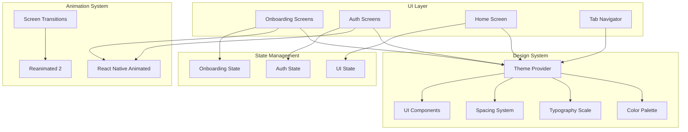

# Design Document: HushRyd Mobile App UI Enhancements

## Overview

This design document outlines the comprehensive UI/UX enhancements for the HushRyd Mobile App. The enhancements focus on creating a polished, professional user experience with animated onboarding, streamlined phone authentication, an intuitive home screen layout, and a consistent design system using white backgrounds with orange accents.

Key design principles:
- **Visual Consistency**: Unified color palette, typography, and spacing across all screens
- **Smooth Animations**: Subtle, purposeful animations that enhance user experience
- **Responsive Design**: Adaptive layouts that work on all device sizes
- **Accessibility**: Touch-friendly targets and readable text at all sizes
- **Performance**: Efficient rendering with skeleton loaders and optimized animations

## Architecture



### Technology Stack

| Layer | Technology | Purpose |
|-------|------------|---------|
| Animation | react-native-reanimated | Smooth, performant animations |
| Gestures | react-native-gesture-handler | Swipe gestures for onboarding |
| Navigation | expo-router | File-based routing with transitions |
| Styling | StyleSheet + Theme | Consistent styling system |
| Icons | @expo/vector-icons | Icon library |
| Storage | AsyncStorage | Persist onboarding state |

## Components and Interfaces

### 1. Theme System

```javascript
// src/theme/colors.js
const colors = {
  // Primary colors
  primary: '#FF6B00',        // Orange accent
  primaryLight: '#FF8533',   // Light orange for hover states
  primaryDark: '#CC5500',    // Dark orange for pressed states
  
  // Background colors
  background: '#FFFFFF',     // White background
  surface: '#F8F9FA',        // Light gray for cards
  
  // Text colors
  textPrimary: '#1A1A1A',    // Dark gray for primary text
  textSecondary: '#666666',  // Medium gray for secondary text
  textTertiary: '#999999',   // Light gray for hints
  textInverse: '#FFFFFF',    // White text on dark backgrounds
  
  // Status colors
  success: '#28A745',
  error: '#DC3545',
  warning: '#FFC107',
  info: '#17A2B8',
  
  // Border colors
  border: '#E5E5E5',
  borderFocus: '#FF6B00',
};

// src/theme/typography.js
const typography = {
  h1: { fontSize: 28, fontWeight: '700', lineHeight: 36 },
  h2: { fontSize: 24, fontWeight: '600', lineHeight: 32 },
  h3: { fontSize: 20, fontWeight: '600', lineHeight: 28 },
  body1: { fontSize: 16, fontWeight: '400', lineHeight: 24 },
  body2: { fontSize: 14, fontWeight: '400', lineHeight: 20 },
  caption: { fontSize: 12, fontWeight: '400', lineHeight: 16 },
  button: { fontSize: 16, fontWeight: '600', lineHeight: 24 },
};

// src/theme/spacing.js
const spacing = {
  xs: 4,
  sm: 8,
  md: 16,
  lg: 24,
  xl: 32,
  xxl: 48,
};

// src/theme/borderRadius.js
const borderRadius = {
  sm: 4,
  md: 8,      // Cards
  lg: 12,     // Buttons
  xl: 16,
  full: 9999, // Pills, avatars
};
```

### 2. Onboarding System

```javascript
// src/services/onboarding/onboardingService.js
/**
 * @typedef {Object} OnboardingScreen
 * @property {string} id
 * @property {string} illustration - Image source
 * @property {string} title
 * @property {string} description
 */

/**
 * @typedef {Object} OnboardingState
 * @property {boolean} hasSeenOnboarding
 * @property {number} currentIndex
 */

// OnboardingService methods:
// - getOnboardingScreens() -> OnboardingScreen[]
// - hasCompletedOnboarding() -> Promise<boolean>
// - completeOnboarding() -> Promise<void>
// - resetOnboarding() -> Promise<void>
```

### 3. Animation Utilities

```javascript
// src/utils/animations.js
/**
 * @typedef {Object} AnimationConfig
 * @property {number} duration - Animation duration in ms
 * @property {'ease'|'linear'|'spring'} easing
 */

// Animation utilities:
// - fadeIn(duration) -> Animated.timing config
// - slideIn(direction, duration) -> Animated.timing config
// - shake(intensity) -> Animated.sequence config
// - createSlideTransition(index, totalScreens) -> transform style
```

### 4. Responsive Utilities

```javascript
// src/utils/responsive.js
/**
 * @typedef {Object} ScreenDimensions
 * @property {number} width
 * @property {number} height
 * @property {'small'|'medium'|'large'} sizeCategory
 */

// Responsive utilities:
// - scale(size) -> number - Scale size based on screen width
// - verticalScale(size) -> number - Scale based on screen height
// - moderateScale(size, factor) -> number - Moderate scaling
// - getScreenCategory() -> 'small'|'medium'|'large'
// - isSmallScreen() -> boolean
// - isLargeScreen() -> boolean
```

### 5. UI Components

```javascript
// src/components/ui/Button.jsx
/**
 * @typedef {Object} ButtonProps
 * @property {'primary'|'secondary'|'outline'|'ghost'} variant
 * @property {'sm'|'md'|'lg'} size
 * @property {boolean} loading
 * @property {boolean} disabled
 * @property {string} label
 * @property {Function} onPress
 */

// src/components/ui/Input.jsx
/**
 * @typedef {Object} InputProps
 * @property {string} label
 * @property {string} placeholder
 * @property {string} value
 * @property {Function} onChangeText
 * @property {'text'|'phone'|'email'|'password'} type
 * @property {string} error
 * @property {boolean} disabled
 */

// src/components/ui/Card.jsx
/**
 * @typedef {Object} CardProps
 * @property {boolean} elevated
 * @property {Function} onPress
 * @property {ReactNode} children
 */

// src/components/ui/Skeleton.jsx
/**
 * @typedef {Object} SkeletonProps
 * @property {number} width
 * @property {number} height
 * @property {'rectangle'|'circle'|'text'} variant
 */

// src/components/ui/EmptyState.jsx
/**
 * @typedef {Object} EmptyStateProps
 * @property {string} illustration
 * @property {string} title
 * @property {string} message
 * @property {string} actionLabel
 * @property {Function} onAction
 */
```

## Data Models

### Onboarding Screen Model
```javascript
/**
 * @typedef {Object} OnboardingScreen
 * @property {string} id - Unique identifier
 * @property {ImageSource} illustration - Illustration image
 * @property {string} title - Screen title
 * @property {string} description - Screen description
 * @property {string} backgroundColor - Optional background color
 */

const ONBOARDING_SCREENS = [
  {
    id: 'welcome',
    illustration: require('../assets/onboarding/welcome.png'),
    title: 'Welcome to HushRyd',
    description: 'Your trusted companion for long-distance travel. Safe, affordable, and convenient.',
  },
  {
    id: 'search',
    illustration: require('../assets/onboarding/search.png'),
    title: 'Find Your Ride',
    description: 'Search for rides to your destination. Compare prices and choose the best option.',
  },
  {
    id: 'publish',
    illustration: require('../assets/onboarding/publish.png'),
    title: 'Share Your Journey',
    description: 'Driving somewhere? Publish your trip and earn by sharing your ride.',
  },
  {
    id: 'safety',
    illustration: require('../assets/onboarding/safety.png'),
    title: 'Travel Safely',
    description: 'Verified drivers, real-time tracking, and 24/7 support for peace of mind.',
  },
];
```

### Tab Configuration Model
```javascript
/**
 * @typedef {Object} TabConfig
 * @property {string} name - Tab route name
 * @property {string} label - Display label
 * @property {string} icon - Icon name
 * @property {string} activeIcon - Active state icon name
 */

const TAB_CONFIG = [
  { name: 'index', label: 'Search', icon: 'search-outline', activeIcon: 'search' },
  { name: 'publish', label: 'Publish', icon: 'add-circle-outline', activeIcon: 'add-circle' },
  { name: 'bookings', label: 'Your Rides', icon: 'car-outline', activeIcon: 'car' },
  { name: 'profile', label: 'Profile', icon: 'person-outline', activeIcon: 'person' },
];
```

## Correctness Properties

*A property is a characteristic or behavior that should hold true across all valid executions of a system-essentially, a formal statement about what the system should do. Properties serve as the bridge between human-readable specifications and machine-verifiable correctness guarantees.*

Based on the prework analysis, the following correctness properties have been identified:

### Property 1: Onboarding Display on First Launch
*For any* app launch where hasSeenOnboarding is false, the app should display the onboarding screens instead of the login screen.
**Validates: Requirements 1.1**

### Property 2: Onboarding Screen Content Completeness
*For any* onboarding screen in the screens array, the screen object should contain non-empty illustration, title, and description fields.
**Validates: Requirements 1.3**

### Property 3: Onboarding Persistence Round Trip
*For any* onboarding completion event, storing the completion state and retrieving it should return true, and subsequent launches should skip onboarding.
**Validates: Requirements 1.6**

### Property 4: Phone Number Validation
*For any* phone number input, the validation function should return true only for 10-digit numeric strings (Indian format) and false for all other inputs.
**Validates: Requirements 2.1**

### Property 5: OTP Countdown Timer
*For any* OTP request, the countdown timer should start at 30 seconds and decrement by 1 each second until reaching 0, at which point the resend button becomes enabled.
**Validates: Requirements 2.7**

### Property 6: Tab Navigation Configuration
*For any* tab navigator configuration, there should be exactly 4 tabs with labels: Search, Publish, Your Rides, and Profile.
**Validates: Requirements 3.1**

### Property 7: Publish Tab Conditional Rendering
*For any* user with role 'driver', the Publish tab should show the trip creation form; for any user with role 'passenger', it should show the "Become a Driver" prompt.
**Validates: Requirements 3.3**

### Property 8: Active Tab Highlighting
*For any* selected tab index, the tab at that index should have the primary orange color (#FF6B00) applied, and all other tabs should have the inactive color.
**Validates: Requirements 3.6**

### Property 9: Theme Background Color Consistency
*For any* screen component using the theme, the background color should be white (#FFFFFF).
**Validates: Requirements 4.1**

### Property 10: Theme Primary Color Consistency
*For any* primary button or action element using the theme, the background color should be orange (#FF6B00).
**Validates: Requirements 4.2**

### Property 11: Theme Typography Color Consistency
*For any* text element using the theme, primary text should use #1A1A1A and secondary text should use #666666.
**Validates: Requirements 4.3**

### Property 12: Theme Border Radius Consistency
*For any* card component, the border radius should be 8px; for any button component, the border radius should be 12px.
**Validates: Requirements 4.4**

### Property 13: Empty State Content Completeness
*For any* empty state component, it should contain a non-empty illustration source and a non-empty message string.
**Validates: Requirements 4.6**

### Property 14: Responsive Font Scaling
*For any* base font size S and screen width W, the scaled font size should be S * (W / 375) for screens smaller than 375px, and S for larger screens (with max scaling factor of 1.2).
**Validates: Requirements 5.1**

### Property 15: Large Screen Max Width
*For any* screen width greater than 428px, the content container should have a maximum width of 428px and be centered horizontally.
**Validates: Requirements 5.2**

### Property 16: Touch Target Minimum Size
*For any* interactive element (button, input, touchable), the minimum height should be 44px to ensure touch-friendly targets.
**Validates: Requirements 5.5**

### Property 17: Trip Creation Validation
*For any* trip creation form submission, the validation should fail if any required field (source, destination, date, time, seats, fare) is empty or invalid.
**Validates: Requirements 6.2**

### Property 18: Network Error Message Formatting
*For any* network error code, the error handler should return a user-friendly message string (not technical error codes) and include a retry option.
**Validates: Requirements 6.5**

## Error Handling

### Animation Errors
- Fallback to non-animated transitions if animation fails
- Log animation errors for debugging
- Ensure UI remains functional without animations

### Theme Errors
- Provide default values for all theme properties
- Graceful fallback if theme context is unavailable
- Console warnings for missing theme values

### Responsive Errors
- Default to medium screen size if dimensions unavailable
- Handle orientation changes gracefully
- Fallback values for safe area insets

## Testing Strategy

### Dual Testing Approach

The UI enhancements use both unit testing and property-based testing:

1. **Unit Tests**: Verify specific UI behaviors, component rendering, and edge cases
2. **Property-Based Tests**: Verify universal properties across all inputs and states

### Testing Framework

- **Unit Testing**: Jest + React Native Testing Library
- **Property-Based Testing**: fast-check (minimum 100 iterations per property)
- **Snapshot Testing**: For UI component consistency

### Property-Based Testing Requirements

Each property-based test must:
1. Use fast-check library for property generation
2. Run minimum 100 iterations
3. Include comment referencing the correctness property: `**Feature: mobile-app-ui-enhancements, Property {number}: {property_text}**`
4. Test a single correctness property per test

### Test File Structure

```
mobile-app/
├── src/
│   ├── theme/
│   │   ├── colors.js
│   │   ├── typography.js
│   │   ├── spacing.js
│   │   └── index.js
│   ├── components/
│   │   ├── onboarding/
│   │   │   ├── OnboardingScreen.jsx
│   │   │   └── OnboardingPagination.jsx
│   │   └── ui/
│   │       ├── Button.jsx
│   │       ├── Input.jsx
│   │       ├── Card.jsx
│   │       ├── Skeleton.jsx
│   │       └── EmptyState.jsx
│   ├── services/
│   │   └── onboarding/
│   │       └── onboardingService.js
│   └── utils/
│       ├── animations.js
│       ├── responsive.js
│       └── validation.js
├── tests/
│   └── property/
│       ├── onboarding.property.test.js
│       ├── theme.property.test.js
│       ├── responsive.property.test.js
│       └── validation.property.test.js
└── app/
    ├── (onboarding)/
    │   └── index.jsx
    ├── (auth)/
    │   ├── login.jsx
    │   └── otp.jsx
    └── (tabs)/
        ├── index.jsx
        ├── publish.jsx
        ├── bookings.jsx
        └── profile.jsx
```

### Example Property Test

```javascript
// tests/property/theme.property.test.js
const fc = require('fast-check');
const { colors, borderRadius } = require('../../src/theme');

describe('Theme Properties', () => {
  /**
   * **Feature: mobile-app-ui-enhancements, Property 9: Theme Background Color Consistency**
   */
  it('should use white background color', () => {
    expect(colors.background).toBe('#FFFFFF');
  });

  /**
   * **Feature: mobile-app-ui-enhancements, Property 10: Theme Primary Color Consistency**
   */
  it('should use orange as primary color', () => {
    expect(colors.primary).toBe('#FF6B00');
  });

  /**
   * **Feature: mobile-app-ui-enhancements, Property 12: Theme Border Radius Consistency**
   */
  it('should have correct border radius for cards and buttons', () => {
    expect(borderRadius.md).toBe(8);  // Cards
    expect(borderRadius.lg).toBe(12); // Buttons
  });
});
```

```javascript
// tests/property/validation.property.test.js
const fc = require('fast-check');
const { validatePhoneNumber } = require('../../src/utils/validation');

describe('Validation Properties', () => {
  /**
   * **Feature: mobile-app-ui-enhancements, Property 4: Phone Number Validation**
   */
  it('should validate 10-digit phone numbers correctly', () => {
    fc.assert(
      fc.property(
        fc.stringOf(fc.constantFrom('0','1','2','3','4','5','6','7','8','9'), { minLength: 10, maxLength: 10 }),
        (phoneNumber) => {
          return validatePhoneNumber(phoneNumber) === true;
        }
      ),
      { numRuns: 100 }
    );
  });

  it('should reject invalid phone numbers', () => {
    fc.assert(
      fc.property(
        fc.string().filter(s => !/^\d{10}$/.test(s)),
        (invalidPhone) => {
          return validatePhoneNumber(invalidPhone) === false;
        }
      ),
      { numRuns: 100 }
    );
  });
});
```

### Coverage Requirements

- Unit test coverage: minimum 80% for theme, utilities, and services
- Property tests: all 18 correctness properties must have corresponding tests
- Component tests: all UI components must render without errors
