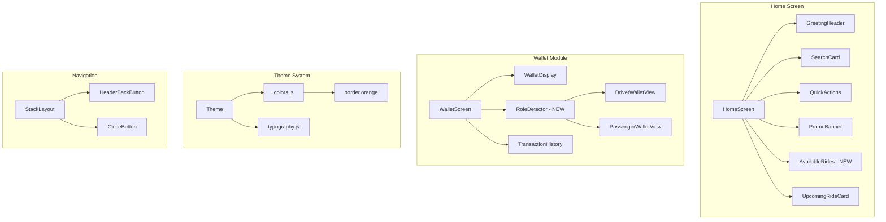

# Design Document: Mobile App UI Fixes

## Overview

This design addresses seven critical UI/UX issues in the HushRyd mobile application:
1. Post ride visibility on home screen
2. Wallet role differentiation (driver vs passenger)
3. Home screen creative enhancements
4. Orange theme border consistency
5. Button label visibility
6. Profile edit flow completion
7. Navigation back/close buttons

The implementation follows the existing React Native/Expo architecture with the established theme system and component library.

## Architecture



## Components and Interfaces

### 1. AvailableRidesSection Component (NEW)

```javascript
/**
 * Displays up to 5 recently posted rides on home screen
 * @param {Array} rides - Array of available ride objects
 * @param {Function} onRidePress - Handler when ride card is tapped
 * @param {boolean} loading - Loading state
 */
interface AvailableRidesSectionProps {
  rides: Ride[];
  onRidePress: (ride: Ride) => void;
  loading: boolean;
}
```

### 2. RoleBasedWallet Component (NEW)

```javascript
/**
 * Wallet display that adapts based on user role
 * @param {string} userRole - 'driver' | 'passenger'
 * @param {Object} walletData - Wallet balance and transaction data
 */
interface RoleBasedWalletProps {
  userRole: 'driver' | 'passenger';
  walletData: WalletData;
  onWithdraw?: () => void;
  onAddMoney?: () => void;
}
```

### 3. Enhanced GreetingHeader

```javascript
/**
 * Time-based greeting with user name
 * Returns "Good Morning/Afternoon/Evening, {name}"
 */
function getTimeBasedGreeting(hour: number): string;
```

### 4. NavigationHeader Component (Enhanced)

```javascript
/**
 * Consistent header with back/close buttons
 * @param {boolean} showBack - Show back arrow
 * @param {boolean} showClose - Show close button
 * @param {Function} onBack - Back button handler
 * @param {Function} onClose - Close button handler
 */
interface NavigationHeaderProps {
  title: string;
  showBack?: boolean;
  showClose?: boolean;
  onBack?: () => void;
  onClose?: () => void;
}
```

## Data Models

### Ride Model (for Available Rides)

```javascript
interface AvailableRide {
  id: string;
  driver: {
    name: string;
    avatar?: string;
    rating: number;
  };
  source: {
    address: string;
    city: string;
  };
  destination: {
    address: string;
    city: string;
  };
  departureTime: Date;
  availableSeats: number;
  pricePerSeat: number;
  isWomenOnly: boolean;
}
```

### Wallet Data Model (Role-Based)

```javascript
interface DriverWalletData {
  totalEarnings: number;
  pendingPayout: number;
  availableForWithdrawal: number;
  transactions: DriverTransaction[];
}

interface PassengerWalletData {
  currentBalance: number;
  transactions: PassengerTransaction[];
}

interface DriverTransaction {
  id: string;
  type: 'earning' | 'withdrawal' | 'bonus';
  amount: number;
  status: 'locked' | 'unlocked' | 'withdrawn';
  label: 'Earned'; // Always "Earned" for drivers
}

interface PassengerTransaction {
  id: string;
  type: 'payment' | 'refund' | 'topup';
  amount: number;
  label: 'Paid'; // Always "Paid" for passengers
}
```

## Correctness Properties

*A property is a characteristic or behavior that should hold true across all valid executions of a system-essentially, a formal statement about what the system should do. Properties serve as the bridge between human-readable specifications and machine-verifiable correctness guarantees.*

### Property Reflection

After analyzing the acceptance criteria, the following redundancies were identified and consolidated:
- UI rendering tests (4.1-4.4) consolidated into theme configuration verification
- Navigation tests (7.1-7.5) consolidated into header configuration verification
- Form validation tests (6.3, 6.5) combined into single validation property

### Property 1: Available Rides Display Limit

*For any* list of available rides with N rides where N > 0, the home screen SHALL display at most 5 rides, specifically min(N, 5) rides.

**Validates: Requirements 1.1**

### Property 2: Transaction Label by Role

*For any* transaction displayed in the wallet and *for any* user role, the transaction label SHALL be "Earned" when role is "driver" and "Paid" when role is "passenger".

**Validates: Requirements 2.4**

### Property 3: Wallet View Role Consistency

*For any* user role change from role A to role B, the wallet view SHALL update to display the view corresponding to role B.

**Validates: Requirements 2.3**

### Property 4: Time-Based Greeting

*For any* hour H in range [0, 23], the greeting function SHALL return:
- "Good Morning" when 5 <= H < 12
- "Good Afternoon" when 12 <= H < 17
- "Good Evening" when 17 <= H < 21
- "Good Night" when H >= 21 or H < 5

**Validates: Requirements 3.1**

### Property 5: Countdown Timer Accuracy

*For any* departure time T in the future, the countdown SHALL display the correct hours and minutes remaining, calculated as floor((T - now) / 60000) minutes.

**Validates: Requirements 3.4**

### Property 6: Button Contrast Ratio

*For any* button variant (primary, secondary, outline), the text-to-background contrast ratio SHALL be at least 4.5:1 to meet WCAG AA standards.

**Validates: Requirements 5.2**

### Property 7: Button Text Visibility

*For any* button text of length L, the button SHALL either display the full text (when L <= maxChars) or truncate with ellipsis without hiding the text completely.

**Validates: Requirements 5.4**

### Property 8: Profile Form Validation

*For any* profile form state, the submit button SHALL be enabled if and only if all required fields (fullName, email, gender, 3 emergency contacts) are filled with valid values.

**Validates: Requirements 6.3, 6.5**

## Error Handling

### Home Screen - Available Rides
- If API fails to fetch rides, display empty state with retry option
- If rides array is null/undefined, treat as empty array
- Log errors to console for debugging

### Wallet Module
- If role detection fails, default to passenger view
- If wallet data fails to load, show error state with retry
- Handle network errors gracefully with offline indicator

### Profile Completion
- Validate each field on blur and on submit
- Display inline error messages for invalid fields
- Prevent submission until all validations pass

### Navigation
- If navigation fails, log error and stay on current screen
- Handle deep link navigation errors gracefully

## Testing Strategy

### Property-Based Testing Library
- **fast-check** for JavaScript/TypeScript property-based testing
- Minimum 100 iterations per property test

### Unit Tests
- Test individual component rendering
- Test utility functions (greeting, countdown, validation)
- Test theme color values

### Property-Based Tests

Each property test MUST be tagged with format: `**Feature: mobile-app-ui-fixes, Property {number}: {property_text}**`

1. **Available Rides Limit Property Test**
   - Generate arrays of 0-20 rides
   - Verify displayed count is always min(N, 5)

2. **Transaction Label Property Test**
   - Generate random transactions and roles
   - Verify label matches role

3. **Time-Based Greeting Property Test**
   - Generate random hours 0-23
   - Verify correct greeting returned

4. **Countdown Accuracy Property Test**
   - Generate random future timestamps
   - Verify countdown calculation

5. **Button Contrast Property Test**
   - Test all button variants
   - Calculate and verify contrast ratios

6. **Profile Validation Property Test**
   - Generate random form states
   - Verify button enabled state matches validation

### Integration Tests
- Test wallet role switching flow
- Test profile completion flow
- Test navigation back/close behavior
