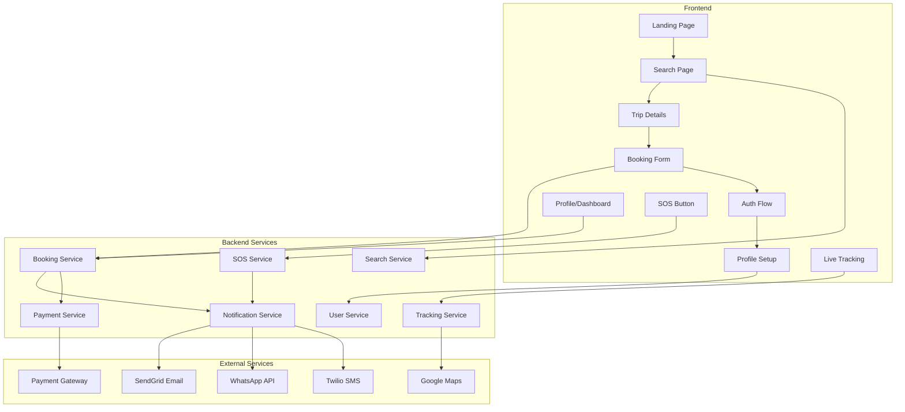

# Design Document: Passenger Booking Flow

## Overview

This design document outlines the complete passenger booking flow for the HushRyd ride-sharing platform. The system enables passengers to discover rides from the landing page, search and filter available driver-posted rides, complete registration/login during booking, generate a permanent 4-digit booking PIN, receive multi-channel notifications (Email, WhatsApp, SMS), view upcoming rides, verify identity with PIN at ride start, share live location with emergency contacts, and trigger SOS alerts during emergencies.

## Architecture



## Components and Interfaces

### 1. Search Service
- `searchRides(filters)` - Returns rides matching criteria
- `getRideDetails(tripId)` - Returns full trip details
- Filters: date, time, origin, destination, price range

### 2. User Service
- `createUser(phone, name, email)` - Creates new user
- `generateBookingPIN(userId)` - Generates permanent 4-digit PIN
- `validatePIN(userId, pin)` - Validates passenger PIN
- `updateEmergencyContacts(userId, contacts)` - Manages emergency contacts
- `getProfile(userId)` - Returns user profile with PIN

### 3. Booking Service
- `createBooking(tripId, userId, seats)` - Creates pending booking
- `confirmBooking(bookingId, paymentId)` - Confirms after payment
- `getUpcomingBookings(userId)` - Returns user's upcoming rides
- `calculateFare(tripId, seats)` - Calculates total with fees

### 4. Notification Service
- `sendBookingConfirmation(booking)` - Sends Email, WhatsApp, SMS
- `sendTrackingLink(booking, contacts)` - Sends live tracking to contacts
- `sendSOSAlert(sosAlert)` - Sends emergency notifications

### 5. Tracking Service
- `startTracking(bookingId)` - Initiates live GPS tracking
- `updateLocation(bookingId, location)` - Updates current position
- `stopTracking(bookingId)` - Ends tracking on ride complete
- `getTrackingLink(bookingId)` - Generates shareable tracking URL

### 6. SOS Service
- `triggerSOS(bookingId, location)` - Creates SOS alert
- `resolveSOSAlert(alertId)` - Marks alert as resolved
- `getActiveAlerts()` - Returns all active SOS alerts for support

## Data Models

### User
```javascript
{
  _id: ObjectId,
  phone: String (unique),
  name: String,
  email: String (optional),
  bookingPIN: String (4-digit, unique per phone),
  emergencyContacts: [{
    name: String,
    phone: String,
    relationship: String
  }], // max 5
  profileComplete: Boolean,
  createdAt: Date
}
```

### Booking
```javascript
{
  _id: ObjectId,
  tripId: ObjectId,
  userId: ObjectId,
  seats: Number,
  baseFare: Number,
  platformFee: Number (₹15 per seat),
  totalAmount: Number,
  status: Enum ['pending', 'confirmed', 'cancelled', 'completed'],
  paymentId: String,
  passengerPIN: String (copied from user),
  boardedAt: Date,
  createdAt: Date
}
```

### SOSAlert
```javascript
{
  _id: ObjectId,
  bookingId: ObjectId,
  userId: ObjectId,
  tripId: ObjectId,
  location: {
    lat: Number,
    lng: Number,
    address: String
  },
  passengerName: String,
  passengerPhone: String,
  driverName: String,
  driverPhone: String,
  vehicleDetails: String,
  route: { origin: String, destination: String },
  status: Enum ['active', 'resolved'],
  supportTicketId: ObjectId,
  createdAt: Date,
  resolvedAt: Date
}
```

### TrackingSession
```javascript
{
  _id: ObjectId,
  bookingId: ObjectId,
  tripId: ObjectId,
  shareToken: String (unique),
  currentLocation: { lat: Number, lng: Number },
  locationHistory: [{ lat: Number, lng: Number, timestamp: Date }],
  status: Enum ['active', 'completed'],
  notifiedContacts: [String], // phone numbers
  startedAt: Date,
  endedAt: Date
}
```

## Correctness Properties

*A property is a characteristic or behavior that should hold true across all valid executions of a system-essentially, a formal statement about what the system should do. Properties serve as the bridge between human-readable specifications and machine-verifiable correctness guarantees.*

### Property 1: Future Rides Only in Search
*For any* set of rides in the database, the search results SHALL only contain rides with departure time greater than the current time.
**Validates: Requirements 2.1**

### Property 2: Filter Consistency
*For any* search filter criteria and ride set, all returned rides SHALL match every applied filter condition.
**Validates: Requirements 2.2**

### Property 3: Ride Card Completeness
*For any* ride displayed in search results, the rendered card SHALL contain driver name, rating, vehicle details, departure time, route, fare per seat, and available seats.
**Validates: Requirements 2.4**

### Property 4: OTP Generation for Valid Phone
*For any* valid phone number submitted for registration, the system SHALL generate and send a 6-digit OTP.
**Validates: Requirements 3.2**

### Property 5: Profile Completeness Validation
*For any* user profile, if name is empty OR emergency contacts count is zero, the profile SHALL be marked as incomplete and booking SHALL be blocked.
**Validates: Requirements 3.4, 3.5**

### Property 6: PIN Generation Uniqueness
*For any* newly registered user, the system SHALL generate a 4-digit PIN that is unique and between 1000-9999.
**Validates: Requirements 4.1, 4.2**

### Property 7: Booking Confirmation Contains PIN
*For any* confirmed booking, the booking details SHALL include the passenger's 4-digit booking PIN.
**Validates: Requirements 4.4**

### Property 8: Fare Calculation Correctness
*For any* booking with N seats and base fare F, the total amount SHALL equal (F × N) + (15 × N) where 15 is the platform fee per seat.
**Validates: Requirements 5.2**

### Property 9: Payment Success Updates Status
*For any* booking where payment succeeds, the booking status SHALL change from 'pending' to 'confirmed'.
**Validates: Requirements 5.4**

### Property 10: Payment Failure Retains Pending
*For any* booking where payment fails, the booking status SHALL remain 'pending' and not be deleted.
**Validates: Requirements 5.5**

### Property 11: Notification Content Completeness
*For any* booking confirmation notification (Email/WhatsApp/SMS), the message SHALL contain trip date, time, pickup location, drop location, driver name, vehicle details, and fare.
**Validates: Requirements 6.4**

### Property 12: Upcoming Rides Chronological Order
*For any* user with multiple upcoming bookings, the bookings SHALL be displayed sorted by departure time in ascending order.
**Validates: Requirements 7.2**

### Property 13: Upcoming Soon Highlight
*For any* booking with departure time within 24 hours of current time, the booking SHALL be marked as "Upcoming Soon".
**Validates: Requirements 7.4**

### Property 14: PIN Validation Correctness
*For any* PIN entry during ride start, if the entered PIN matches the passenger's registered PIN, validation SHALL return true; otherwise false.
**Validates: Requirements 8.2, 8.3, 8.4**

### Property 15: All Passengers Verified for Trip Start
*For any* trip with multiple bookings, the driver SHALL only be able to start the trip when all boarded passengers have verified PINs.
**Validates: Requirements 8.5**

### Property 16: Tracking Starts on Ride Start
*For any* ride that transitions to 'in_progress' status, a tracking session SHALL be created with 'active' status.
**Validates: Requirements 9.1**

### Property 17: Emergency Contacts Receive Tracking
*For any* ride start, tracking links SHALL be sent to all emergency contacts (up to 5) of the passenger.
**Validates: Requirements 9.2**

### Property 18: Tracking Stops on Ride Complete
*For any* ride that transitions to 'completed' status, the tracking session status SHALL change to 'completed'.
**Validates: Requirements 9.5**

### Property 19: SOS Captures Location
*For any* SOS trigger, the alert SHALL contain the exact GPS coordinates at the time of trigger.
**Validates: Requirements 10.1**

### Property 20: SOS Alert Contains Required Details
*For any* SOS alert, the alert record SHALL contain passenger name, phone, location, route, driver name, driver phone, and vehicle details.
**Validates: Requirements 10.2, 10.6**

### Property 21: SOS Creates Support Ticket
*For any* SOS trigger, a high-priority support ticket SHALL be created with all trip details.
**Validates: Requirements 10.4**

### Property 22: Authenticated User Direct Booking
*For any* authenticated user with complete profile clicking "Book Now", the system SHALL proceed directly to booking form without auth redirect.
**Validates: Requirements 11.1**

### Property 23: Pre-filled Booking Form
*For any* authenticated user, the booking form SHALL pre-fill name, phone, and email from the user's profile.
**Validates: Requirements 11.2**

## Error Handling

| Error Scenario | Handling Strategy |
|----------------|-------------------|
| OTP verification fails | Display error, allow retry up to 3 times |
| Payment gateway timeout | Retain pending booking, show retry option |
| Payment declined | Show specific error, allow different payment method |
| Seats no longer available | Show error, redirect to search |
| Invalid PIN entry | Show error, allow retry, lock after 5 attempts |
| GPS location unavailable | Use last known location, show warning |
| SOS notification fails | Retry with exponential backoff, log for manual follow-up |
| Emergency contact invalid | Skip invalid, notify remaining contacts |

## Testing Strategy

### Property-Based Testing Library
- **fast-check** for JavaScript/Node.js property-based testing
- Minimum 100 iterations per property test

### Unit Tests
- User service: PIN generation, profile validation
- Booking service: fare calculation, status transitions
- Search service: filter application, date filtering
- Notification service: message content validation

### Property-Based Tests
Each correctness property will be implemented as a property-based test with the following format:
```javascript
// **Feature: passenger-booking-flow, Property {N}: {property_text}**
```

### Integration Tests
- End-to-end booking flow from search to confirmation
- OTP verification flow
- Payment integration with mock gateway
- SOS alert creation and notification flow

### Test Coverage Requirements
- All fare calculations must be property-tested
- PIN generation uniqueness must be property-tested
- Filter consistency must be property-tested
- Notification content must be property-tested
