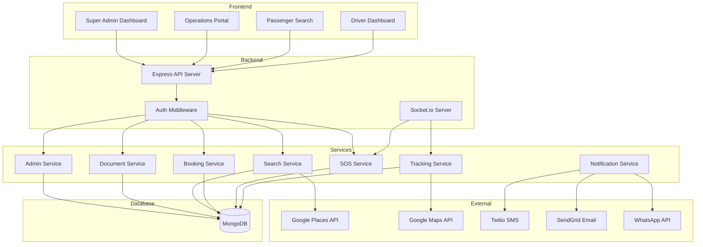
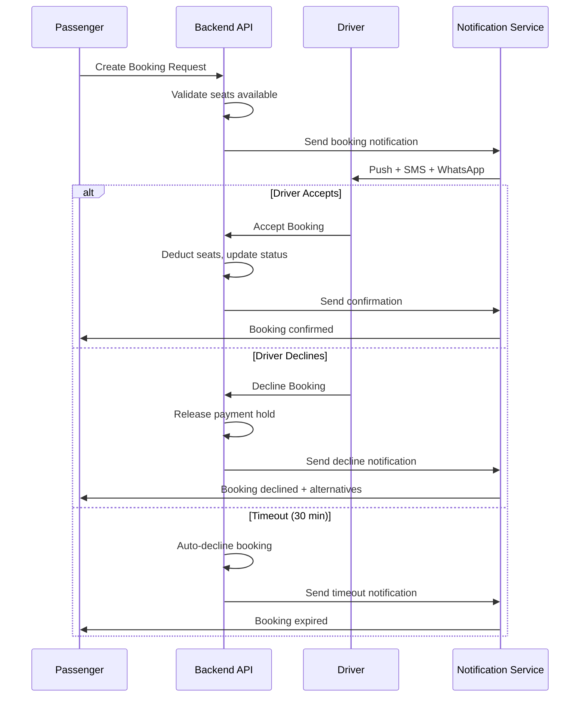

# Platform Enhancements - Design Document

## Overview

This design document covers critical platform enhancements for HushRyd including Super Admin dashboard, Operations Team document verification workflow, Google Maps-based ride search, driver booking acceptance flow, and enhanced SOS/tracking features. The implementation uses the existing Next.js frontend, Node.js/Express backend, and MongoDB database stack.

### Technology Stack

- **Frontend**: Next.js 14 (App Router), React, Tailwind CSS
- **Backend**: Node.js, Express.js
- **Database**: MongoDB with Mongoose ODM
- **Maps**: Google Places API, Google Maps JavaScript API
- **Real-time**: Socket.io for live tracking and SOS alerts
- **Notifications**: Twilio (SMS), SendGrid (Email), WhatsApp Business API
- **Testing**: Jest, fast-check for property-based testing

## Architecture

### System Architecture



### Role-Based Access Control

| Role | Access Level | Features |
|------|--------------|----------|
| super_admin | Full platform access | All dashboards, user management, transactions, analytics, audit logs |
| operations | Document verification | Document review, driver verification, support tickets |
| driver | Driver features | Trip creation (if verified), booking management, earnings |
| passenger | Passenger features | Ride search, booking, tracking, SOS |

**Design Decision**: Extend existing User model with `super_admin` role rather than creating separate admin collection.
**Rationale**: Maintains single source of truth for authentication, simplifies role checks, and allows role transitions.

## Components and Interfaces

### 1. Super Admin Dashboard

#### Backend Components

**AdminService** (`backend/src/services/adminService.js`)
- `getDashboardMetrics()` - Aggregates real-time platform metrics
- `getUsers(filters)` - Paginated user list with filters
- `getTransactions(filters)` - Transaction history with filters
- `getSupportTickets(filters)` - Support ticket management
- `getAnalytics(dateRange)` - Platform analytics and trends
- `logAdminAction(action)` - Audit trail logging

**AuditLog Model** (`backend/src/models/AuditLog.js`)
```javascript
{
  userId: ObjectId,        // Admin who performed action
  action: String,          // Action type (e.g., 'user_update', 'transaction_view')
  targetType: String,      // Entity type affected
  targetId: ObjectId,      // Entity ID affected
  details: Object,         // Action-specific details
  ipAddress: String,       // Request IP
  userAgent: String,       // Browser/client info
  timestamp: Date
}
```

**SupportTicket Model** (`backend/src/models/SupportTicket.js`)
```javascript
{
  ticketId: String,        // Format: TK-YYYY-NNNNNN
  userId: ObjectId,        // User who created ticket
  subject: String,
  description: String,
  priority: String,        // 'low', 'medium', 'high', 'critical'
  status: String,          // 'open', 'in_progress', 'resolved', 'closed'
  assignedTo: ObjectId,    // Operations team member
  category: String,        // 'booking', 'payment', 'driver', 'safety', 'other'
  messages: [{
    senderId: ObjectId,
    message: String,
    timestamp: Date
  }],
  resolvedAt: Date,
  createdAt: Date
}
```

#### Frontend Components

**SuperAdminDashboard** (`frontend/src/components/admin/SuperAdminDashboard.jsx`)
- Real-time metrics cards (users, drivers, trips, revenue)
- Quick action buttons
- Recent activity feed

**UserManagement** (`frontend/src/components/admin/UserManagement.jsx`)
- User table with pagination
- Filter panel (role, status, date range)
- Search by name/phone/email
- User detail modal

**TransactionHistory** (`frontend/src/components/admin/TransactionHistory.jsx`)
- Transaction table with filters
- Date range picker
- Export functionality

**AnalyticsDashboard** (`frontend/src/components/admin/AnalyticsDashboard.jsx`)
- Revenue trends chart
- User growth chart
- Trip analytics
- Geographic heatmap

#### API Endpoints

| Method | Endpoint | Description |
|--------|----------|-------------|
| GET | `/api/admin/dashboard` | Get dashboard metrics |
| GET | `/api/admin/users` | List users with filters |
| GET | `/api/admin/users/:id` | Get user details |
| PUT | `/api/admin/users/:id` | Update user |
| GET | `/api/admin/transactions` | List transactions |
| GET | `/api/admin/tickets` | List support tickets |
| PUT | `/api/admin/tickets/:id` | Update ticket |
| GET | `/api/admin/analytics` | Get analytics data |
| GET | `/api/admin/audit-logs` | Get audit trail |

### 2. Operations Team - Document Verification

#### Backend Components

**DocumentService** (extends existing `backend/src/services/documentService.js`)
- `getPendingDocuments(filters)` - Queue of pending documents
- `getDriverDocuments(driverId)` - All documents for a driver
- `markDocumentsMissing(driverId, documentTypes)` - Mark missing documents
- `approveDocument(documentId, reviewerId)` - Approve with status update
- `rejectDocument(documentId, reviewerId, reason)` - Reject with notification

**Design Decision**: Documents stored as subdocuments in Driver model rather than separate collection.
**Rationale**: Atomic updates, simpler queries, documents always accessed with driver context.

#### Frontend Components

**DocumentQueue** (`frontend/src/components/admin/DocumentQueue.jsx`)
- Pending documents list sorted by submission time
- Filter by document type
- Quick actions (approve/reject)

**DocumentReview** (`frontend/src/components/admin/DocumentReview.jsx`)
- Full-screen document viewer
- Zoom, rotate, pan controls
- Driver profile sidebar
- Approval/rejection form

**MissingDocumentsForm** (`frontend/src/components/admin/MissingDocumentsForm.jsx`)
- Checklist of required documents
- Custom message field
- Send notification button

#### API Endpoints

| Method | Endpoint | Description |
|--------|----------|-------------|
| GET | `/api/admin/documents` | List documents for review |
| GET | `/api/admin/documents/:id` | Get document details |
| GET | `/api/admin/drivers/:id/documents` | Get all driver documents |
| POST | `/api/admin/documents/:id/approve` | Approve document |
| POST | `/api/admin/documents/:id/reject` | Reject with reason |
| POST | `/api/admin/drivers/:id/missing-documents` | Mark missing documents |

### 3. Improved Ride Search with Google Maps

#### Backend Components

**SearchService** (extends existing `backend/src/services/searchService.js`)
- `searchRides(params)` - Geo-based search with radius matching
- `calculateDistance(coord1, coord2)` - Haversine formula
- `matchesGeoSearch(trip, source, dest, radius)` - Radius matching

**Design Decision**: Use Haversine formula for distance calculation instead of MongoDB geospatial queries.
**Rationale**: More flexible for custom radius matching, works with existing coordinate storage format.

#### Frontend Components

**LocationAutocomplete** (`frontend/src/components/search/LocationAutocomplete.jsx`)
- Google Places Autocomplete integration
- Debounced input
- Stores both display name and coordinates

**RideSearchForm** (`frontend/src/components/passenger/RideSearchForm.jsx`)
- Source/destination with autocomplete
- Date picker
- Seat count selector
- Optional filters (vehicle type, price range)

**SearchResults** (extends existing `frontend/src/components/passenger/SearchResults.jsx`)
- Trip cards with driver photo, vehicle, fare
- Sort options (departure, fare, rating)
- Available seats display

#### API Endpoints

| Method | Endpoint | Description |
|--------|----------|-------------|
| GET | `/api/search/rides` | Search rides with geo-matching |
| GET | `/api/search/trips/:id` | Get public trip details |

#### Google Maps Integration

```javascript
// Frontend: Google Places Autocomplete
const autocomplete = new google.maps.places.Autocomplete(inputRef.current, {
  componentRestrictions: { country: 'in' },
  fields: ['formatted_address', 'geometry', 'name']
});

autocomplete.addListener('place_changed', () => {
  const place = autocomplete.getPlace();
  setLocation({
    address: place.formatted_address,
    coordinates: {
      lat: place.geometry.location.lat(),
      lng: place.geometry.location.lng()
    }
  });
});
```

### 4. Driver Booking Acceptance Flow

#### Backend Components

**BookingService** (extends existing `backend/src/services/bookingService.js`)
- `createBookingRequest(passengerId, tripId, data)` - Create pending booking
- `acceptBooking(bookingId, driverId)` - Driver accepts, deducts seats
- `declineBooking(bookingId, driverId, reason)` - Driver declines
- `autoDeclineExpiredBookings()` - Cron job for 30-min timeout
- `checkTripFullyBooked(tripId)` - Auto-mark fully booked

**Booking Model** (extends existing `backend/src/models/Booking.js`)
```javascript
{
  // Existing fields...
  driverResponse: {
    status: String,        // 'pending', 'accepted', 'declined', 'auto_declined'
    respondedAt: Date,
    declineReason: String
  },
  expiresAt: Date          // 30 minutes from creation
}
```

**Design Decision**: Add `expiresAt` field for booking timeout instead of calculating from `createdAt`.
**Rationale**: Allows flexible timeout periods, simpler queries for expired bookings.

#### Frontend Components

**BookingRequestCard** (`frontend/src/components/driver/BookingRequestCard.jsx`)
- Passenger details display
- Seats requested, pickup point
- Accept/Decline buttons
- Countdown timer

**BookingManagement** (`frontend/src/components/driver/BookingManagement.jsx`)
- Pending requests list
- Accepted bookings
- Trip seat availability

#### API Endpoints

| Method | Endpoint | Description |
|--------|----------|-------------|
| POST | `/api/bookings` | Create booking request |
| POST | `/api/bookings/:id/accept` | Driver accepts booking |
| POST | `/api/bookings/:id/decline` | Driver declines booking |
| GET | `/api/driver/booking-requests` | Get pending requests for driver |

#### Notification Flow



### 5. Enhanced SOS for Passengers and Drivers

#### Backend Components

**SOSService** (extends existing `backend/src/services/sosService.js`)
- `triggerSOS(params)` - Create SOS with GPS capture
- `notifyAdminDashboard(alertId)` - WebSocket broadcast
- `notifyEmergencyContacts(alertId)` - SMS with tracking link
- `updateLocation(alertId, coordinates)` - Continuous location updates
- `resolveAlert(alertId, resolution)` - Close with audit

**SOSAlert Model** (existing `backend/src/models/SOSAlert.js`)
- Already supports passenger and driver SOS
- Location tracking array for continuous updates

**Design Decision**: Use Socket.io rooms for SOS broadcasts to ensure sub-5-second delivery.
**Rationale**: WebSocket provides lowest latency for critical alerts vs polling.

#### Frontend Components

**SOSButton** (`frontend/src/components/common/SOSButton.jsx`)
- Prominent emergency button
- Long-press to activate (prevent accidental triggers)
- Confirmation dialog

**SOSAlertsDashboard** (extends existing `frontend/src/components/admin/SOSAlerts.jsx`)
- Real-time alert feed
- Map with alert locations
- One-click call options
- Resolution workflow

#### API Endpoints

| Method | Endpoint | Description |
|--------|----------|-------------|
| POST | `/api/sos/trigger` | Trigger SOS alert |
| GET | `/api/sos/alerts` | List SOS alerts (admin) |
| GET | `/api/sos/alerts/:id` | Get alert details |
| POST | `/api/sos/alerts/:id/acknowledge` | Acknowledge alert |
| POST | `/api/sos/alerts/:id/resolve` | Resolve alert |
| POST | `/api/sos/alerts/:id/location` | Update location |

#### WebSocket Events

| Event | Direction | Description |
|-------|-----------|-------------|
| `sos:triggered` | Server → Admin | New SOS alert |
| `sos:location_update` | Server → Contacts | Location update |
| `sos:resolved` | Server → All | Alert resolved |
| `sos:acknowledged` | Server → All | Alert acknowledged |

### 6. Live Location Tracking and Ride Sharing

#### Backend Components

**TrackingService** (extends existing `backend/src/services/tripTrackingService.js`)
- `generateShareLink(bookingId)` - Create shareable tracking link
- `getSharedTripData(shareToken)` - Public trip data
- `updateDriverLocation(tripId, coordinates)` - Location updates
- `expireShareLinks(tripId)` - Expire on trip completion

**ShareLink Model** (`backend/src/models/ShareLink.js`)
```javascript
{
  token: String,           // Unique share token
  bookingId: ObjectId,
  tripId: ObjectId,
  createdBy: ObjectId,     // Passenger who shared
  expiresAt: Date,         // Trip completion or manual expiry
  accessCount: Number,     // Track link usage
  isActive: Boolean
}
```

**Design Decision**: Use short-lived tokens for share links instead of booking IDs.
**Rationale**: Security - prevents enumeration attacks, allows link revocation.

#### Frontend Components

**ShareRideButton** (`frontend/src/components/passenger/ShareRideButton.jsx`)
- Generate/copy share link
- Share via native share API
- QR code generation

**PublicTrackingPage** (`frontend/src/app/track/share/[token]/page.js`)
- No authentication required
- Driver details, vehicle info
- Live map with driver location
- ETA display

**LiveTrackingMap** (extends existing `frontend/src/components/passenger/LiveTracking.jsx`)
- Real-time driver location
- Route polyline
- ETA calculation

#### API Endpoints

| Method | Endpoint | Description |
|--------|----------|-------------|
| POST | `/api/tracking/share` | Generate share link |
| GET | `/api/tracking/share/:token` | Get shared trip data (public) |
| DELETE | `/api/tracking/share/:token` | Revoke share link |
| GET | `/api/tracking/trip/:id` | Get live tracking data |

#### WebSocket Events

| Event | Direction | Description |
|-------|-----------|-------------|
| `tracking:location` | Server → Clients | Driver location update |
| `tracking:eta` | Server → Clients | ETA update |
| `tracking:trip_completed` | Server → Clients | Trip ended |

## Data Models

### New Models

#### AuditLog
```javascript
const AuditLogSchema = new mongoose.Schema({
  userId: { type: ObjectId, ref: 'User', required: true, index: true },
  action: { type: String, required: true, index: true },
  targetType: { type: String, enum: ['user', 'driver', 'trip', 'booking', 'transaction', 'document', 'sos'] },
  targetId: { type: ObjectId },
  details: { type: Object },
  ipAddress: { type: String },
  userAgent: { type: String },
  timestamp: { type: Date, default: Date.now, index: true }
});
```

#### SupportTicket
```javascript
const SupportTicketSchema = new mongoose.Schema({
  ticketId: { type: String, unique: true, index: true },
  userId: { type: ObjectId, ref: 'User', required: true },
  subject: { type: String, required: true, maxlength: 200 },
  description: { type: String, required: true, maxlength: 2000 },
  priority: { type: String, enum: ['low', 'medium', 'high', 'critical'], default: 'medium' },
  status: { type: String, enum: ['open', 'in_progress', 'resolved', 'closed'], default: 'open' },
  assignedTo: { type: ObjectId, ref: 'User' },
  category: { type: String, enum: ['booking', 'payment', 'driver', 'safety', 'other'] },
  messages: [{
    senderId: { type: ObjectId, ref: 'User' },
    message: { type: String },
    timestamp: { type: Date, default: Date.now }
  }],
  resolvedAt: { type: Date }
}, { timestamps: true });
```

#### ShareLink
```javascript
const ShareLinkSchema = new mongoose.Schema({
  token: { type: String, unique: true, required: true, index: true },
  bookingId: { type: ObjectId, ref: 'Booking', required: true },
  tripId: { type: ObjectId, ref: 'Trip', required: true },
  createdBy: { type: ObjectId, ref: 'User', required: true },
  expiresAt: { type: Date, required: true },
  accessCount: { type: Number, default: 0 },
  isActive: { type: Boolean, default: true }
}, { timestamps: true });
```

### Model Extensions

#### User Model Extension
```javascript
// Add super_admin to role enum
role: {
  type: String,
  enum: ['passenger', 'driver', 'admin', 'operations', 'super_admin'],
  default: 'passenger'
}
```

#### Booking Model Extension
```javascript
// Add driver response tracking
driverResponse: {
  status: { type: String, enum: ['pending', 'accepted', 'declined', 'auto_declined'], default: 'pending' },
  respondedAt: { type: Date },
  declineReason: { type: String }
},
expiresAt: { type: Date }  // 30 minutes from creation
```


## Correctness Properties

*A property is a characteristic or behavior that should hold true across all valid executions of a system-essentially, a formal statement about what the system should do. Properties serve as the bridge between human-readable specifications and machine-verifiable correctness guarantees.*

### Property Reflection

After analyzing the acceptance criteria, the following redundancies were identified and consolidated:
- Properties 1.3 and 1.4 (user and transaction filtering) follow the same pattern - kept separate as they test different data types
- Properties 3.1 and 3.2 (Google Places autocomplete) are UI features - excluded from testable properties
- Properties 5.2 and 5.4 (real-time timing requirements) are performance constraints - excluded from property tests
- Properties 4.5 and 4.6 (fully booked status) are related but test different aspects - consolidated into one property

### Testable Properties

**Property 1: Super Admin Role Authentication**
*For any* authentication attempt, if the credentials are valid AND the user has `super_admin` role, access to admin dashboard SHALL be granted; otherwise access SHALL be denied.
**Validates: Requirements 1.1**

**Property 2: Dashboard Metrics Accuracy**
*For any* database state, the dashboard metrics (total users, active drivers, ongoing trips, daily revenue) SHALL match the actual counts computed from the underlying collections.
**Validates: Requirements 1.2**

**Property 3: User Filter Correctness**
*For any* combination of user filters (role, status, registration date, search term), all returned users SHALL match ALL specified filter criteria.
**Validates: Requirements 1.3**

**Property 4: Transaction Filter Correctness**
*For any* combination of transaction filters (date range, type, status, amount range), all returned transactions SHALL match ALL specified filter criteria.
**Validates: Requirements 1.4**

**Property 5: Audit Log Completeness**
*For any* admin action performed, an audit log entry SHALL be created containing userId, action type, timestamp, and action details.
**Validates: Requirements 1.7**

**Property 6: Document Upload Notification**
*For any* document upload by a driver, a notification SHALL be created for the operations team containing driver details and document information.
**Validates: Requirements 2.1**

**Property 7: Pending Documents Data Completeness**
*For any* pending document query, the result SHALL include driver profile, all uploaded documents, and submission timestamp for each document.
**Validates: Requirements 2.2**

**Property 8: Document Rejection Requires Reason**
*For any* document rejection attempt, if no rejection reason is provided, the rejection SHALL fail; if a reason is provided, the rejection SHALL succeed and trigger driver notification.
**Validates: Requirements 2.5**

**Property 9: Driver Verification Status Transition**
*For any* driver with all required documents (license, registration, insurance, KYC) approved, the driver's verificationStatus SHALL be 'verified'.
**Validates: Requirements 2.6**

**Property 10: Verified Driver Trip Creation**
*For any* trip creation attempt, if the driver's verificationStatus is NOT 'verified', the creation SHALL fail; if 'verified', the creation SHALL succeed (given valid trip data).
**Validates: Requirements 2.7**

**Property 11: Location Storage Completeness**
*For any* location selection, both the display name (address) AND coordinates (lat, lng) SHALL be stored.
**Validates: Requirements 3.3**

**Property 12: Geo-Search Radius Matching**
*For any* ride search with source/destination coordinates and radius, all returned trips SHALL have source within radius of search source AND destination within radius of search destination.
**Validates: Requirements 3.5**

**Property 13: Search Results Data Completeness**
*For any* search result, the trip data SHALL include driver photo, vehicle details, departure time, route, available seats, and fare.
**Validates: Requirements 3.6**

**Property 14: Booking Creates Driver Notification**
*For any* booking request creation, a notification SHALL be sent to the driver via at least one channel (push, SMS, or WhatsApp).
**Validates: Requirements 4.1**

**Property 15: Booking Acceptance Seat Deduction**
*For any* booking acceptance, the trip's available seats SHALL decrease by the number of seats in the booking, and the passenger SHALL receive a confirmation notification.
**Validates: Requirements 4.3**

**Property 16: Booking Decline Payment Release**
*For any* booking decline, if a payment hold exists, it SHALL be released, and the passenger SHALL receive a notification.
**Validates: Requirements 4.4**

**Property 17: Fully Booked Trip Prevention**
*For any* trip where booked seats equal total seats, the trip status SHALL be 'fully_booked' AND new booking requests SHALL be rejected.
**Validates: Requirements 4.5, 4.6**

**Property 18: Booking Auto-Decline Timeout**
*For any* pending booking older than 30 minutes without driver response, the booking SHALL be auto-declined and the passenger SHALL be notified.
**Validates: Requirements 4.7**

**Property 19: SOS Data Capture Completeness**
*For any* SOS trigger, the alert SHALL capture GPS coordinates (lat, lng), timestamp, trip ID, and user type (passenger/driver).
**Validates: Requirements 5.1**

**Property 20: SOS Emergency Contact Notification**
*For any* SOS trigger, all registered emergency contacts of the user SHALL receive a notification with a live location tracking link.
**Validates: Requirements 5.3**

**Property 21: SOS Details Completeness**
*For any* SOS alert viewed by operations team, the display SHALL include trip details, both parties' information, exact location, and contact options.
**Validates: Requirements 5.5**

**Property 22: SOS Resolution Logging**
*For any* SOS resolution, the resolution details SHALL be logged, location sharing SHALL stop, and emergency contacts SHALL be notified.
**Validates: Requirements 5.6**

**Property 23: Share Ride Availability**
*For any* trip with status 'in_progress', the 'Share Ride' option SHALL be available to the passenger.
**Validates: Requirements 6.1**

**Property 24: Share Link Generation**
*For any* ride share request, a unique shareable link SHALL be generated containing trip details and tracking capability.
**Validates: Requirements 6.2**

**Property 25: Public Share Link Access**
*For any* valid share link access (without authentication), the response SHALL include driver details, vehicle info, route, and current location.
**Validates: Requirements 6.3**

**Property 26: Share Link Expiration**
*For any* completed trip, all associated share links SHALL be expired and return an expired status when accessed.
**Validates: Requirements 6.5**

**Property 27: Active Trip Display Completeness**
*For any* active trip viewed by passenger, the display SHALL include driver's live location, ETA, and contact option.
**Validates: Requirements 6.6**

## Error Handling

### Error Categories

| Category | HTTP Status | Error Codes |
|----------|-------------|-------------|
| Authentication | 401 | `UNAUTHORIZED`, `INVALID_TOKEN`, `TOKEN_EXPIRED` |
| Authorization | 403 | `FORBIDDEN`, `INSUFFICIENT_ROLE`, `NOT_VERIFIED` |
| Validation | 400 | `INVALID_INPUT`, `MISSING_FIELD`, `INVALID_FORMAT` |
| Not Found | 404 | `USER_NOT_FOUND`, `TRIP_NOT_FOUND`, `BOOKING_NOT_FOUND` |
| Conflict | 409 | `DUPLICATE_BOOKING`, `INSUFFICIENT_SEATS`, `ALREADY_PROCESSED` |
| Server Error | 500 | `INTERNAL_ERROR`, `DATABASE_ERROR`, `EXTERNAL_SERVICE_ERROR` |

### Error Response Format

```javascript
{
  success: false,
  error: {
    code: 'ERROR_CODE',
    message: 'Human-readable error message',
    details: {} // Optional additional context
  }
}
```

### Specific Error Handling

**Super Admin Authentication**
- Invalid credentials: Return 401 with `INVALID_CREDENTIALS`
- Non-super_admin role: Return 403 with `INSUFFICIENT_ROLE`
- Token expired: Return 401 with `TOKEN_EXPIRED`

**Document Verification**
- Document not found: Return 404 with `DOCUMENT_NOT_FOUND`
- Already processed: Return 409 with `DOCUMENT_ALREADY_PROCESSED`
- Missing rejection reason: Return 400 with `REASON_REQUIRED`

**Booking Acceptance**
- Insufficient seats: Return 409 with `INSUFFICIENT_SEATS`
- Booking expired: Return 400 with `BOOKING_EXPIRED`
- Already responded: Return 409 with `ALREADY_RESPONDED`

**SOS Alerts**
- Missing coordinates: Return 400 with `COORDINATES_REQUIRED`
- Trip not found: Return 404 with `TRIP_NOT_FOUND`
- Already resolved: Return 409 with `ALERT_ALREADY_RESOLVED`

**Share Links**
- Link expired: Return 410 with `LINK_EXPIRED`
- Link not found: Return 404 with `LINK_NOT_FOUND`
- Trip completed: Return 410 with `TRIP_COMPLETED`

## Testing Strategy

### Dual Testing Approach

This implementation uses both unit tests and property-based tests for comprehensive coverage:
- **Unit tests**: Verify specific examples, edge cases, and error conditions
- **Property-based tests**: Verify universal properties that should hold across all inputs

### Property-Based Testing Framework

**Framework**: fast-check (JavaScript property-based testing library)
**Minimum iterations**: 100 per property test
**Test file location**: `backend/tests/property/`

### Property Test Annotations

Each property-based test MUST be annotated with:
```javascript
/**
 * Feature: platform-enhancements, Property {number}: {property_text}
 * Validates: Requirements {X.Y}
 */
```

### Test Categories

#### Unit Tests

| Component | Test Focus |
|-----------|------------|
| AdminService | Metrics calculation, filter logic, audit logging |
| DocumentService | Approval/rejection workflow, status transitions |
| SearchService | Geo-matching, distance calculation, filtering |
| BookingService | Seat management, timeout handling, notifications |
| SOSService | Alert creation, notification dispatch, resolution |
| TrackingService | Link generation, expiration, location updates |

#### Property Tests

| Property | Generator Strategy |
|----------|-------------------|
| Role Authentication | Generate users with various roles, test access |
| Filter Correctness | Generate random filter combinations, verify results |
| Geo-Search | Generate random coordinates, verify radius matching |
| Seat Management | Generate bookings, verify seat arithmetic |
| SOS Data Capture | Generate SOS triggers, verify data completeness |
| Share Link Expiration | Generate trips with various statuses, verify link behavior |

### Test Data Generators

```javascript
// Example generators for property tests
const userGenerator = fc.record({
  phone: fc.stringOf(fc.constantFrom('0', '1', '2', '3', '4', '5', '6', '7', '8', '9'), { minLength: 10, maxLength: 10 }),
  email: fc.emailAddress(),
  role: fc.constantFrom('passenger', 'driver', 'admin', 'operations', 'super_admin'),
  isActive: fc.boolean()
});

const coordinatesGenerator = fc.record({
  lat: fc.double({ min: -90, max: 90 }),
  lng: fc.double({ min: -180, max: 180 })
});

const bookingGenerator = fc.record({
  seats: fc.integer({ min: 1, max: 6 }),
  status: fc.constantFrom('pending', 'confirmed', 'cancelled', 'completed')
});
```

### Integration Tests

| Flow | Test Scenario |
|------|---------------|
| Document Verification | Upload → Review → Approve/Reject → Status Update → Notification |
| Booking Acceptance | Request → Notify Driver → Accept/Decline → Update Seats → Notify Passenger |
| SOS Flow | Trigger → Capture Data → Notify Admin → Notify Contacts → Resolve |
| Ride Sharing | Start Trip → Generate Link → Access Link → Complete Trip → Expire Link |

### Test Coverage Targets

- Unit test coverage: 80%+
- Property test coverage: All 27 correctness properties
- Integration test coverage: All critical user flows
