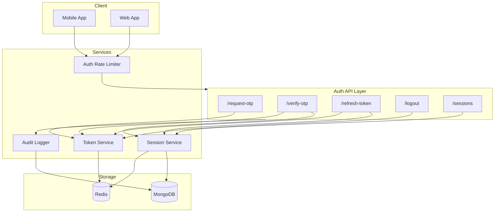

# Design Document: Production Authentication API

## Overview

This design enhances the existing HushRyd authentication system to production-grade standards. The current system uses OTP-based authentication with JWT tokens. This enhancement adds:

- Dual-token architecture (short-lived access tokens + long-lived refresh tokens)
- Token blacklisting for secure logout
- Session management with device tracking
- Enhanced rate limiting for auth endpoints
- Comprehensive security audit logging

The design builds on existing infrastructure (Redis, JWT, OTP service) while adding new capabilities.

## Architecture



## Components and Interfaces

### 1. Enhanced Token Service

Extends the existing `tokenService.js` with dual-token support.

```javascript
// Token generation with access + refresh tokens
interface TokenPair {
  accessToken: string;      // 15-minute expiry
  refreshToken: string;     // 7-day expiry
  accessExpiresIn: number;  // seconds
  refreshExpiresIn: number; // seconds
}

// Token service methods
generateTokenPair(user: User, sessionId: string): TokenPair
verifyAccessToken(token: string): TokenVerifyResult
verifyRefreshToken(token: string): RefreshTokenResult
blacklistToken(token: string, reason: string): Promise<void>
isTokenBlacklisted(token: string): Promise<boolean>
```

### 2. Session Service

New service for managing user sessions across devices.

```javascript
interface Session {
  sessionId: string;
  userId: string;
  deviceInfo: string;
  ipAddress: string;
  createdAt: Date;
  lastActivityAt: Date;
  refreshTokenHash: string;
  isActive: boolean;
}

// Session service methods
createSession(userId: string, deviceInfo: string, ip: string): Promise<Session>
getActiveSessions(userId: string): Promise<Session[]>
revokeSession(sessionId: string): Promise<void>
revokeAllSessions(userId: string): Promise<void>
updateSessionActivity(sessionId: string): Promise<void>
```

### 3. Auth Rate Limiter

Specialized rate limiting for authentication endpoints.

```javascript
// Rate limit configurations
const authRateLimits = {
  otpRequest: { windowMs: 15 * 60 * 1000, max: 5 },      // 5 per 15 min per phone
  otpVerify: { windowMs: 15 * 60 * 1000, max: 10 },     // 10 per 15 min per phone
  staffLogin: { windowMs: 15 * 60 * 1000, max: 5 },     // 5 per 15 min per IP
  tokenRefresh: { windowMs: 60 * 1000, max: 10 }        // 10 per min per user
};
```

### 4. Audit Logger

Security event logging for authentication activities.

```javascript
interface AuthAuditEvent {
  eventType: 'LOGIN_SUCCESS' | 'LOGIN_FAILURE' | 'LOGOUT' | 'TOKEN_REFRESH' | 
             'SESSION_REVOKED' | 'RATE_LIMITED';
  userId?: string;
  identifier?: string;
  ipAddress: string;
  userAgent: string;
  timestamp: Date;
  metadata: Record<string, any>;
}

// Audit logger methods
logAuthEvent(event: AuthAuditEvent): Promise<void>
getAuthEvents(userId: string, options: QueryOptions): Promise<AuthAuditEvent[]>
```

## Data Models

### Session Model (MongoDB)

```javascript
const SessionSchema = new mongoose.Schema({
  sessionId: { type: String, required: true, unique: true, index: true },
  userId: { type: mongoose.Schema.Types.ObjectId, ref: 'User', required: true, index: true },
  deviceInfo: { type: String, default: 'Unknown Device' },
  ipAddress: { type: String, required: true },
  userAgent: { type: String },
  refreshTokenHash: { type: String, required: true },
  createdAt: { type: Date, default: Date.now },
  lastActivityAt: { type: Date, default: Date.now },
  expiresAt: { type: Date, required: true, index: true },
  isActive: { type: Boolean, default: true }
}, { timestamps: true });

// TTL index for automatic cleanup
SessionSchema.index({ expiresAt: 1 }, { expireAfterSeconds: 0 });
```

### Auth Audit Log Model (MongoDB)

```javascript
const AuthAuditLogSchema = new mongoose.Schema({
  eventType: { 
    type: String, 
    required: true,
    enum: ['LOGIN_SUCCESS', 'LOGIN_FAILURE', 'LOGOUT', 'TOKEN_REFRESH', 
           'SESSION_REVOKED', 'RATE_LIMITED', 'TOKEN_BLACKLISTED']
  },
  userId: { type: mongoose.Schema.Types.ObjectId, ref: 'User', index: true },
  identifier: { type: String }, // phone/email for failed attempts
  ipAddress: { type: String, required: true },
  userAgent: { type: String },
  failureReason: { type: String },
  metadata: { type: mongoose.Schema.Types.Mixed },
  timestamp: { type: Date, default: Date.now, index: true }
});

// TTL index - keep logs for 90 days
AuthAuditLogSchema.index({ timestamp: 1 }, { expireAfterSeconds: 90 * 24 * 60 * 60 });
```

### Redis Key Structures

```
# Token blacklist (TTL: token remaining lifetime)
blacklist:{tokenHash} = "1"

# Refresh token to session mapping (TTL: 7 days)
refresh:{tokenHash} = {sessionId}

# Rate limiting keys
rl:auth:otp:{phone} = count
rl:auth:verify:{phone} = count
rl:auth:staff:{ip} = count
```

## Correctness Properties

*A property is a characteristic or behavior that should hold true across all valid executions of a system-essentially, a formal statement about what the system should do. Properties serve as the bridge between human-readable specifications and machine-verifiable correctness guarantees.*

### Property 1: Token Expiry Correctness
*For any* successfully authenticated user, the generated access token SHALL have an expiry time of exactly 15 minutes from generation, and the refresh token SHALL have an expiry time of exactly 7 days from generation.
**Validates: Requirements 1.1**

### Property 2: Expired Token Rejection
*For any* access token that has passed its expiry time, the token verification SHALL return invalid with error code AUTH_002.
**Validates: Requirements 1.2**

### Property 3: Refresh Token Round-Trip
*For any* valid refresh token, calling the refresh endpoint SHALL return a new valid access token that can be used for API authentication.
**Validates: Requirements 1.3**

### Property 4: Blacklist Enforcement
*For any* token that has been added to the blacklist, subsequent authentication attempts using that token SHALL be rejected with 401 status.
**Validates: Requirements 2.1, 2.3**

### Property 5: Logout All Devices Invalidation
*For any* user with multiple active sessions, calling logout with allDevices=true SHALL invalidate all refresh tokens, making none of them usable for token refresh.
**Validates: Requirements 2.2**

### Property 6: Rate Limit Retry-After Header
*For any* rate-limited response (429 status), the response SHALL include a Retry-After header with a positive integer value representing seconds until the limit resets.
**Validates: Requirements 3.4**

### Property 7: Session Listing Completeness
*For any* user with active sessions, the session listing endpoint SHALL return all sessions with non-null deviceInfo, masked ipAddress, and valid lastActivityAt timestamp.
**Validates: Requirements 4.1, 4.4**

### Property 8: Session Revocation Prevents Refresh
*For any* revoked session, attempting to use its refresh token SHALL fail with an appropriate error.
**Validates: Requirements 4.2, 4.3**

### Property 9: Error Response Consistency
*For any* authentication error, the response body SHALL contain error (string), errorCode (string), and message (string) fields.
**Validates: Requirements 5.1**

### Property 10: Success Response Token Format
*For any* successful authentication, the response SHALL contain accessToken, refreshToken, accessExpiresIn, and refreshExpiresIn fields with valid values.
**Validates: Requirements 5.3**

### Property 11: Audit Log Completeness
*For any* authentication event (success or failure), an audit log entry SHALL be created with non-null ipAddress and timestamp fields.
**Validates: Requirements 6.1, 6.2**

## Error Handling

### Error Codes

| Code | HTTP Status | Description |
|------|-------------|-------------|
| AUTH_001 | 400 | Invalid request parameters |
| AUTH_002 | 401 | Token expired |
| AUTH_003 | 401 | Invalid OTP |
| AUTH_004 | 401 | Max OTP attempts exceeded |
| AUTH_005 | 401 | Invalid or missing token |
| AUTH_006 | 403 | Insufficient permissions |
| AUTH_007 | 401 | Refresh token expired |
| AUTH_008 | 401 | Session revoked |
| AUTH_009 | 429 | Rate limit exceeded |

### Error Response Format

```json
{
  "success": false,
  "error": "Human readable error message",
  "errorCode": "AUTH_XXX",
  "details": {} // Optional field-level errors for validation
}
```

## Testing Strategy

### Property-Based Testing Library
- **Library**: fast-check (JavaScript)
- **Minimum iterations**: 100 per property test

### Unit Tests
- Token generation with correct expiry times
- Token verification for valid/invalid/expired tokens
- Blacklist add/check operations
- Session CRUD operations
- Rate limiter behavior at boundaries

### Property-Based Tests
Each correctness property will have a corresponding property-based test:

1. **Token Expiry Property Test**: Generate random users, create tokens, verify expiry claims match expected values
2. **Blacklist Enforcement Test**: Generate random tokens, blacklist them, verify all are rejected
3. **Session Listing Test**: Create random sessions, verify listing returns all with required fields
4. **Error Response Test**: Trigger various auth errors, verify response structure consistency
5. **Audit Log Test**: Perform auth operations, verify logs contain required fields

### Integration Tests
- Full OTP flow: request → verify → get tokens
- Refresh token flow: authenticate → wait → refresh
- Logout flow: authenticate → logout → verify rejection
- Session management: create sessions → list → revoke → verify

### Test Annotations
All property-based tests will be annotated with:
```javascript
/**
 * Feature: production-auth-api, Property {N}: {property_text}
 * Validates: Requirements X.Y
 */
```
