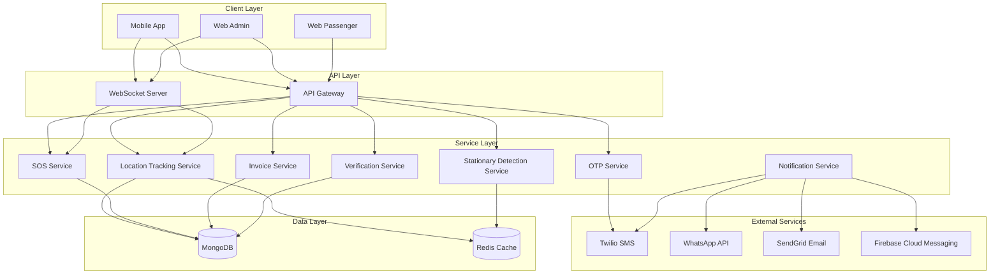

# Design Document: Ride Safety, Tracking & Notifications

## Overview

This design document outlines the architecture and implementation for enhanced safety, tracking, and notification features in the HushRyd platform. The features include real SMS OTP delivery, comprehensive live location tracking for both drivers and passengers, enhanced SOS functionality with journey details, booking invoice generation with multi-channel delivery, unique ride verification codes, and stationary vehicle detection with safety checks.

## Architecture

The system follows a layered architecture with clear separation of concerns:



## Components and Interfaces

### 1. OTP Delivery Service

Extends the existing `otpService.js` to integrate with Twilio for real SMS delivery.

```javascript
// Interface
interface OTPDeliveryService {
  sendOTP(phoneNumber: string): Promise<OTPResult>;
  verifyOTP(phoneNumber: string, code: string): Promise<VerificationResult>;
  getDeliveryStatus(messageId: string): Promise<DeliveryStatus>;
}

interface OTPResult {
  success: boolean;
  messageId: string;
  maskedPhone: string; // Last 4 digits visible
  expiresAt: Date;
}
```

### 2. Live Location Tracking Service

Extends `tripTrackingService.js` with contact sharing and admin monitoring.

```javascript
// Interface
interface LiveLocationService {
  startSharing(tripId: string, userId: string, contacts: Contact[]): Promise<ShareSession>;
  updateLocation(tripId: string, coordinates: Coordinates): Promise<void>;
  stopSharing(tripId: string, userId: string): Promise<void>;
  getActiveTrips(): Promise<ActiveTrip[]>;
  subscribeToTrip(tripId: string, callback: LocationCallback): Subscription;
}

interface ShareSession {
  sessionId: string;
  tripId: string;
  contacts: Contact[];
  trackingUrl: string;
  expiresAt: Date;
}
```

### 3. Enhanced SOS Service

Extends `sosService.js` with journey details and multi-dashboard notifications.

```javascript
// Interface
interface EnhancedSOSService {
  triggerSOS(params: SOSTriggerParams): Promise<SOSAlert>;
  getJourneyDetails(alertId: string): Promise<JourneyDetails>;
  notifyDashboards(alertId: string): Promise<NotificationResults>;
  resolveAlert(alertId: string, resolution: Resolution): Promise<void>;
}

interface JourneyDetails {
  alertId: string;
  tripId: string;
  routeTaken: Coordinates[];
  stops: StopEvent[];
  currentLocation: Coordinates;
  driver: DriverInfo;
  passenger: PassengerInfo;
  vehicle: VehicleInfo;
}
```

### 4. Invoice Service

New service for generating and delivering booking invoices.

```javascript
// Interface
interface InvoiceService {
  generateInvoice(bookingId: string): Promise<Invoice>;
  sendInvoice(invoice: Invoice, channels: Channel[]): Promise<DeliveryResults>;
  getInvoice(invoiceId: string): Promise<Invoice>;
}

interface Invoice {
  invoiceId: string;
  bookingId: string;
  tripDetails: TripDetails;
  fareBreakdown: FareBreakdown;
  driverDetails: DriverDetails;
  vehicleDetails: VehicleDetails;
  generatedAt: Date;
  pdfUrl: string;
}
```

### 5. Ride Verification Service

Extends booking flow with unique verification codes.

```javascript
// Interface
interface VerificationService {
  generateCode(bookingId: string): Promise<VerificationCode>;
  validateCode(bookingId: string, code: string): Promise<ValidationResult>;
  getAttempts(bookingId: string): Promise<number>;
}

interface VerificationCode {
  code: string; // 4-digit
  bookingId: string;
  expiresAt: Date;
  maxAttempts: number;
}
```

### 6. Stationary Detection Service

New service for monitoring vehicle movement and safety checks.

```javascript
// Interface
interface StationaryDetectionService {
  startMonitoring(tripId: string): Promise<void>;
  processLocationUpdate(tripId: string, coordinates: Coordinates): Promise<StationaryStatus>;
  handleSafetyResponse(tripId: string, response: SafetyResponse): Promise<void>;
  escalate(tripId: string): Promise<EscalationResult>;
}

interface StationaryStatus {
  isStationary: boolean;
  stationaryDuration: number; // seconds
  lastMovement: Date;
  alertSent: boolean;
}
```

## Data Models

### LocationShare Model

```javascript
const LocationShareSchema = new Schema({
  tripId: { type: Schema.Types.ObjectId, ref: 'Trip', required: true },
  userId: { type: Schema.Types.ObjectId, ref: 'User', required: true },
  userType: { type: String, enum: ['driver', 'passenger'], required: true },
  contacts: [{
    name: String,
    phone: String,
    notifiedAt: Date,
    trackingUrl: String
  }],
  isActive: { type: Boolean, default: true },
  startedAt: { type: Date, default: Date.now },
  endedAt: Date,
  lastLocation: {
    coordinates: { lat: Number, lng: Number },
    timestamp: Date
  }
});
```

### Invoice Model

```javascript
const InvoiceSchema = new Schema({
  invoiceId: { type: String, unique: true, required: true },
  bookingId: { type: Schema.Types.ObjectId, ref: 'Booking', required: true },
  tripDetails: {
    tripId: String,
    source: { address: String, coordinates: { lat: Number, lng: Number } },
    destination: { address: String, coordinates: { lat: Number, lng: Number } },
    scheduledAt: Date
  },
  fareBreakdown: {
    baseFare: Number,
    distanceCharge: Number,
    taxes: Number,
    total: Number
  },
  driverDetails: {
    name: String,
    phone: String,
    rating: Number
  },
  vehicleDetails: {
    make: String,
    model: String,
    color: String,
    plateNumber: String
  },
  verificationCode: String,
  deliveryStatus: {
    whatsapp: { sent: Boolean, sentAt: Date, messageId: String },
    sms: { sent: Boolean, sentAt: Date, messageId: String },
    email: { sent: Boolean, sentAt: Date, messageId: String }
  },
  pdfUrl: String,
  generatedAt: { type: Date, default: Date.now }
});
```

### StationaryEvent Model

```javascript
const StationaryEventSchema = new Schema({
  tripId: { type: Schema.Types.ObjectId, ref: 'Trip', required: true },
  location: {
    coordinates: { lat: Number, lng: Number },
    address: String
  },
  startedAt: { type: Date, required: true },
  duration: Number, // seconds
  alertSentAt: Date,
  passengerResponse: {
    responded: Boolean,
    respondedAt: Date,
    response: { type: String, enum: ['safe', 'help', 'no_response'] }
  },
  escalation: {
    callAttempted: Boolean,
    callAnswered: Boolean,
    escalatedToSupport: Boolean,
    escalatedAt: Date
  },
  resolvedAt: Date
});
```

## Correctness Properties

*A property is a characteristic or behavior that should hold true across all valid executions of a system-essentially, a formal statement about what the system should do. Properties serve as the bridge between human-readable specifications and machine-verifiable correctness guarantees.*

### Property 1: OTP Generation Format
*For any* phone number, the generated OTP SHALL be exactly 6 digits and numeric only.
**Validates: Requirements 1.1**

### Property 2: Phone Number Masking
*For any* phone number of 10 or more digits, the masking function SHALL return a string showing only the last 4 digits with the rest replaced by asterisks.
**Validates: Requirements 1.2**

### Property 3: Retry Mechanism Limit
*For any* failed SMS delivery, the retry mechanism SHALL attempt at most 3 retries before marking as failed.
**Validates: Requirements 1.3**

### Property 4: Location Sharing Contact Limit
*For any* location sharing session, the system SHALL accept at most 5 contacts and reject attempts to add more.
**Validates: Requirements 2.2**

### Property 5: Location Broadcast Completeness
*For any* active location sharing session with N contacts, a location update SHALL be broadcast to all N contacts.
**Validates: Requirements 2.3, 3.3**

### Property 6: Tracking Data Completeness
*For any* shared tracking link access, the response SHALL contain passenger location, driver name, and vehicle information.
**Validates: Requirements 3.5**

### Property 7: Trip End Cleanup
*For any* trip that ends, all associated location sharing sessions SHALL be marked inactive and contacts notified.
**Validates: Requirements 2.5, 3.4**

### Property 8: Admin Dashboard Trip Visibility
*For any* trip with status "in_progress", the trip SHALL appear in the admin active trips list.
**Validates: Requirements 4.1**

### Property 9: Trip Filtering Correctness
*For any* filter criteria (region or status), the filtered trip list SHALL contain only trips matching all specified criteria.
**Validates: Requirements 4.4**

### Property 10: SOS Data Capture Completeness
*For any* SOS trigger, the created alert SHALL contain GPS coordinates, timestamp, trip ID, and user ID.
**Validates: Requirements 5.1**

### Property 11: SOS Dashboard Notification
*For any* SOS alert, notifications SHALL be sent to both super admin and customer support dashboards.
**Validates: Requirements 5.2, 5.3**

### Property 12: Invoice Content Completeness
*For any* generated invoice, the invoice SHALL contain trip details, fare breakdown, driver details, vehicle information, and verification code.
**Validates: Requirements 6.1, 6.6**

### Property 13: Invoice Multi-Channel Delivery
*For any* confirmed booking, the invoice SHALL be sent via all three channels (WhatsApp, SMS, email).
**Validates: Requirements 6.2, 6.3, 6.4**

### Property 14: Verification Code Format
*For any* confirmed booking, the generated verification code SHALL be exactly 4 digits and unique within active bookings.
**Validates: Requirements 7.1**

### Property 15: Verification Code Validation
*For any* booking with verification code C, entering code C SHALL return valid=true and start the ride, while entering any other code SHALL return valid=false.
**Validates: Requirements 7.5, 7.6**

### Property 16: Stationary Detection Trigger
*For any* trip where the vehicle has not moved more than 50 meters in 15 minutes, a stationary alert SHALL be triggered.
**Validates: Requirements 8.2**

### Property 17: Safety Check Options
*For any* stationary alert notification, the notification SHALL contain both "confirm safety" and "request help" options.
**Validates: Requirements 8.3**

### Property 18: Help Request SOS Trigger
*For any* safety check where passenger selects "request help", an SOS alert SHALL be automatically created.
**Validates: Requirements 8.5**

### Property 19: Escalation Flow
*For any* stationary alert with no passenger response after 5 minutes, the system SHALL attempt to call the passenger, and if unanswered, escalate to customer support.
**Validates: Requirements 8.6, 8.7**

## Error Handling

### OTP Delivery Errors
- **SMS_DELIVERY_FAILED**: Retry up to 3 times, then offer email alternative
- **INVALID_PHONE_NUMBER**: Return validation error with format guidance
- **RATE_LIMIT_EXCEEDED**: Return error with retry-after timestamp

### Location Tracking Errors
- **GPS_UNAVAILABLE**: Use last known location, notify user to enable GPS
- **WEBSOCKET_DISCONNECTED**: Queue updates, reconnect automatically
- **CONTACT_NOTIFICATION_FAILED**: Log failure, retry in background

### SOS Errors
- **LOCATION_CAPTURE_FAILED**: Use last known location, proceed with alert
- **DASHBOARD_NOTIFICATION_FAILED**: Retry immediately, escalate if persistent
- **EMERGENCY_CONTACT_UNREACHABLE**: Log and continue with other contacts

### Invoice Errors
- **PDF_GENERATION_FAILED**: Retry, send text-only if persistent
- **CHANNEL_DELIVERY_FAILED**: Retry channel, log for support review
- **BOOKING_NOT_FOUND**: Return 404 with clear error message

### Verification Errors
- **CODE_EXPIRED**: Generate new code, notify passenger
- **MAX_ATTEMPTS_EXCEEDED**: Lock verification, require support intervention
- **BOOKING_NOT_CONFIRMED**: Return error, guide to complete booking

### Stationary Detection Errors
- **LOCATION_UPDATE_GAP**: Use interpolation, flag for review
- **NOTIFICATION_FAILED**: Retry, escalate immediately if critical
- **CALL_SERVICE_UNAVAILABLE**: Skip to support escalation

## Testing Strategy

### Property-Based Testing Framework
The project uses **fast-check** for property-based testing in JavaScript/Node.js.

### Unit Tests
- OTP generation and validation
- Phone number masking
- Verification code generation
- Invoice content assembly
- Stationary detection logic
- Filter query building

### Property-Based Tests
Each correctness property will be implemented as a property-based test using fast-check:

1. **OTP Format Property**: Generate random phone numbers, verify OTP is always 6 digits
2. **Masking Property**: Generate random phone numbers, verify masking shows only last 4 digits
3. **Retry Limit Property**: Simulate failures, verify max 3 retries
4. **Contact Limit Property**: Generate random contact lists, verify 5-contact limit
5. **Broadcast Property**: Generate sessions with N contacts, verify N broadcasts
6. **Tracking Data Property**: Generate tracking requests, verify all required fields present
7. **Cleanup Property**: Generate trip end events, verify all sessions deactivated
8. **Admin Visibility Property**: Generate trips, verify in_progress trips appear in admin list
9. **Filter Property**: Generate trips and filters, verify correct filtering
10. **SOS Capture Property**: Generate SOS triggers, verify all required data captured
11. **SOS Notification Property**: Generate SOS alerts, verify both dashboards notified
12. **Invoice Content Property**: Generate bookings, verify invoice completeness
13. **Multi-Channel Property**: Generate invoices, verify all channels attempted
14. **Code Format Property**: Generate bookings, verify 4-digit unique codes
15. **Code Validation Property**: Generate codes, verify correct/incorrect handling
16. **Stationary Property**: Generate location sequences, verify detection at 15 minutes
17. **Safety Options Property**: Generate alerts, verify both options present
18. **Help SOS Property**: Generate help requests, verify SOS creation
19. **Escalation Property**: Generate no-response scenarios, verify escalation flow

### Integration Tests
- End-to-end OTP flow with Twilio sandbox
- Location sharing with WebSocket connections
- SOS alert flow from trigger to resolution
- Invoice generation and delivery
- Verification code flow from booking to ride start
- Stationary detection with simulated GPS data

### Test Configuration
```javascript
// jest.config.js additions
module.exports = {
  // ... existing config
  testMatch: [
    '**/tests/property/**/*.property.test.js',
    '**/tests/unit/**/*.test.js',
    '**/tests/integration/**/*.test.js'
  ],
  setupFilesAfterEnv: ['./tests/setup.js']
};

// Property test configuration
const fc = require('fast-check');
fc.configureGlobal({ numRuns: 100 });
```
