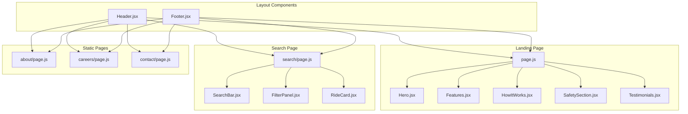

# Design Document: UI/UX Enhancements

## Overview

This design document outlines the implementation of UI/UX enhancements for the HushRyd platform. The changes focus on four main areas:
1. Removing the pricing section from the landing page
2. Implementing consistent navigation with separate page links
3. Redesigning the search page to match the reference design
4. Applying consistent orange-white color theming across all pages

## Architecture

The implementation follows the existing Next.js App Router architecture with React components. Changes are primarily frontend-focused, modifying existing components and creating new ones where needed.



## Components and Interfaces

### 1. Header Component (Modified)

**File:** `frontend/src/components/landing/Header.jsx`

**Changes:**
- Update navigation items to include separate links for About Us, Careers, Contact Us
- Remove section scroll behavior for these items (direct page navigation)
- Ensure consistent orange theming

**Interface:**
```javascript
// Navigation items configuration
const navItems = [
  { label: 'About Us', href: '/about' },
  { label: 'Careers', href: '/careers' },
  { label: 'Safety Features', href: '/safety' },
  { label: 'How It Works', sectionId: 'how-it-works' },
  { label: 'For Drivers', href: '/auth/login?mode=driver' },
  { label: 'Contact Us', href: '/contact' },
];
```

### 2. Landing Page (Modified)

**File:** `frontend/src/app/page.js`

**Changes:**
- Remove Pricing component import and usage
- Keep Hero, Features, HowItWorks, SafetySection, Testimonials

### 3. Search Page Components (New/Modified)

#### 3.1 SearchBar Component (New)

**File:** `frontend/src/components/passenger/SearchBar.jsx`

**Purpose:** Horizontal search bar matching reference design

**Props:**
```typescript
interface SearchBarProps {
  initialValues?: {
    from: string;
    to: string;
    date: string;
    passengers: number;
  };
  onSearch: (params: SearchParams) => void;
  onModify: () => void;
  loading?: boolean;
}
```

#### 3.2 FilterPanel Component (New)

**File:** `frontend/src/components/passenger/FilterPanel.jsx`

**Purpose:** Left sidebar with filters matching reference design

**Props:**
```typescript
interface FilterPanelProps {
  filters: {
    sortBy: 'earliest' | 'lowest_price' | 'shortest';
    departureTime: string[];
    amenities: string[];
  };
  onFilterChange: (filters: FilterState) => void;
  onReset: () => void;
  totalResults: number;
}
```

**Filter Options:**
- Sort by: Earliest departure, Lowest price, Shortest duration
- Departure time: Before 06:00, 06:00-12:00, 12:01-18:00, After 18:00
- Amenities: Max 2 in back seat, Instant Approval, Pets allowed, Smoking allowed

#### 3.3 RideCard Component (New)

**File:** `frontend/src/components/passenger/RideCard.jsx`

**Purpose:** Individual ride card matching reference design

**Props:**
```typescript
interface RideCardProps {
  trip: {
    id: string;
    departureTime: string;
    arrivalTime: string;
    pickupLocation: string;
    dropLocation: string;
    driver: {
      name: string;
      photo?: string;
      rating: number;
      totalRatings: number;
    };
    badges: string[];
    price: number;
    availableSeats: number;
    isFull: boolean;
  };
  onBook: (tripId: string) => void;
}
```

### 4. Static Pages (Modified)

**Files:**
- `frontend/src/app/about/page.js`
- `frontend/src/app/careers/page.js`
- `frontend/src/app/contact/page.js`

**Changes:**
- Add Header and Footer components
- Apply consistent orange-white theming

## Data Models

No new data models required. The implementation uses existing Trip and Driver models from the backend.

## Correctness Properties

*A property is a characteristic or behavior that should hold true across all valid executions of a system-essentially, a formal statement about what the system should do. Properties serve as the bridge between human-readable specifications and machine-verifiable correctness guarantees.*

### Property 1: Ride Card Data Completeness

*For any* ride card rendered in search results, the card SHALL display all required fields: departure time, arrival time, pickup location, drop location, driver name, driver rating, price, available seats, and a Book button.

**Validates: Requirements 4.7**

## Error Handling

### Search Page
- Display loading spinner during API calls
- Show "No rides found" message with suggestions when results are empty
- Handle network errors gracefully with retry option
- Validate search inputs before API call

### Navigation
- Handle 404 for non-existent pages
- Graceful fallback for missing page content

## Testing Strategy

### Unit Testing
- Test component rendering with various props
- Test filter state management
- Test navigation link behavior
- Use Jest and React Testing Library

### Property-Based Testing
- Use fast-check library for property-based tests
- Test ride card rendering with generated trip data
- Verify all required fields are present for any valid trip input

### Integration Testing
- Test search flow end-to-end
- Test navigation between pages
- Verify consistent header/footer across routes

### Visual Testing
- Verify orange color (#f97316) usage on interactive elements
- Verify white backgrounds on content areas
- Test responsive behavior on mobile/tablet/desktop
