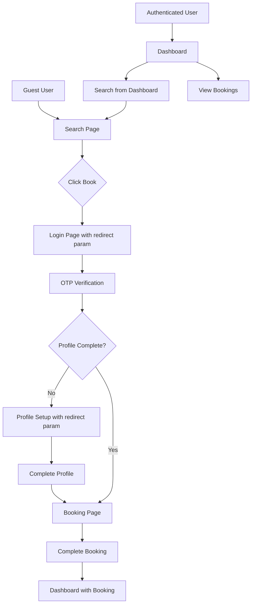

# Design Document

## Overview

This design document outlines the implementation for the complete user booking flow with authentication, profile completion enforcement, dashboard integration, and breadcrumb navigation across the HushRyd web application.

The solution involves:
1. Enhancing the booking page to properly redirect unauthenticated users with return URL preservation
2. Implementing profile completion checks with redirect-back functionality
3. Ensuring all search filters work correctly on the search page
4. Making breadcrumb navigation consistent across all pages
5. Displaying all user bookings on the dashboard with real-time updates

## Architecture



## Components and Interfaces

### 1. Redirect URL Service (Frontend)

A utility service to manage redirect URLs across the authentication and profile completion flows.

```javascript
// frontend/src/lib/redirectService.js
const REDIRECT_KEY = 'hushryd_redirect_url';

export const redirectService = {
  // Store the URL to redirect to after auth/profile completion
  setRedirectUrl: (url) => {
    if (typeof window !== 'undefined') {
      sessionStorage.setItem(REDIRECT_KEY, url);
    }
  },
  
  // Get and clear the stored redirect URL
  getAndClearRedirectUrl: () => {
    if (typeof window !== 'undefined') {
      const url = sessionStorage.getItem(REDIRECT_KEY);
      sessionStorage.removeItem(REDIRECT_KEY);
      return url;
    }
    return null;
  },
  
  // Check if a redirect URL exists
  hasRedirectUrl: () => {
    if (typeof window !== 'undefined') {
      return !!sessionStorage.getItem(REDIRECT_KEY);
    }
    return false;
  }
};
```

### 2. Enhanced Auth Hook

Update the useAuth hook to handle redirect URLs after authentication.

```javascript
// Updates to frontend/src/hooks/useAuth.js
const login = (authData) => {
  // ... existing login logic
  
  // Check for stored redirect URL
  const redirectUrl = redirectService.getAndClearRedirectUrl();
  if (redirectUrl && isValidRedirectUrl(redirectUrl)) {
    router.push(redirectUrl);
  } else if (isNewUser) {
    router.push('/profile/setup');
  } else {
    // Route to role-specific dashboard
    routeByRole(newUser?.role);
  }
};
```

### 3. Profile Completion Check Service

A service to validate profile completeness and required fields.

```javascript
// frontend/src/lib/profileService.js
export const profileService = {
  checkCompletion: (profile) => {
    const issues = [];
    
    if (!profile?.name || profile.name.trim() === '') {
      issues.push('Name is required');
    }
    
    if (!profile?.emergencyContacts || profile.emergencyContacts.length === 0) {
      issues.push('At least one emergency contact is required');
    }
    
    return {
      isComplete: issues.length === 0,
      issues
    };
  }
};
```

### 4. Enhanced Breadcrumb Component

Update the Breadcrumb component to work consistently across all pages.

```javascript
// Updates to frontend/src/components/common/Breadcrumb.jsx
// Add more route mappings and handle all page types
const routeNames = {
  // ... existing mappings
  'payments': 'Payments',
  'earnings': 'Earnings',
  'vehicle-details': 'Vehicle Details',
  'register': 'Register',
  'tracking': 'Tracking',
  // Add all missing routes
};
```

### 5. Search Filter Integration

Ensure all filters in FilterPanel properly communicate with the search API.

```javascript
// Backend filter handling in searchService.js
const applyFilters = (query, filters) => {
  // Sort handling
  if (filters.sortBy) {
    query.sort(getSortField(filters.sortBy));
  }
  
  // Departure time filter
  if (filters.departureTime?.length > 0) {
    query.where('departureTime').in(getTimeRanges(filters.departureTime));
  }
  
  // Amenities filter
  if (filters.amenities?.length > 0) {
    query.where('amenities').all(filters.amenities);
  }
  
  return query;
};
```

## Data Models

### Redirect State Model

```typescript
interface RedirectState {
  url: string;           // The URL to redirect to
  timestamp: number;     // When the redirect was stored
  context: 'auth' | 'profile';  // Why the redirect was stored
}
```

### Profile Completion Model

```typescript
interface ProfileCompletion {
  isComplete: boolean;
  issues: string[];
  requiredFields: {
    name: boolean;
    emergencyContacts: boolean;
  };
}
```

### Filter State Model

```typescript
interface FilterState {
  sortBy: 'earliest' | 'lowest_price' | 'shortest';
  departureTime: ('before_06' | '06_12' | '12_18' | 'after_18')[];
  amenities: ('max_2_back' | 'instant_approval' | 'pets_allowed' | 'smoking_allowed')[];
}
```


## Correctness Properties

*A property is a characteristic or behavior that should hold true across all valid executions of a system-essentially, a formal statement about what the system should do. Properties serve as the bridge between human-readable specifications and machine-verifiable correctness guarantees.*

Based on the prework analysis, the following correctness properties have been identified. Redundant properties have been consolidated for efficiency.

### Property 1: Redirect URL Storage and Retrieval Round Trip

*For any* valid booking URL, storing it before redirect and retrieving it after authentication/profile completion should return the same URL.

**Validates: Requirements 1.3, 1.4, 3.2, 3.3**

### Property 2: Filter Results Correctness

*For any* combination of filters (sort, departure time, amenities) and any set of rides, the filtered results should:
- Only contain rides matching ALL selected filter criteria (AND logic)
- Be sorted according to the selected sort option
- Include all rides that match the criteria (no false negatives)

**Validates: Requirements 1.2, 5.1, 5.2, 5.3, 5.5**

### Property 3: Profile Completion Validation

*For any* user profile, the profile completion check should correctly identify all missing required fields (name, emergency contacts) and return isComplete=true only when all required fields are present.

**Validates: Requirements 3.1, 3.4, 3.5**

### Property 4: Breadcrumb Generation from Path

*For any* valid application path, the breadcrumb generator should produce a list of items where:
- The first item is always "Home" with href "/"
- Each path segment has a corresponding breadcrumb item
- Dynamic segments (IDs) are labeled as "Details"
- The last item is marked as isLast=true

**Validates: Requirements 4.1, 4.3, 4.4**

### Property 5: Booking Display Ordering

*For any* set of user bookings, the dashboard should display them sorted by departure time in ascending order (soonest first).

**Validates: Requirements 2.3, 6.4**

### Property 6: Upcoming Soon Indicator

*For any* booking, the "Upcoming Soon" indicator should be displayed if and only if the booking's departure time is within 24 hours of the current time.

**Validates: Requirements 6.5**

### Property 7: Filter Reset Idempotence

*For any* filter state, clicking "Reset all" should return the filter state to the default values (sortBy: 'earliest', departureTime: [], amenities: []), and applying reset multiple times should have the same effect as applying it once.

**Validates: Requirements 5.4**

## Error Handling

### Authentication Errors

| Error Scenario | Handling |
|----------------|----------|
| Invalid redirect URL | Redirect to dashboard instead |
| Expired session during booking | Redirect to login with booking URL preserved |
| OTP verification failure | Display error message, allow retry |

### Profile Errors

| Error Scenario | Handling |
|----------------|----------|
| Profile fetch failure | Display error, allow retry |
| Profile save failure | Display error, preserve form data |
| Incomplete profile on booking | Block submission, show missing fields |

### Search/Filter Errors

| Error Scenario | Handling |
|----------------|----------|
| Search API failure | Display error message, show retry button |
| No results found | Display empty state with suggestions |
| Filter produces no results | Show message, offer to reset filters |

### Breadcrumb Errors

| Error Scenario | Handling |
|----------------|----------|
| Unknown route segment | Use capitalized segment name as label |
| Invalid path | Fall back to Home breadcrumb only |

## Testing Strategy

### Property-Based Testing

The project will use **fast-check** for property-based testing in JavaScript/TypeScript. Each correctness property will be implemented as a property-based test with a minimum of 100 iterations.

#### Test File Structure

```
frontend/tests/property/
├── redirectService.property.test.js    # Property 1
├── filterResults.property.test.js      # Property 2
├── profileCompletion.property.test.js  # Property 3
├── breadcrumb.property.test.js         # Property 4
├── bookingDisplay.property.test.js     # Properties 5, 6
├── filterReset.property.test.js        # Property 7
```

#### Property Test Annotations

Each property-based test must be annotated with:
- `**Feature: user-booking-flow-breadcrumbs, Property {number}: {property_text}**`
- `**Validates: Requirements X.Y**`

### Unit Tests

Unit tests will cover:
- Individual component rendering
- Event handler behavior
- API integration points
- Edge cases identified in prework (1.5, 2.5, 4.5)

### Integration Tests

Integration tests will verify:
- Complete auth → booking flow
- Profile completion → booking flow
- Dashboard data loading and display
- Breadcrumb navigation across page transitions
