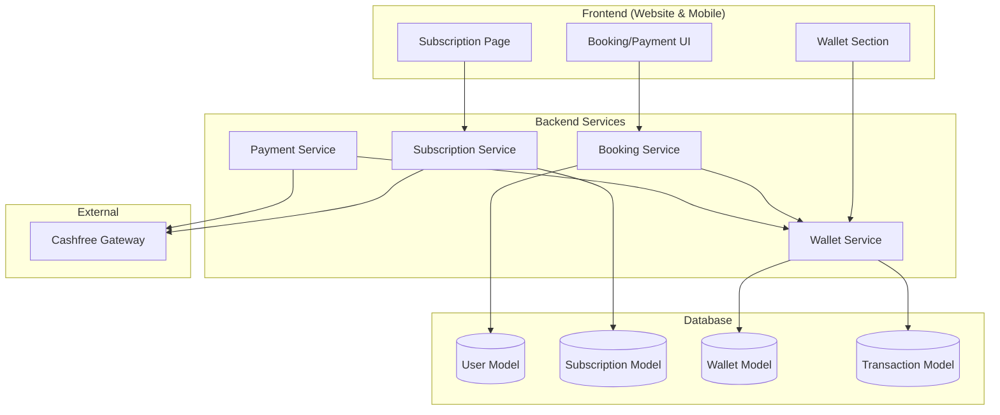

# Design Document: Women-Only Booking, Subscription Plans & Cashback Wallet

## Overview

This design implements three interconnected features for the HushRyd platform:

1. **Women-Only Booking** - Gender verification gate that restricts ride bookings to female passengers only
2. **Subscription Plans** - Three-tier membership system (Normal ₹0, Silver ₹299, Gold ₹499) with benefits
3. **Cashback Wallet** - Reward system crediting cashback after rides, claimable on future payments

The implementation integrates with the existing Cashfree payment gateway, MongoDB database, and spans both the Next.js website and React Native mobile app.

## Architecture



## Components and Interfaces

### 1. Gender Verification Middleware

```javascript
// backend/src/middleware/genderVerification.js
const verifyFemaleOnly = async (req, res, next) => {
  const user = await User.findById(req.user.id);
  
  if (!user.gender) {
    return res.status(400).json({
      error: 'PROFILE_INCOMPLETE',
      message: 'Please complete your profile with gender information',
      redirectTo: '/profile/setup'
    });
  }
  
  if (user.gender !== 'female') {
    return res.status(403).json({
      error: 'WOMEN_ONLY',
      message: 'HushRyd is currently available for women travelers only'
    });
  }
  
  next();
};
```

### 2. Subscription Service Interface

```javascript
// backend/src/services/subscriptionService.js
interface SubscriptionService {
  // Plan management
  getPlans(): Promise<Plan[]>;
  getUserSubscription(userId: string): Promise<Subscription | null>;
  
  // Purchase flow
  createSubscriptionOrder(userId: string, planId: string): Promise<CashfreeOrder>;
  activateSubscription(userId: string, planId: string, paymentId: string): Promise<Subscription>;
  
  // Benefits
  getRemainingBenefits(userId: string): Promise<Benefits>;
  useFreeCancellation(userId: string): Promise<boolean>;
  resetMonthlyBenefits(): Promise<void>; // Cron job
  
  // Expiry
  checkAndExpireSubscriptions(): Promise<void>; // Cron job
}
```

### 3. Wallet Service Interface

```javascript
// backend/src/services/walletService.js
interface WalletService {
  // Balance management
  getWalletBalance(userId: string): Promise<WalletBalance>;
  getCashbackBreakdown(userId: string): Promise<CashbackEntry[]>;
  
  // Cashback operations
  creditCashback(userId: string, amount: number, bookingId: string, expiryDays: number): Promise<CashbackEntry>;
  expireCashback(): Promise<void>; // Cron job
  
  // Redemption
  applyWalletToPayment(userId: string, fareAmount: number): Promise<WalletRedemption>;
  recordRedemption(userId: string, amount: number, bookingId: string): Promise<Transaction>;
}
```

### 4. API Endpoints

| Endpoint | Method | Description |
|----------|--------|-------------|
| `/api/subscriptions/plans` | GET | Get all subscription plans |
| `/api/subscriptions/current` | GET | Get user's current subscription |
| `/api/subscriptions/purchase` | POST | Initiate subscription purchase |
| `/api/subscriptions/activate` | POST | Activate after payment (webhook) |
| `/api/wallet/balance` | GET | Get wallet balance and breakdown |
| `/api/wallet/apply` | POST | Apply wallet to payment |
| `/api/wallet/transactions` | GET | Get wallet transaction history |

## Data Models

### Subscription Model

```javascript
// backend/src/models/Subscription.js
const SubscriptionSchema = new mongoose.Schema({
  userId: {
    type: mongoose.Schema.Types.ObjectId,
    ref: 'User',
    required: true,
    index: true
  },
  planId: {
    type: String,
    enum: ['normal', 'silver', 'gold'],
    required: true
  },
  status: {
    type: String,
    enum: ['active', 'expired', 'cancelled'],
    default: 'active'
  },
  activatedAt: {
    type: Date,
    required: true
  },
  expiresAt: {
    type: Date,
    required: true,
    index: true
  },
  paymentId: {
    type: String // Cashfree payment reference
  },
  orderId: {
    type: String // Cashfree order reference
  },
  // Monthly benefits tracking
  freeCancellationsUsed: {
    type: Number,
    default: 0
  },
  benefitsResetAt: {
    type: Date
  }
}, { timestamps: true });
```

### Wallet Model

```javascript
// backend/src/models/Wallet.js
const CashbackEntrySchema = new mongoose.Schema({
  amount: {
    type: Number,
    required: true,
    min: 0
  },
  bookingId: {
    type: mongoose.Schema.Types.ObjectId,
    ref: 'Booking'
  },
  creditedAt: {
    type: Date,
    default: Date.now
  },
  expiresAt: {
    type: Date,
    required: true,
    index: true
  },
  status: {
    type: String,
    enum: ['active', 'redeemed', 'expired'],
    default: 'active'
  },
  redeemedAt: Date,
  redeemedBookingId: {
    type: mongoose.Schema.Types.ObjectId,
    ref: 'Booking'
  }
});

const WalletSchema = new mongoose.Schema({
  userId: {
    type: mongoose.Schema.Types.ObjectId,
    ref: 'User',
    required: true,
    unique: true
  },
  balance: {
    type: Number,
    default: 0,
    min: 0
  },
  cashbackEntries: [CashbackEntrySchema],
  totalEarned: {
    type: Number,
    default: 0
  },
  totalRedeemed: {
    type: Number,
    default: 0
  },
  totalExpired: {
    type: Number,
    default: 0
  }
}, { timestamps: true });
```

### Subscription Plans Configuration

```javascript
// backend/src/config/subscriptionPlans.js
const SUBSCRIPTION_PLANS = {
  normal: {
    id: 'normal',
    name: 'Normal',
    price: 0,
    currency: 'INR',
    features: {
      standardAllocation: true,
      support24x7: true,
      coreFeatures: true,
      priorityAllocation: false,
      freeCancellation: false,
      cashbackRewards: false
    },
    benefits: {
      freeCancellationsPerMonth: 0,
      cashbackPerBooking: 0,
      cashbackValidityDays: 0,
      seatHoldMinutes: 5
    }
  },
  silver: {
    id: 'silver',
    name: 'Silver',
    price: 299,
    currency: 'INR',
    features: {
      standardAllocation: true,
      support24x7: true,
      coreFeatures: true,
      priorityAllocation: true,
      freeCancellation: true,
      cashbackRewards: true,
      extendedBenefits: true
    },
    benefits: {
      freeCancellationsPerMonth: 2,
      cashbackPerBooking: 50,
      cashbackValidityDays: 10,
      seatHoldMinutes: 10
    }
  },
  gold: {
    id: 'gold',
    name: 'Gold',
    price: 499,
    currency: 'INR',
    features: {
      standardAllocation: true,
      support24x7: true,
      coreFeatures: true,
      priorityAllocation: true,
      freeCancellation: true,
      cashbackRewards: true,
      extendedBenefits: true,
      exclusiveMemberPerks: true
    },
    benefits: {
      freeCancellationsPerMonth: 5,
      cashbackPerBooking: 75,
      cashbackValidityDays: 15,
      seatHoldMinutes: 10
    }
  }
};
```

## Correctness Properties

*A property is a characteristic or behavior that should hold true across all valid executions of a system-essentially, a formal statement about what the system should do. Properties serve as the bridge between human-readable specifications and machine-verifiable correctness guarantees.*

### Property 1: Women-only booking enforcement
*For any* user attempting to book a ride, the booking SHALL succeed if and only if the user's gender is "female"
**Validates: Requirements 1.1, 1.2**

### Property 2: Gender redirect for incomplete profiles
*For any* user without gender set attempting to book, the system SHALL redirect to profile completion
**Validates: Requirements 1.4**

### Property 3: Subscription expiry calculation
*For any* subscription activation, the expiry date SHALL be exactly 30 days from activation timestamp
**Validates: Requirements 3.2**

### Property 4: Silver cashback amount
*For any* completed ride by a Silver subscriber, the cashback credited SHALL be exactly ₹50
**Validates: Requirements 4.1**

### Property 5: Gold cashback amount
*For any* completed ride by a Gold subscriber, the cashback credited SHALL be exactly ₹75
**Validates: Requirements 4.2**

### Property 6: Cashback expiry by plan
*For any* cashback credit, the expiry SHALL be 10 days for Silver and 15 days for Gold subscribers
**Validates: Requirements 4.3**

### Property 7: Wallet FIFO redemption
*For any* wallet redemption, the oldest non-expired cashback entries SHALL be consumed first
**Validates: Requirements 6.2**

### Property 8: Wallet balance cap at fare
*For any* payment where wallet balance exceeds fare, only the fare amount SHALL be deducted from wallet
**Validates: Requirements 6.4**

### Property 9: Free cancellation limit - Silver
*For any* Silver subscriber, free cancellations SHALL be limited to 2 per subscription month
**Validates: Requirements 7.1**

### Property 10: Free cancellation limit - Gold
*For any* Gold subscriber, free cancellations SHALL be limited to 5 per subscription month
**Validates: Requirements 7.2**

### Property 11: Free cancellation counter decrement
*For any* free cancellation used, the remaining count SHALL decrease by exactly 1
**Validates: Requirements 7.3**

### Property 12: Monthly benefits reset
*For any* subscription month boundary, free cancellation counts SHALL reset to plan limits
**Validates: Requirements 7.5**

### Property 13: Priority ordering
*For any* seat allocation conflict, Gold subscribers SHALL be prioritized over Silver, and Silver over Normal
**Validates: Requirements 8.1**

### Property 14: Wallet balance consistency
*For any* sequence of credits and redemptions, wallet balance SHALL equal sum of active cashback entries
**Validates: Requirements 10.2**

### Property 15: Subscription payment amount
*For any* subscription purchase, the Cashfree order amount SHALL match the plan price exactly
**Validates: Requirements 11.1**

## Error Handling

| Error Code | HTTP Status | Description |
|------------|-------------|-------------|
| `WOMEN_ONLY` | 403 | Non-female user attempting to book |
| `PROFILE_INCOMPLETE` | 400 | Gender not set in profile |
| `SUBSCRIPTION_EXPIRED` | 400 | Attempting to use expired subscription benefits |
| `INSUFFICIENT_WALLET` | 400 | Wallet balance insufficient (should not occur with partial apply) |
| `FREE_CANCELLATION_EXHAUSTED` | 400 | No free cancellations remaining |
| `PAYMENT_FAILED` | 402 | Cashfree payment failed |
| `CASHBACK_EXPIRED` | 400 | Attempting to use expired cashback |

## Testing Strategy

### Property-Based Testing Library
- **Backend**: fast-check (JavaScript)
- **Mobile**: fast-check (via Jest)

### Unit Tests
- Gender verification middleware
- Subscription plan configuration
- Cashback calculation functions
- Wallet balance calculations
- FIFO redemption logic

### Property-Based Tests
Each correctness property will have a corresponding property-based test:
- Generate random users with various genders
- Generate random subscription states
- Generate random wallet states with multiple cashback entries
- Verify invariants hold across all generated inputs

### Integration Tests
- End-to-end subscription purchase flow
- Cashback credit after ride completion
- Wallet redemption during payment
- Subscription expiry and downgrade

### Test Configuration
```javascript
// Property tests should run minimum 100 iterations
fc.assert(
  fc.property(/* generators */, /* property */),
  { numRuns: 100 }
);
```
